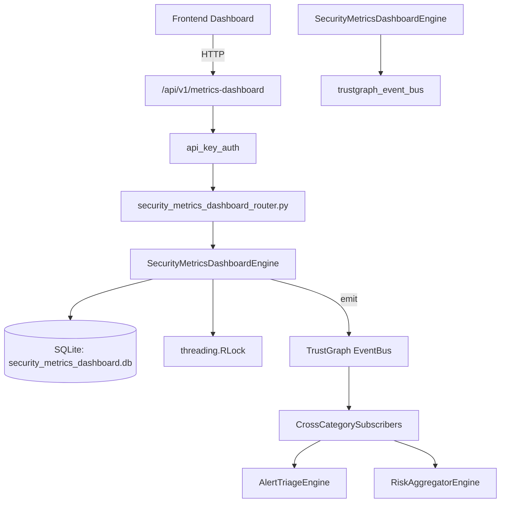

# US-0243: Security Metrics Dashboard

## Sub-Epic: Executive
**Master Goal**: ALDECI — $35/mo enterprise security intelligence platform replacing $50K-500K/yr tools

## User Story
As a **Sarah Chen (CISO)**, I need to aggregate security metrics
so that the platform delivers enterprise-grade executive capabilities at 1/1000th the cost of legacy tools.

## Why This Matters
Security Metrics Dashboard replaces functionality found in enterprise tools like CrowdStrike, Wiz, Snyk, and Rapid7.
By building this into ALDECI's $35/mo stack, customers save $50K+/yr on standalone Executive tooling.

## Architecture

## Current State: 95% Complete
- ✅ `create_dashboard()` — Create a new dashboard. (line 128)
- ✅ `list_dashboards()` — List dashboards with optional type filter. (line 184)
- ✅ `get_dashboard()` — Retrieve a single dashboard by ID. (line 208)
- ✅ `add_widget()` — Add a widget to a dashboard. Returns None if dashboard not found. (line 228)
- ✅ `list_widgets()` — List all widgets for a dashboard ordered by position. (line 284)
- ✅ `record_metric_snapshot()` — Record a metric snapshot. (line 306)
- ❌ TrustGraph event emission — not yet verified

## Key Functions (from `suite-core/core/security_metrics_dashboard_engine.py` — 424 lines)
- `SecurityMetricsDashboardEngine.create_dashboard()` — Create a new dashboard. (line 128)
- `SecurityMetricsDashboardEngine.list_dashboards()` — List dashboards with optional type filter. (line 184)
- `SecurityMetricsDashboardEngine.get_dashboard()` — Retrieve a single dashboard by ID. (line 208)
- `SecurityMetricsDashboardEngine.add_widget()` — Add a widget to a dashboard. Returns None if dashboard not found. (line 228)
- `SecurityMetricsDashboardEngine.list_widgets()` — List all widgets for a dashboard ordered by position. (line 284)
- `SecurityMetricsDashboardEngine.record_metric_snapshot()` — Record a metric snapshot. (line 306)
- `SecurityMetricsDashboardEngine.get_metric_history()` — Return metric snapshot history ordered by snapshot_at DESC. (line 353)
- `SecurityMetricsDashboardEngine.get_dashboard_stats()` — Return aggregated dashboard statistics for an org. (line 382)

## Dependencies
- **Depends on**: trustgraph_event_bus
- **Depended by**: Routers, TrustGraph EventBus, CrossCategorySubscribers
- **TrustGraph**: Event emission wired via ResponseInterceptorMiddleware
- **Source file**: `suite-core/core/security_metrics_dashboard_engine.py` (424 lines)
- **Router file**: `suite-api/apps/api/security_metrics_dashboard_router.py`

## API Endpoints
| Method | Path | Description |
|--------|------|-------------|
| POST | `/api/v1/metrics-dashboard/dashboards` | create dashboard |
| GET | `/api/v1/metrics-dashboard/dashboards` | list dashboards |
| GET | `/api/v1/metrics-dashboard/dashboards/{dashboard_id}` | get dashboard |
| POST | `/api/v1/metrics-dashboard/dashboards/{dashboard_id}/widgets` | add widget |
| GET | `/api/v1/metrics-dashboard/dashboards/{dashboard_id}/widgets` | list widgets |
| POST | `/api/v1/metrics-dashboard/snapshots` | record snapshot |
| GET | `/api/v1/metrics-dashboard/snapshots` | get metric history |
| GET | `/api/v1/metrics-dashboard/stats` | get stats |

## Tasks Remaining
1. Verify TrustGraph event emission works end-to-end (2h)
2. Add integration test with real persona workflow (2h)
3. Wire CrossCategorySubscriber consumer chain (1h)
4. Validate with 30-persona walkthrough (1h)
5. Optimize query performance for large datasets (2h)
6. Expand test coverage to edge cases (2h)

## Definition of Done
- [ ] Sarah Chen (CISO) can access /api/v1/metrics-dashboard and get meaningful data
- [ ] All CRUD operations return correct HTTP status codes
- [ ] TrustGraph receives events from this engine
- [ ] 34+ tests passing in `tests/test_security_metrics_dashboard_engine.py`
- [ ] 30-persona walkthrough includes this endpoint at 100%
- [ ] No hardcoded org_id — all queries are org-scoped

## Sprint: Wave 50 (est. April 26-28, 2026)

## Test Coverage
- **Test file**: `tests/test_security_metrics_dashboard_engine.py`
- **Tests**: 34 tests
- **Status**: Passing
