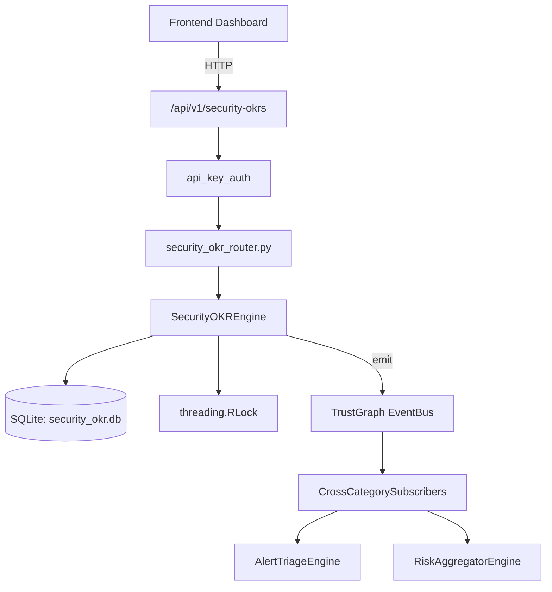

# US-0244: Security Okr

## Sub-Epic: Executive
**Master Goal**: ALDECI — $35/mo enterprise security intelligence platform replacing $50K-500K/yr tools

## User Story
As a **Sarah Chen (CISO)**, I need to track security OKRs
so that the platform delivers enterprise-grade executive capabilities at 1/1000th the cost of legacy tools.

## Why This Matters
Security Okr replaces functionality found in enterprise tools like CrowdStrike, Wiz, Snyk, and Rapid7.
By building this into ALDECI's $35/mo stack, customers save $50K+/yr on standalone Executive tooling.

## Architecture

## Current State: 95% Complete
- ✅ `create_objective()` — Create a new objective with status=draft. (line 140)
- ✅ `list_objectives()` — List objectives with optional filters. (line 183)
- ✅ `get_objective()` — Return objective with nested key_results list. (line 203)
- ✅ `close_objective()` — Set objective status to final_status (progress stays as-is). (line 221)
- ✅ `add_key_result()` — Add a key result to an objective. current_value=0, progress=0. (line 248)
- ✅ `update_key_result()` — Update key result value; recompute progress and parent objective progress. (line 295)
- ❌ TrustGraph event emission — not yet verified

## Key Functions (from `suite-core/core/security_okr_engine.py` — 449 lines)
- `SecurityOKREngine.create_objective()` — Create a new objective with status=draft. (line 140)
- `SecurityOKREngine.list_objectives()` — List objectives with optional filters. (line 183)
- `SecurityOKREngine.get_objective()` — Return objective with nested key_results list. (line 203)
- `SecurityOKREngine.close_objective()` — Set objective status to final_status (progress stays as-is). (line 221)
- `SecurityOKREngine.add_key_result()` — Add a key result to an objective. current_value=0, progress=0. (line 248)
- `SecurityOKREngine.update_key_result()` — Update key result value; recompute progress and parent objective progress. (line 295)
- `SecurityOKREngine.get_period_summary()` — Summary for a period: avg_progress, on_track / at_risk / off_track counts. (line 369)
- `SecurityOKREngine.get_team_okrs()` — Return objectives filtered by owner. (line 404)

## Dependencies
- **Depends on**: standalone
- **Depended by**: Routers, TrustGraph EventBus, CrossCategorySubscribers
- **TrustGraph**: Event emission wired via ResponseInterceptorMiddleware
- **Source file**: `suite-core/core/security_okr_engine.py` (449 lines)
- **Router file**: `suite-api/apps/api/security_okr_router.py`

## API Endpoints
| Method | Path | Description |
|--------|------|-------------|
| POST | `/api/v1/security-okrs/objectives` | create objective |
| GET | `/api/v1/security-okrs/objectives` | list objectives |
| GET | `/api/v1/security-okrs/objectives/{objective_id}` | get objective |
| POST | `/api/v1/security-okrs/objectives/{objective_id}/close` | close objective |
| POST | `/api/v1/security-okrs/objectives/{objective_id}/key-results` | add key result |
| POST | `/api/v1/security-okrs/objectives/{objective_id}/key-results/{kr_id}/update` | update key result |
| GET | `/api/v1/security-okrs/summary/{period}` | get period summary |
| GET | `/api/v1/security-okrs/team/{owner}` | get team okrs |
| GET | `/api/v1/security-okrs/velocity` | get okr velocity |

## Tasks Remaining
1. Verify TrustGraph event emission works end-to-end (2h)
2. Add integration test with real persona workflow (2h)
3. Wire CrossCategorySubscriber consumer chain (1h)
4. Validate with 30-persona walkthrough (1h)
5. Optimize query performance for large datasets (2h)
6. Expand test coverage to edge cases (2h)

## Definition of Done
- [ ] Sarah Chen (CISO) can access /api/v1/security-okrs and get meaningful data
- [ ] All CRUD operations return correct HTTP status codes
- [ ] TrustGraph receives events from this engine
- [ ] 37+ tests passing in `tests/test_security_okr_engine.py`
- [ ] 30-persona walkthrough includes this endpoint at 100%
- [ ] No hardcoded org_id — all queries are org-scoped

## Sprint: Wave 50 (est. April 26-28, 2026)

## Test Coverage
- **Test file**: `tests/test_security_okr_engine.py`
- **Tests**: 37 tests
- **Status**: Passing
