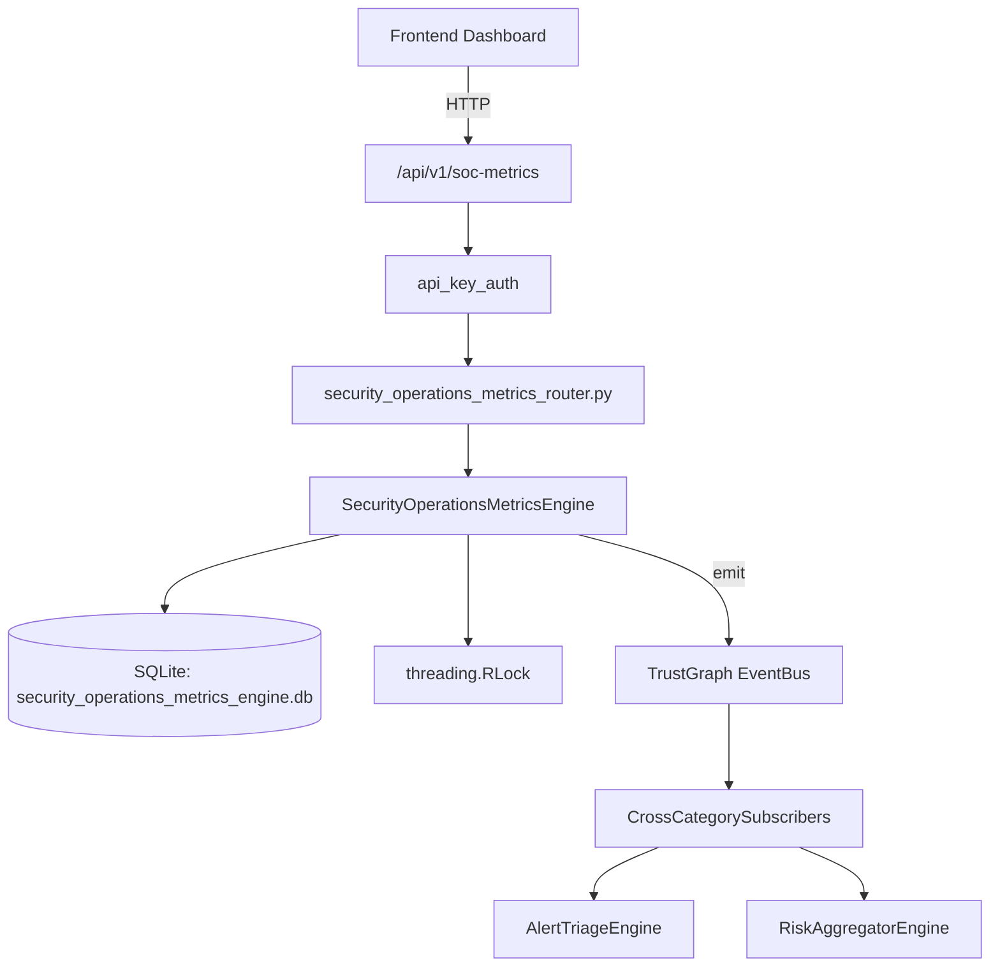

# US-0245: Security Operations Metrics

## Sub-Epic: Advanced
**Master Goal**: ALDECI — $35/mo enterprise security intelligence platform replacing $50K-500K/yr tools

## User Story
As a **Daniel Thompson (SecOps Manager)**, I need to monitor SOC performance
so that the platform delivers enterprise-grade advanced capabilities at 1/1000th the cost of legacy tools.

## Why This Matters
Security Operations Metrics replaces functionality found in enterprise tools like CrowdStrike, Wiz, Snyk, and Rapid7.
By building this into ALDECI's $35/mo stack, customers save $50K+/yr on standalone Advanced tooling.

## Architecture

## Current State: 95% Complete
- ✅ `create_alert()` — Create a new SOC alert. detected_at defaults to now. (line 131)
- ✅ `acknowledge_alert()` — Acknowledge an alert: set acknowledged_at=now, assigned_to=analyst, status=ackno (line 169)
- ✅ `resolve_alert()` — Resolve an alert: set resolved_at=now, status=resolved, false_positive flag. (line 196)
- ✅ `take_daily_snapshot()` — Compute and INSERT OR REPLACE a daily snapshot for org_id. (line 228)
- ✅ `update_analyst_workload()` — INSERT OR REPLACE analyst workload record for a given date. (line 298)
- ✅ `get_soc_summary()` — Return total open alerts, by_severity, by_status, last 7 snapshots, top analysts (line 335)
- ❌ TrustGraph event emission — not yet verified

## Key Functions (from `suite-core/core/security_operations_metrics_engine.py` — 413 lines)
- `SecurityOperationsMetricsEngine.create_alert()` — Create a new SOC alert. detected_at defaults to now. (line 131)
- `SecurityOperationsMetricsEngine.acknowledge_alert()` — Acknowledge an alert: set acknowledged_at=now, assigned_to=analyst, status=ackno (line 169)
- `SecurityOperationsMetricsEngine.resolve_alert()` — Resolve an alert: set resolved_at=now, status=resolved, false_positive flag. (line 196)
- `SecurityOperationsMetricsEngine.take_daily_snapshot()` — Compute and INSERT OR REPLACE a daily snapshot for org_id. (line 228)
- `SecurityOperationsMetricsEngine.update_analyst_workload()` — INSERT OR REPLACE analyst workload record for a given date. (line 298)
- `SecurityOperationsMetricsEngine.get_soc_summary()` — Return total open alerts, by_severity, by_status, last 7 snapshots, top analysts (line 335)
- `SecurityOperationsMetricsEngine.get_mttd_trend()` — Return snapshots ordered by date with mttd_mins + mttr_mins (last N days). (line 386)
- `SecurityOperationsMetricsEngine.get_analyst_performance()` — Return analyst workload records, optionally filtered by date. (line 398)

## Dependencies
- **Depends on**: standalone
- **Depended by**: Routers, TrustGraph EventBus, CrossCategorySubscribers
- **TrustGraph**: Event emission wired via ResponseInterceptorMiddleware
- **Source file**: `suite-core/core/security_operations_metrics_engine.py` (413 lines)
- **Router file**: `suite-api/apps/api/security_operations_metrics_router.py`

## API Endpoints
| Method | Path | Description |
|--------|------|-------------|
| POST | `/api/v1/soc-metrics/alerts` | create alert |
| PUT | `/api/v1/soc-metrics/alerts/{alert_id}/acknowledge` | acknowledge alert |
| PUT | `/api/v1/soc-metrics/alerts/{alert_id}/resolve` | resolve alert |
| POST | `/api/v1/soc-metrics/snapshots` | take daily snapshot |
| PUT | `/api/v1/soc-metrics/workload` | update analyst workload |
| GET | `/api/v1/soc-metrics/summary` | get soc summary |
| GET | `/api/v1/soc-metrics/mttd-trend` | get mttd trend |
| GET | `/api/v1/soc-metrics/analyst-performance` | get analyst performance |

## Tasks Remaining
1. Verify TrustGraph event emission works end-to-end (2h)
2. Add integration test with real persona workflow (2h)
3. Wire CrossCategorySubscriber consumer chain (1h)
4. Validate with 30-persona walkthrough (1h)
5. Optimize query performance for large datasets (2h)
6. Expand test coverage to edge cases (2h)

## Definition of Done
- [ ] Daniel Thompson (SecOps Manager) can access /api/v1/soc-metrics and get meaningful data
- [ ] All CRUD operations return correct HTTP status codes
- [ ] TrustGraph receives events from this engine
- [ ] 31+ tests passing in `tests/test_security_operations_metrics_engine.py`
- [ ] 30-persona walkthrough includes this endpoint at 100%
- [ ] No hardcoded org_id — all queries are org-scoped

## Sprint: Wave 50 (est. April 26-28, 2026)

## Test Coverage
- **Test file**: `tests/test_security_operations_metrics_engine.py`
- **Tests**: 31 tests
- **Status**: Passing
