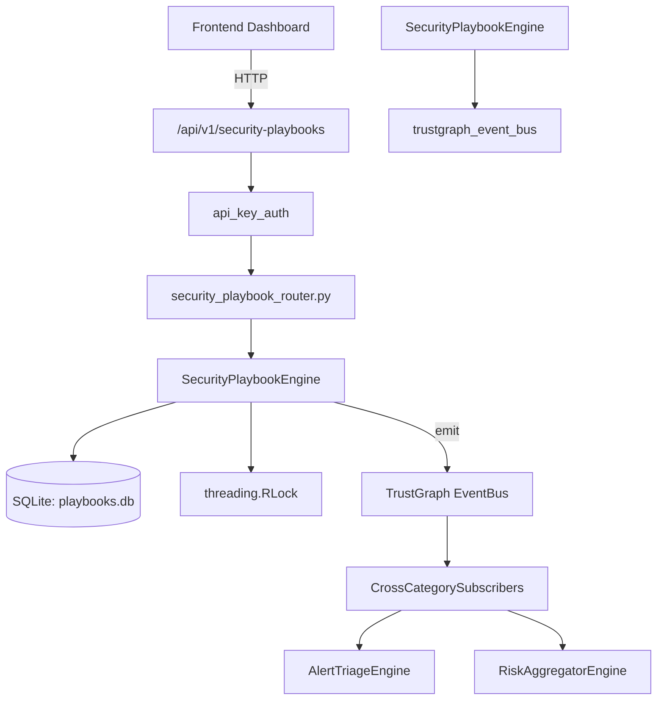

# US-0246: Security Playbook

## Sub-Epic: Advanced
**Master Goal**: ALDECI — $35/mo enterprise security intelligence platform replacing $50K-500K/yr tools

## User Story
As a **Karen Taylor (IR Lead)**, I need to manage security playbooks
so that the platform delivers enterprise-grade advanced capabilities at 1/1000th the cost of legacy tools.

## Why This Matters
Security Playbook replaces functionality found in enterprise tools like CrowdStrike, Wiz, Snyk, and Rapid7.
By building this into ALDECI's $35/mo stack, customers save $50K+/yr on standalone Advanced tooling.

## Architecture

## Current State: 95% Complete
- ✅ `create_playbook()` — Create a new playbook. Returns playbook_id. (line 306)
- ✅ `list_playbooks()` — Return all playbooks for the given org_id. (line 354)
- ✅ `get_playbook()` — Return a single playbook or None if not found / wrong org. (line 364)
- ✅ `execute_playbook()` — Execute a playbook sequentially, simulating each step. (line 386)
- ✅ `list_executions()` — Return execution history for org_id, newest first. (line 526)
- ✅ `get_execution()` — Return a single execution record or None. (line 541)
- ❌ TrustGraph event emission — not yet verified

## Key Functions (from `suite-core/core/security_playbook_engine.py` — 564 lines)
- `SecurityPlaybookEngine.create_playbook()` — Create a new playbook. Returns playbook_id. (line 306)
- `SecurityPlaybookEngine.list_playbooks()` — Return all playbooks for the given org_id. (line 354)
- `SecurityPlaybookEngine.get_playbook()` — Return a single playbook or None if not found / wrong org. (line 364)
- `SecurityPlaybookEngine.execute_playbook()` — Execute a playbook sequentially, simulating each step. (line 386)
- `SecurityPlaybookEngine.list_executions()` — Return execution history for org_id, newest first. (line 526)
- `SecurityPlaybookEngine.get_execution()` — Return a single execution record or None. (line 541)
- `SecurityPlaybookEngine.get_builtin_playbooks()` — Return the 5 built-in security response playbook templates. (line 561)

## Dependencies
- **Depends on**: trustgraph_event_bus
- **Depended by**: Routers, TrustGraph EventBus, CrossCategorySubscribers
- **TrustGraph**: Event emission wired via ResponseInterceptorMiddleware
- **Source file**: `suite-core/core/security_playbook_engine.py` (564 lines)
- **Router file**: `suite-api/apps/api/security_playbook_router.py`

## API Endpoints
| Method | Path | Description |
|--------|------|-------------|
| GET | `/api/v1/security-playbooks/playbooks/builtins` | get builtin playbooks |
| GET | `/api/v1/security-playbooks/playbooks` | list playbooks |
| POST | `/api/v1/security-playbooks/playbooks` | create playbook |
| GET | `/api/v1/security-playbooks/playbooks/{playbook_id}` | get playbook |
| POST | `/api/v1/security-playbooks/playbooks/{playbook_id}/execute` | execute playbook |
| GET | `/api/v1/security-playbooks/executions` | list executions |
| GET | `/api/v1/security-playbooks/executions/{execution_id}` | get execution |

## Tasks Remaining
1. Verify TrustGraph event emission works end-to-end (2h)
2. Add integration test with real persona workflow (2h)
3. Wire CrossCategorySubscriber consumer chain (1h)
4. Validate with 30-persona walkthrough (1h)
5. Optimize query performance for large datasets (2h)
6. Expand test coverage to edge cases (2h)

## Definition of Done
- [ ] Karen Taylor (IR Lead) can access /api/v1/security-playbooks and get meaningful data
- [ ] All CRUD operations return correct HTTP status codes
- [ ] TrustGraph receives events from this engine
- [ ] 35+ tests passing in `tests/test_security_playbook_engine.py`
- [ ] 30-persona walkthrough includes this endpoint at 100%
- [ ] No hardcoded org_id — all queries are org-scoped

## Sprint: Wave 50 (est. April 26-28, 2026)

## Test Coverage
- **Test file**: `tests/test_security_playbook_engine.py`
- **Tests**: 35 tests
- **Status**: Passing
