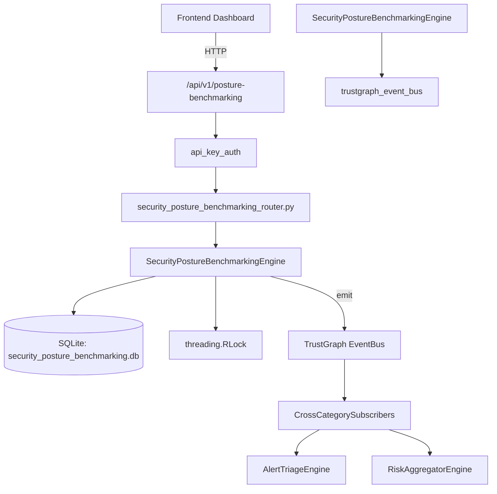

# US-0247: Security Posture Benchmarking

## Sub-Epic: Advanced
**Master Goal**: ALDECI — $35/mo enterprise security intelligence platform replacing $50K-500K/yr tools

## User Story
As a **Sarah Chen (CISO)**, I need to track security posture over time
so that the platform delivers enterprise-grade advanced capabilities at 1/1000th the cost of legacy tools.

## Why This Matters
Security Posture Benchmarking replaces functionality found in enterprise tools like CrowdStrike, Wiz, Snyk, and Rapid7.
By building this into ALDECI's $35/mo stack, customers save $50K+/yr on standalone Advanced tooling.

## Architecture

## Current State: 95% Complete
- ✅ `create_benchmark()` — Create a new benchmark record. (line 145)
- ✅ `list_benchmarks()` — Return benchmarks for the org, optionally filtered by framework and status. (line 213)
- ✅ `get_benchmark()` — Return a single benchmark by id with org isolation, or None. (line 238)
- ✅ `record_control()` — Record a control assessment result. (line 253)
- ✅ `list_controls()` — Return controls for the org, optionally filtered by benchmark, result, severity. (line 330)
- ✅ `add_comparison()` — Add a peer-group comparison for a benchmark. (line 363)
- ❌ TrustGraph event emission — not yet verified

## Key Functions (from `suite-core/core/security_posture_benchmarking_engine.py` — 540 lines)
- `SecurityPostureBenchmarkingEngine.create_benchmark()` — Create a new benchmark record. (line 145)
- `SecurityPostureBenchmarkingEngine.list_benchmarks()` — Return benchmarks for the org, optionally filtered by framework and status. (line 213)
- `SecurityPostureBenchmarkingEngine.get_benchmark()` — Return a single benchmark by id with org isolation, or None. (line 238)
- `SecurityPostureBenchmarkingEngine.record_control()` — Record a control assessment result. (line 253)
- `SecurityPostureBenchmarkingEngine.list_controls()` — Return controls for the org, optionally filtered by benchmark, result, severity. (line 330)
- `SecurityPostureBenchmarkingEngine.add_comparison()` — Add a peer-group comparison for a benchmark. (line 363)
- `SecurityPostureBenchmarkingEngine.list_comparisons()` — Return comparisons for the org, optionally filtered by benchmark_id. (line 411)
- `SecurityPostureBenchmarkingEngine.complete_assessment()` — Mark a benchmark assessment complete. (line 434)

## Dependencies
- **Depends on**: trustgraph_event_bus
- **Depended by**: Routers, TrustGraph EventBus, CrossCategorySubscribers
- **TrustGraph**: Event emission wired via ResponseInterceptorMiddleware
- **Source file**: `suite-core/core/security_posture_benchmarking_engine.py` (540 lines)
- **Router file**: `suite-api/apps/api/security_posture_benchmarking_router.py`

## API Endpoints
| Method | Path | Description |
|--------|------|-------------|
| POST | `/api/v1/posture-benchmarking/benchmarks` | create benchmark |
| GET | `/api/v1/posture-benchmarking/benchmarks` | list benchmarks |
| GET | `/api/v1/posture-benchmarking/benchmarks/{benchmark_id}` | get benchmark |
| PUT | `/api/v1/posture-benchmarking/benchmarks/{benchmark_id}/complete` | complete assessment |
| POST | `/api/v1/posture-benchmarking/controls` | record control |
| GET | `/api/v1/posture-benchmarking/controls` | list controls |
| POST | `/api/v1/posture-benchmarking/comparisons` | add comparison |
| GET | `/api/v1/posture-benchmarking/comparisons` | list comparisons |
| GET | `/api/v1/posture-benchmarking/stats` | get benchmarking stats |

## Tasks Remaining
1. Verify TrustGraph event emission works end-to-end (2h)
2. Add integration test with real persona workflow (2h)
3. Wire CrossCategorySubscriber consumer chain (1h)
4. Validate with 30-persona walkthrough (1h)
5. Optimize query performance for large datasets (2h)
6. Expand test coverage to edge cases (2h)

## Definition of Done
- [ ] Sarah Chen (CISO) can access /api/v1/posture-benchmarking and get meaningful data
- [ ] All CRUD operations return correct HTTP status codes
- [ ] TrustGraph receives events from this engine
- [ ] 50+ tests passing in `tests/test_security_posture_benchmarking_engine.py`
- [ ] 30-persona walkthrough includes this endpoint at 100%
- [ ] No hardcoded org_id — all queries are org-scoped

## Sprint: Wave 50 (est. April 26-28, 2026)

## Test Coverage
- **Test file**: `tests/test_security_posture_benchmarking_engine.py`
- **Tests**: 50 tests
- **Status**: Passing
