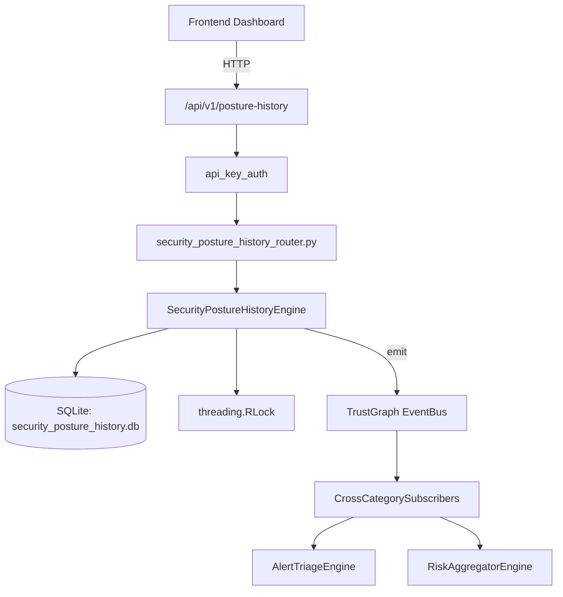

# US-0248: Security Posture History

## Sub-Epic: Advanced
**Master Goal**: ALDECI — $35/mo enterprise security intelligence platform replacing $50K-500K/yr tools

## User Story
As a **Sarah Chen (CISO)**, I need to track security posture over time
so that the platform delivers enterprise-grade advanced capabilities at 1/1000th the cost of legacy tools.

## Why This Matters
Security Posture History replaces functionality found in enterprise tools like CrowdStrike, Wiz, Snyk, and Rapid7.
By building this into ALDECI's $35/mo stack, customers save $50K+/yr on standalone Advanced tooling.

## Architecture

## Current State: 95% Complete
- ✅ `record_snapshot()` — Record a posture snapshot. overall_score = avg of last 7 days per org. (line 126)
- ✅ `get_snapshots()` — Get snapshots filtered by date range (last N days), optionally by domain. (line 186)
- ✅ `compute_trend()` — Compute trend for a domain/period; determine improving/declining/stable. (line 216)
- ✅ `get_trends()` — Get computed trends, optionally filtered by domain. (line 296)
- ✅ `set_baseline()` — Upsert a baseline for a domain. (line 322)
- ✅ `get_baseline()` — Get baseline for a specific domain. (line 373)
- ❌ TrustGraph event emission — not yet verified

## Key Functions (from `suite-core/core/security_posture_history_engine.py` — 489 lines)
- `SecurityPostureHistoryEngine.record_snapshot()` — Record a posture snapshot. overall_score = avg of last 7 days per org. (line 126)
- `SecurityPostureHistoryEngine.get_snapshots()` — Get snapshots filtered by date range (last N days), optionally by domain. (line 186)
- `SecurityPostureHistoryEngine.compute_trend()` — Compute trend for a domain/period; determine improving/declining/stable. (line 216)
- `SecurityPostureHistoryEngine.get_trends()` — Get computed trends, optionally filtered by domain. (line 296)
- `SecurityPostureHistoryEngine.set_baseline()` — Upsert a baseline for a domain. (line 322)
- `SecurityPostureHistoryEngine.get_baseline()` — Get baseline for a specific domain. (line 373)
- `SecurityPostureHistoryEngine.get_posture_delta()` — Score change from oldest to newest snapshot in the window. (line 387)
- `SecurityPostureHistoryEngine.get_domain_summary()` — Per-domain: latest score, trend direction, baseline gap. (line 420)

## Dependencies
- **Depends on**: standalone
- **Depended by**: Routers, TrustGraph EventBus, CrossCategorySubscribers
- **TrustGraph**: Event emission wired via ResponseInterceptorMiddleware
- **Source file**: `suite-core/core/security_posture_history_engine.py` (489 lines)
- **Router file**: `suite-api/apps/api/security_posture_history_router.py`

## API Endpoints
| Method | Path | Description |
|--------|------|-------------|
| POST | `/api/v1/posture-history/snapshots` | record snapshot |
| GET | `/api/v1/posture-history/snapshots` | get snapshots |
| POST | `/api/v1/posture-history/trends/compute` | compute trend |
| GET | `/api/v1/posture-history/trends` | get trends |
| PUT | `/api/v1/posture-history/baselines` | set baseline |
| GET | `/api/v1/posture-history/baselines/{domain}` | get baseline |
| GET | `/api/v1/posture-history/delta` | get posture delta |
| GET | `/api/v1/posture-history/summary` | get domain summary |

## Tasks Remaining
1. Verify TrustGraph event emission works end-to-end (2h)
2. Add integration test with real persona workflow (2h)
3. Wire CrossCategorySubscriber consumer chain (1h)
4. Validate with 30-persona walkthrough (1h)
5. Optimize query performance for large datasets (2h)
6. Expand test coverage to edge cases (2h)

## Definition of Done
- [ ] Sarah Chen (CISO) can access /api/v1/posture-history and get meaningful data
- [ ] All CRUD operations return correct HTTP status codes
- [ ] TrustGraph receives events from this engine
- [ ] 40+ tests passing in `tests/test_security_posture_history_engine.py`
- [ ] 30-persona walkthrough includes this endpoint at 100%
- [ ] No hardcoded org_id — all queries are org-scoped

## Sprint: Wave 50 (est. April 26-28, 2026)

## Test Coverage
- **Test file**: `tests/test_security_posture_history_engine.py`
- **Tests**: 40 tests
- **Status**: Passing
