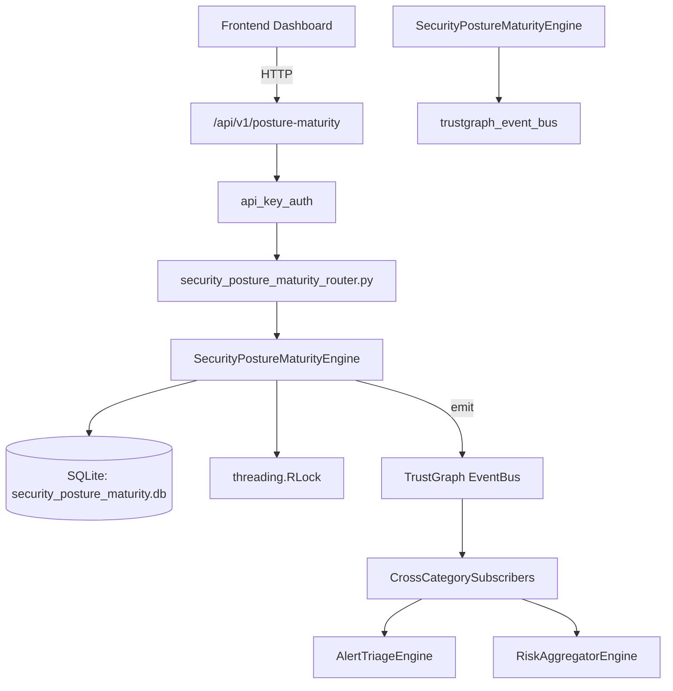

# US-0249: Security Posture Maturity

## Sub-Epic: Advanced
**Master Goal**: ALDECI — $35/mo enterprise security intelligence platform replacing $50K-500K/yr tools

## User Story
As a **Sarah Chen (CISO)**, I need to track security posture over time
so that the platform delivers enterprise-grade advanced capabilities at 1/1000th the cost of legacy tools.

## Why This Matters
Security Posture Maturity replaces functionality found in enterprise tools like CrowdStrike, Wiz, Snyk, and Rapid7.
By building this into ALDECI's $35/mo stack, customers save $50K+/yr on standalone Advanced tooling.

## Architecture

## Current State: 95% Complete
- ✅ `record_assessment()` — Record a new capability maturity assessment. Clamps maturity_level to 1..max_lev (line 140)
- ✅ `update_level()` — Update maturity_level and evidence for an existing assessment. (line 188)
- ✅ `get_overdue_reviews()` — Return assessments where next_review is set and earlier than now. (line 219)
- ✅ `create_roadmap_item()` — Create a roadmap item with status=planned. (line 236)
- ✅ `advance_roadmap_item()` — Advance roadmap status: planned→in_progress→completed. (line 284)
- ✅ `get_roadmap()` — Return roadmap items, optionally filtered by status. (line 307)
- ❌ TrustGraph event emission — not yet verified

## Key Functions (from `suite-core/core/security_posture_maturity_engine.py` — 444 lines)
- `SecurityPostureMaturityEngine.record_assessment()` — Record a new capability maturity assessment. Clamps maturity_level to 1..max_lev (line 140)
- `SecurityPostureMaturityEngine.update_level()` — Update maturity_level and evidence for an existing assessment. (line 188)
- `SecurityPostureMaturityEngine.get_overdue_reviews()` — Return assessments where next_review is set and earlier than now. (line 219)
- `SecurityPostureMaturityEngine.create_roadmap_item()` — Create a roadmap item with status=planned. (line 236)
- `SecurityPostureMaturityEngine.advance_roadmap_item()` — Advance roadmap status: planned→in_progress→completed. (line 284)
- `SecurityPostureMaturityEngine.get_roadmap()` — Return roadmap items, optionally filtered by status. (line 307)
- `SecurityPostureMaturityEngine.take_snapshot()` — Compute and persist a maturity snapshot. (line 327)
- `SecurityPostureMaturityEngine.get_maturity_overview()` — Latest snapshot + all assessments + all roadmap items. (line 384)

## Dependencies
- **Depends on**: trustgraph_event_bus
- **Depended by**: Routers, TrustGraph EventBus, CrossCategorySubscribers
- **TrustGraph**: Event emission wired via ResponseInterceptorMiddleware
- **Source file**: `suite-core/core/security_posture_maturity_engine.py` (444 lines)
- **Router file**: `suite-api/apps/api/security_posture_maturity_router.py`

## API Endpoints
| Method | Path | Description |
|--------|------|-------------|
| POST | `/api/v1/posture-maturity/assessments` | record assessment |
| PUT | `/api/v1/posture-maturity/assessments/{assessment_id}` | update level |
| POST | `/api/v1/posture-maturity/roadmap` | create roadmap item |
| PUT | `/api/v1/posture-maturity/roadmap/{item_id}/advance` | advance roadmap item |
| POST | `/api/v1/posture-maturity/snapshots` | take snapshot |
| GET | `/api/v1/posture-maturity/overview` | get maturity overview |
| GET | `/api/v1/posture-maturity/domains` | get domain breakdown |
| GET | `/api/v1/posture-maturity/roadmap` | get roadmap |
| GET | `/api/v1/posture-maturity/overdue` | get overdue reviews |

## Tasks Remaining
1. Verify TrustGraph event emission works end-to-end (2h)
2. Add integration test with real persona workflow (2h)
3. Wire CrossCategorySubscriber consumer chain (1h)
4. Validate with 30-persona walkthrough (1h)
5. Optimize query performance for large datasets (2h)
6. Expand test coverage to edge cases (2h)

## Definition of Done
- [ ] Sarah Chen (CISO) can access /api/v1/posture-maturity and get meaningful data
- [ ] All CRUD operations return correct HTTP status codes
- [ ] TrustGraph receives events from this engine
- [ ] 48+ tests passing in `tests/test_security_posture_maturity_engine.py`
- [ ] 30-persona walkthrough includes this endpoint at 100%
- [ ] No hardcoded org_id — all queries are org-scoped

## Sprint: Wave 50 (est. April 26-28, 2026)

## Test Coverage
- **Test file**: `tests/test_security_posture_maturity_engine.py`
- **Tests**: 48 tests
- **Status**: Passing
