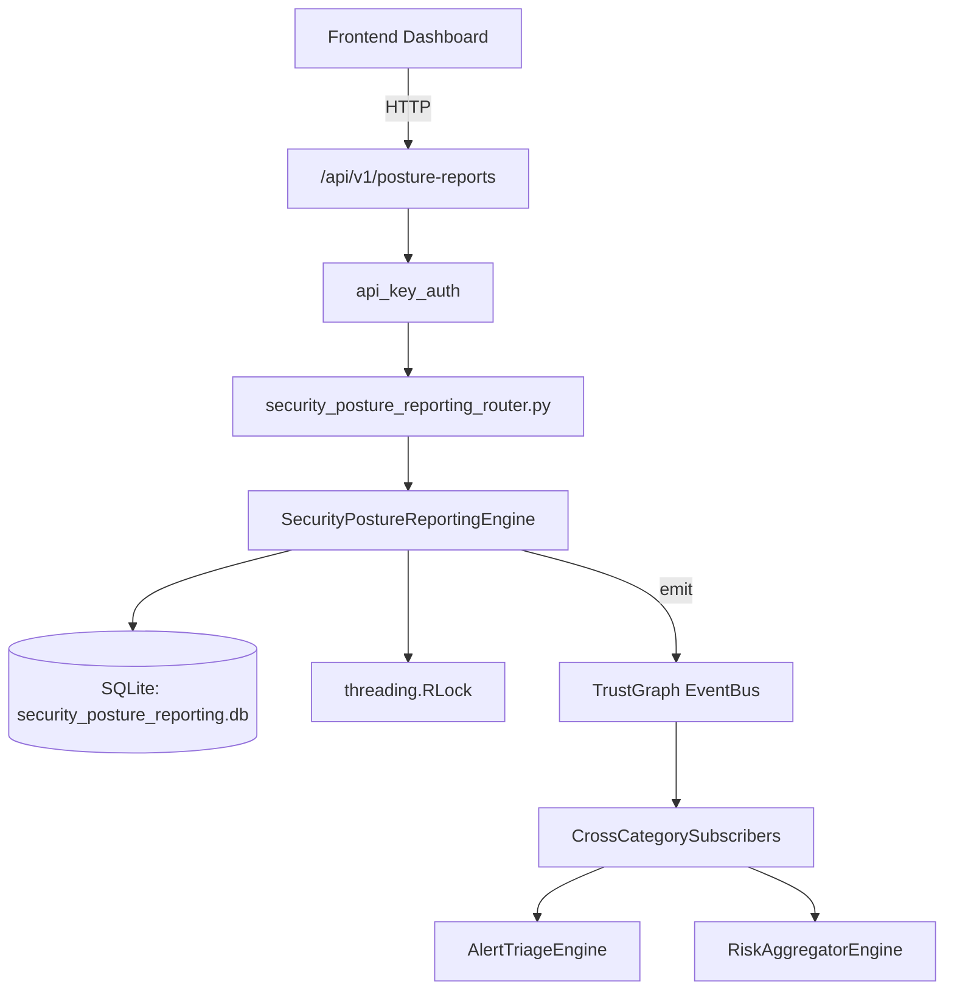

# US-0250: Security Posture Reporting

## Sub-Epic: Advanced
**Master Goal**: ALDECI — $35/mo enterprise security intelligence platform replacing $50K-500K/yr tools

## User Story
As a **Sarah Chen (CISO)**, I need to track security posture over time
so that the platform delivers enterprise-grade advanced capabilities at 1/1000th the cost of legacy tools.

## Why This Matters
Security Posture Reporting replaces functionality found in enterprise tools like CrowdStrike, Wiz, Snyk, and Rapid7.
By building this into ALDECI's $35/mo stack, customers save $50K+/yr on standalone Advanced tooling.

## Architecture

## Current State: 95% Complete
- ✅ `create_report()` — Create a new posture report in draft status. (line 179)
- ✅ `add_section()` — Add a section to a report, auto-computing status and recomputing overall score. (line 221)
- ✅ `add_metric()` — Add a metric to a report with auto-computed trend. (line 269)
- ✅ `publish_report()` — Publish a report: set status=published and published_at=now. (line 315)
- ✅ `get_report_detail()` — Return report + sections (ordered by sort_order) + metrics. (line 336)
- ✅ `list_reports()` — List reports filtered by optional report_type and/or status, newest first. (line 366)
- ❌ TrustGraph event emission — not yet verified

## Key Functions (from `suite-core/core/security_posture_reporting_engine.py` — 434 lines)
- `SecurityPostureReportingEngine.create_report()` — Create a new posture report in draft status. (line 179)
- `SecurityPostureReportingEngine.add_section()` — Add a section to a report, auto-computing status and recomputing overall score. (line 221)
- `SecurityPostureReportingEngine.add_metric()` — Add a metric to a report with auto-computed trend. (line 269)
- `SecurityPostureReportingEngine.publish_report()` — Publish a report: set status=published and published_at=now. (line 315)
- `SecurityPostureReportingEngine.get_report_detail()` — Return report + sections (ordered by sort_order) + metrics. (line 336)
- `SecurityPostureReportingEngine.list_reports()` — List reports filtered by optional report_type and/or status, newest first. (line 366)
- `SecurityPostureReportingEngine.get_latest_report()` — Return the most recent report of given type for org. (line 386)
- `SecurityPostureReportingEngine.get_trend_summary()` — Per metric_name: latest value, previous_value, trend, benchmark_value — (line 400)

## Dependencies
- **Depends on**: standalone
- **Depended by**: Routers, TrustGraph EventBus, CrossCategorySubscribers
- **TrustGraph**: Event emission wired via ResponseInterceptorMiddleware
- **Source file**: `suite-core/core/security_posture_reporting_engine.py` (434 lines)
- **Router file**: `suite-api/apps/api/security_posture_reporting_router.py`

## API Endpoints
| Method | Path | Description |
|--------|------|-------------|
| POST | `/api/v1/posture-reports/reports` | create report |
| POST | `/api/v1/posture-reports/reports/{report_id}/sections` | add section |
| POST | `/api/v1/posture-reports/reports/{report_id}/metrics` | add metric |
| PUT | `/api/v1/posture-reports/reports/{report_id}/publish` | publish report |
| GET | `/api/v1/posture-reports/reports/{report_id}` | get report detail |
| GET | `/api/v1/posture-reports/reports` | list reports |
| GET | `/api/v1/posture-reports/reports/latest/{report_type}` | get latest report |
| GET | `/api/v1/posture-reports/trends` | get trend summary |

## Tasks Remaining
1. Verify TrustGraph event emission works end-to-end (2h)
2. Add integration test with real persona workflow (2h)
3. Wire CrossCategorySubscriber consumer chain (1h)
4. Validate with 30-persona walkthrough (1h)
5. Optimize query performance for large datasets (2h)
6. Expand test coverage to edge cases (2h)

## Definition of Done
- [ ] Sarah Chen (CISO) can access /api/v1/posture-reports and get meaningful data
- [ ] All CRUD operations return correct HTTP status codes
- [ ] TrustGraph receives events from this engine
- [ ] 48+ tests passing in `tests/test_security_posture_reporting_engine.py`
- [ ] 30-persona walkthrough includes this endpoint at 100%
- [ ] No hardcoded org_id — all queries are org-scoped

## Sprint: Wave 50 (est. April 26-28, 2026)

## Test Coverage
- **Test file**: `tests/test_security_posture_reporting_engine.py`
- **Tests**: 48 tests
- **Status**: Passing
