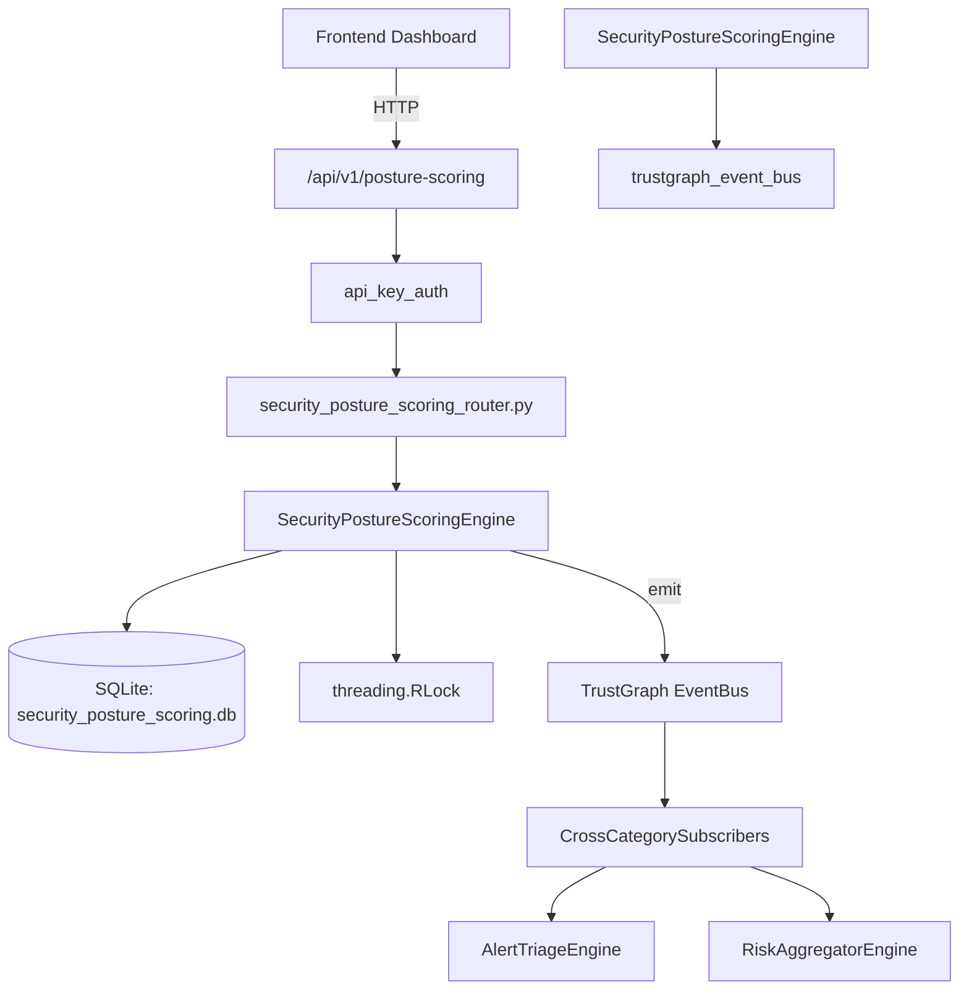

# US-0251: Security Posture Scoring

## Sub-Epic: Advanced
**Master Goal**: ALDECI — $35/mo enterprise security intelligence platform replacing $50K-500K/yr tools

## User Story
As a **Sarah Chen (CISO)**, I need to track security posture over time
so that the platform delivers enterprise-grade advanced capabilities at 1/1000th the cost of legacy tools.

## Why This Matters
Security Posture Scoring replaces functionality found in enterprise tools like CrowdStrike, Wiz, Snyk, and Rapid7.
By building this into ALDECI's $35/mo stack, customers save $50K+/yr on standalone Advanced tooling.

## Architecture

## Current State: 95% Complete
- ✅ `register_control()` — Register a new security control. (line 128)
- ✅ `list_controls()` — List controls with optional domain/status filters. (line 182)
- ✅ `get_control()` — Retrieve a single control by ID with org isolation. (line 202)
- ✅ `update_control_status()` — Update a control's status (and optionally evidence_url). (line 211)
- ✅ `get_trustgraph_context()` — Query TrustGraph for cross-domain context to enrich posture scoring. (line 249)
- ✅ `calculate_posture_score()` — Compute weighted posture score and persist a snapshot. (line 306)
- ❌ TrustGraph event emission — not yet verified

## Key Functions (from `suite-core/core/security_posture_scoring_engine.py` — 422 lines)
- `SecurityPostureScoringEngine.register_control()` — Register a new security control. (line 128)
- `SecurityPostureScoringEngine.list_controls()` — List controls with optional domain/status filters. (line 182)
- `SecurityPostureScoringEngine.get_control()` — Retrieve a single control by ID with org isolation. (line 202)
- `SecurityPostureScoringEngine.update_control_status()` — Update a control's status (and optionally evidence_url). (line 211)
- `SecurityPostureScoringEngine.get_trustgraph_context()` — Query TrustGraph for cross-domain context to enrich posture scoring. (line 249)
- `SecurityPostureScoringEngine.calculate_posture_score()` — Compute weighted posture score and persist a snapshot. (line 306)
- `SecurityPostureScoringEngine.get_posture_history()` — Retrieve posture snapshots ordered by snapshot_at DESC. (line 359)
- `SecurityPostureScoringEngine.get_posture_stats()` — Return overall score, per-domain scores, and control gap counts. (line 377)

## Dependencies
- **Depends on**: trustgraph_event_bus
- **Depended by**: Routers, TrustGraph EventBus, CrossCategorySubscribers
- **TrustGraph**: Event emission wired via ResponseInterceptorMiddleware
- **Source file**: `suite-core/core/security_posture_scoring_engine.py` (422 lines)
- **Router file**: `suite-api/apps/api/security_posture_scoring_router.py`

## API Endpoints
| Method | Path | Description |
|--------|------|-------------|
| POST | `/api/v1/posture-scoring/controls` | register control |
| GET | `/api/v1/posture-scoring/controls` | list controls |
| GET | `/api/v1/posture-scoring/controls/{control_id}` | get control |
| PATCH | `/api/v1/posture-scoring/controls/{control_id}/status` | update control status |
| POST | `/api/v1/posture-scoring/score` | calculate posture score |
| GET | `/api/v1/posture-scoring/history` | get posture history |
| GET | `/api/v1/posture-scoring/stats` | get posture stats |
| GET | `/api/v1/posture-scoring/context/{entity_id}` | get trustgraph context |

## Tasks Remaining
1. Verify TrustGraph event emission works end-to-end (2h)
2. Add integration test with real persona workflow (2h)
3. Wire CrossCategorySubscriber consumer chain (1h)
4. Validate with 30-persona walkthrough (1h)
5. Optimize query performance for large datasets (2h)
6. Expand test coverage to edge cases (2h)

## Definition of Done
- [ ] Sarah Chen (CISO) can access /api/v1/posture-scoring and get meaningful data
- [ ] All CRUD operations return correct HTTP status codes
- [ ] TrustGraph receives events from this engine
- [ ] 41+ tests passing in `tests/test_security_posture_scoring_engine.py`
- [ ] 30-persona walkthrough includes this endpoint at 100%
- [ ] No hardcoded org_id — all queries are org-scoped

## Sprint: Wave 50 (est. April 26-28, 2026)

## Test Coverage
- **Test file**: `tests/test_security_posture_scoring_engine.py`
- **Tests**: 41 tests
- **Status**: Passing
