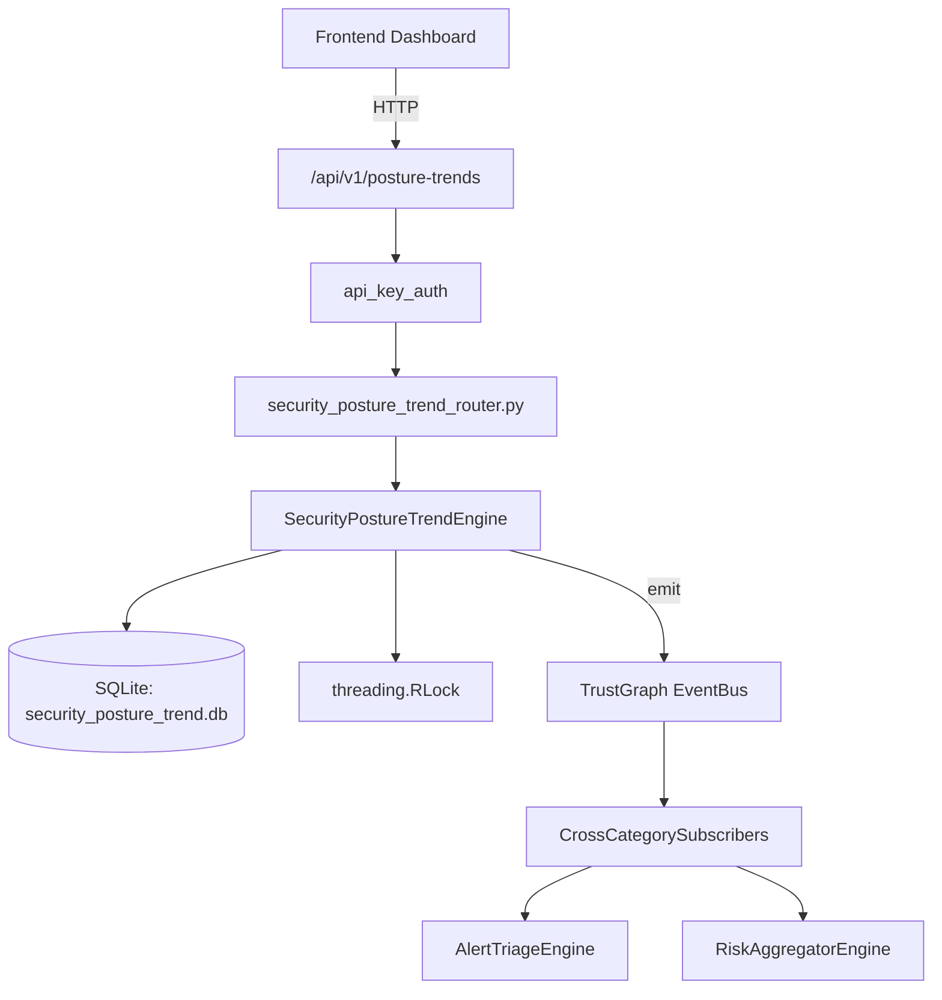

# US-0252: Security Posture Trend

## Sub-Epic: Advanced
**Master Goal**: ALDECI — $35/mo enterprise security intelligence platform replacing $50K-500K/yr tools

## User Story
As a **Sarah Chen (CISO)**, I need to track security posture over time
so that the platform delivers enterprise-grade advanced capabilities at 1/1000th the cost of legacy tools.

## Why This Matters
Security Posture Trend replaces functionality found in enterprise tools like CrowdStrike, Wiz, Snyk, and Rapid7.
By building this into ALDECI's $35/mo stack, customers save $50K+/yr on standalone Advanced tooling.

## Architecture

## Current State: 95% Complete
- ✅ `record_datapoint()` — Record a new security posture data point. (line 122)
- ✅ `analyze_trend()` — Compute trend for a metric over the given period and persist results. (line 186)
- ✅ `get_trend()` — Return the latest trend analysis for a metric. (line 251)
- ✅ `list_trends()` — List latest trend analysis per metric, optionally filtered by label. (line 267)
- ✅ `set_target()` — Create or replace a posture target for a metric. (line 318)
- ✅ `update_target_progress()` — Update current_value, recompute gap and eta_days. (line 372)
- ❌ TrustGraph event emission — not yet verified

## Key Functions (from `suite-core/core/security_posture_trend_engine.py` — 502 lines)
- `SecurityPostureTrendEngine.record_datapoint()` — Record a new security posture data point. (line 122)
- `SecurityPostureTrendEngine.analyze_trend()` — Compute trend for a metric over the given period and persist results. (line 186)
- `SecurityPostureTrendEngine.get_trend()` — Return the latest trend analysis for a metric. (line 251)
- `SecurityPostureTrendEngine.list_trends()` — List latest trend analysis per metric, optionally filtered by label. (line 267)
- `SecurityPostureTrendEngine.set_target()` — Create or replace a posture target for a metric. (line 318)
- `SecurityPostureTrendEngine.update_target_progress()` — Update current_value, recompute gap and eta_days. (line 372)
- `SecurityPostureTrendEngine.get_targets()` — List all targets for org with on_track boolean (gap > 0 and eta_days not None). (line 408)
- `SecurityPostureTrendEngine.get_stagnating_metrics()` — Return metric names with no datapoints in the last threshold_days days. (line 429)

## Dependencies
- **Depends on**: standalone
- **Depended by**: Routers, TrustGraph EventBus, CrossCategorySubscribers
- **TrustGraph**: Event emission wired via ResponseInterceptorMiddleware
- **Source file**: `suite-core/core/security_posture_trend_engine.py` (502 lines)
- **Router file**: `suite-api/apps/api/security_posture_trend_router.py`

## API Endpoints
| Method | Path | Description |
|--------|------|-------------|
| POST | `/api/v1/posture-trends/datapoints` | record datapoint |
| POST | `/api/v1/posture-trends/analyze/{metric_name}` | analyze trend |
| GET | `/api/v1/posture-trends/trends` | list trends |
| GET | `/api/v1/posture-trends/trends/{metric_name}` | get trend |
| POST | `/api/v1/posture-trends/targets` | set target |
| PUT | `/api/v1/posture-trends/targets/{metric_name}/progress` | update target progress |
| GET | `/api/v1/posture-trends/targets` | get targets |
| GET | `/api/v1/posture-trends/stagnating` | get stagnating metrics |
| GET | `/api/v1/posture-trends/velocity-summary` | get posture velocity summary |

## Tasks Remaining
1. Verify TrustGraph event emission works end-to-end (2h)
2. Add integration test with real persona workflow (2h)
3. Wire CrossCategorySubscriber consumer chain (1h)
4. Validate with 30-persona walkthrough (1h)
5. Optimize query performance for large datasets (2h)
6. Expand test coverage to edge cases (2h)

## Definition of Done
- [ ] Sarah Chen (CISO) can access /api/v1/posture-trends and get meaningful data
- [ ] All CRUD operations return correct HTTP status codes
- [ ] TrustGraph receives events from this engine
- [ ] 40+ tests passing in `tests/test_security_posture_trend_engine.py`
- [ ] 30-persona walkthrough includes this endpoint at 100%
- [ ] No hardcoded org_id — all queries are org-scoped

## Sprint: Wave 50 (est. April 26-28, 2026)

## Test Coverage
- **Test file**: `tests/test_security_posture_trend_engine.py`
- **Tests**: 40 tests
- **Status**: Passing
