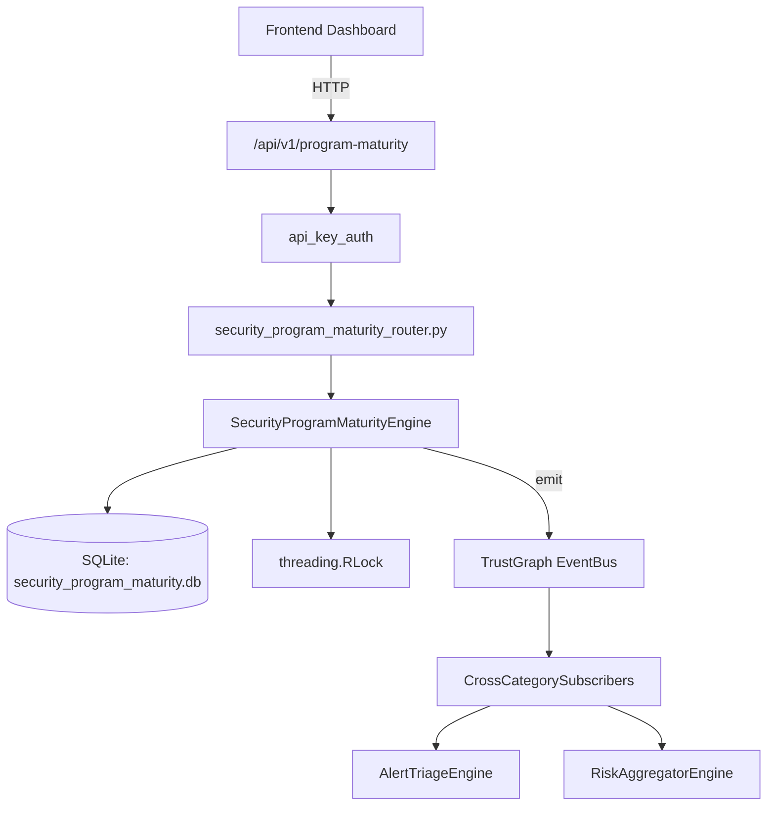

# US-0253: Security Program Maturity

## Sub-Epic: Advanced
**Master Goal**: ALDECI — $35/mo enterprise security intelligence platform replacing $50K-500K/yr tools

## User Story
As a **Sarah Chen (CISO)**, I need to assess program maturity
so that the platform delivers enterprise-grade advanced capabilities at 1/1000th the cost of legacy tools.

## Why This Matters
Security Program Maturity replaces functionality found in enterprise tools like CrowdStrike, Wiz, Snyk, and Rapid7.
By building this into ALDECI's $35/mo stack, customers save $50K+/yr on standalone Advanced tooling.

## Architecture

## Current State: 95% Complete
- ✅ `register_domain()` — Register a new maturity domain. current_level=1, score=0. (line 138)
- ✅ `assess_domain()` — Update a domain's current_level (1-5), score (0-100), evidence, and last_assesse (line 177)
- ✅ `list_domains()` — implemented (line 208)
- ✅ `create_assessment()` — Create a new formal assessment (status=in_progress). (line 220)
- ✅ `complete_assessment()` — Complete an assessment: aggregate AVG(current_level), AVG(score), COUNT from org (line 255)
- ✅ `list_assessments()` — implemented (line 292)
- ❌ TrustGraph event emission — not yet verified

## Key Functions (from `suite-core/core/security_program_maturity_engine.py` — 439 lines)
- `SecurityProgramMaturityEngine.register_domain()` — Register a new maturity domain. current_level=1, score=0. (line 138)
- `SecurityProgramMaturityEngine.assess_domain()` — Update a domain's current_level (1-5), score (0-100), evidence, and last_assesse (line 177)
- `SecurityProgramMaturityEngine.list_domains()` — Handle list domains (line 208)
- `SecurityProgramMaturityEngine.create_assessment()` — Create a new formal assessment (status=in_progress). (line 220)
- `SecurityProgramMaturityEngine.complete_assessment()` — Complete an assessment: aggregate AVG(current_level), AVG(score), COUNT from org (line 255)
- `SecurityProgramMaturityEngine.list_assessments()` — Handle list assessments (line 292)
- `SecurityProgramMaturityEngine.add_improvement()` — Add an improvement plan to a domain. (line 304)
- `SecurityProgramMaturityEngine.complete_improvement()` — Mark an improvement as completed. (line 345)

## Dependencies
- **Depends on**: standalone
- **Depended by**: Routers, TrustGraph EventBus, CrossCategorySubscribers
- **TrustGraph**: Event emission wired via ResponseInterceptorMiddleware
- **Source file**: `suite-core/core/security_program_maturity_engine.py` (439 lines)
- **Router file**: `suite-api/apps/api/security_program_maturity_router.py`

## API Endpoints
| Method | Path | Description |
|--------|------|-------------|
| POST | `/api/v1/program-maturity/domains` | register domain |
| GET | `/api/v1/program-maturity/domains` | list domains |
| POST | `/api/v1/program-maturity/domains/{domain_id}/assess` | assess domain |
| POST | `/api/v1/program-maturity/assessments` | create assessment |
| POST | `/api/v1/program-maturity/assessments/{assessment_id}/complete` | complete assessment |
| GET | `/api/v1/program-maturity/assessments` | list assessments |
| POST | `/api/v1/program-maturity/domains/{domain_id}/improvements` | add improvement |
| POST | `/api/v1/program-maturity/improvements/{improvement_id}/complete` | complete improvement |
| GET | `/api/v1/program-maturity/roadmap` | get roadmap |
| GET | `/api/v1/program-maturity/summary` | get summary |
| GET | `/api/v1/program-maturity/profile` | get maturity profile |

## Tasks Remaining
1. Verify TrustGraph event emission works end-to-end (2h)
2. Add integration test with real persona workflow (2h)
3. Wire CrossCategorySubscriber consumer chain (1h)
4. Validate with 30-persona walkthrough (1h)
5. Optimize query performance for large datasets (2h)
6. Expand test coverage to edge cases (2h)

## Definition of Done
- [ ] Sarah Chen (CISO) can access /api/v1/program-maturity and get meaningful data
- [ ] All CRUD operations return correct HTTP status codes
- [ ] TrustGraph receives events from this engine
- [ ] 49+ tests passing in `tests/test_security_program_maturity_engine.py`
- [ ] 30-persona walkthrough includes this endpoint at 100%
- [ ] No hardcoded org_id — all queries are org-scoped

## Sprint: Wave 50 (est. April 26-28, 2026)

## Test Coverage
- **Test file**: `tests/test_security_program_maturity_engine.py`
- **Tests**: 49 tests
- **Status**: Passing
