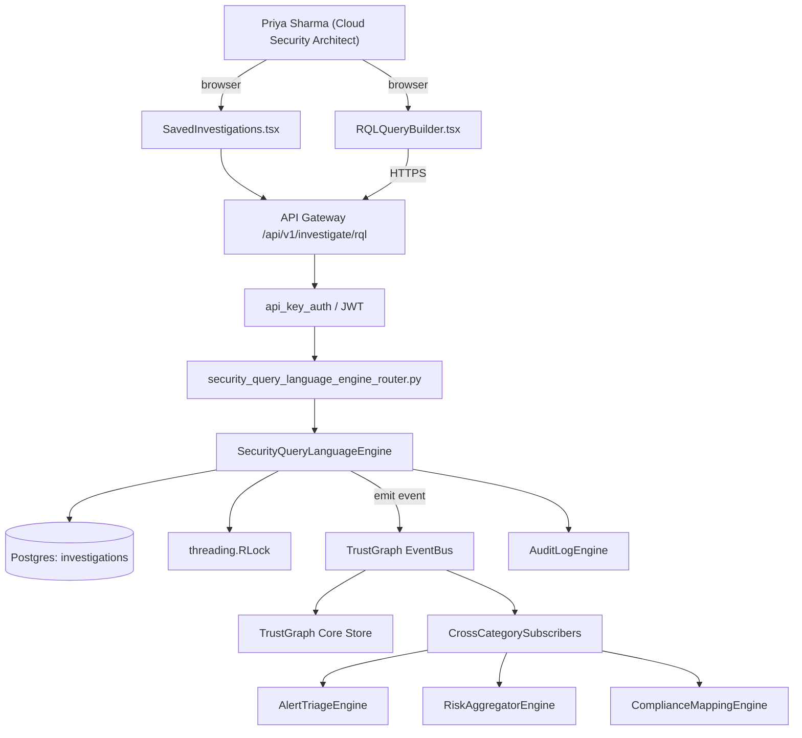

# US-0024: Add structured query language (RQL-style) over security graph + saved investigations

## Sub-Epic: CSPM
**Master Goal**: ALDECI — tiered $199-$1,499/mo enterprise security intelligence platform replacing $50K-$500K/yr tools

## User Story
As a **Priya Sharma (Cloud Security Architect)**, I need to add structured query language (RQL-style) over security graph + saved investigations so that Fixops reaches Wiz/Orca CNAPP parity so cloud teams consolidate onto ALDECI.

## Why This Matters
Per competitor-cspm.md §2, Prisma RQL is a power-user feature that lets analysts compose precise queries over cloud + audit + network + IAM data. NL alone isn't enough. Build a SQL-like DSL over TrustGraph with saved investigations.

This work is called out as a P1 gap in `competitor-cspm.md`. Shipping it is load-bearing for ALDECI's tiered $199-$1,499/mo positioning against $50K-$500K/yr incumbents: every delayed gap becomes a displacement deal we lose.

## Architecture

## Current State: 0% — MISSING (new engine)
- [ ] Engine module `suite-core/core/security_query_language_engine.py` does not exist yet
- [ ] Router `suite-api/apps/api/security_query_language_engine_router.py` does not exist yet
- [ ] DB tables listed under Data Model do not exist yet
- [ ] Frontend screens listed under Key Functions do not exist yet
- [ ] No TrustGraph events emitted yet

## Key Functions
**Backend (engine methods):**
- `create_rql()` — backs `POST /api/v1/investigate/rql`
- `get_saved()` — backs `GET /api/v1/investigate/saved`
- `create_saved()` — backs `POST /api/v1/investigate/saved`
- `create_schedule()` — backs `POST /api/v1/investigate/saved/{id}/schedule`

**Frontend screens:**
- `RQLQueryBuilder.tsx` — operator-facing UI surface for this gap
- `SavedInvestigations.tsx` — operator-facing UI surface for this gap

## API Endpoints
| Method | Path | Auth | Purpose |
|--------|------|------|---------|
| POST | `/api/v1/investigate/rql` | api_key_auth | investigate rql |
| GET | `/api/v1/investigate/saved` | api_key_auth | investigate saved |
| POST | `/api/v1/investigate/saved` | api_key_auth | investigate saved |
| POST | `/api/v1/investigate/saved/{id}/schedule` | api_key_auth | {id} schedule |

## Data Model
- add investigations table: id, org_id, name, dsl_text, schedule_cron, last_run_at, alert_on_delta (bool)

## Dependencies
**Depends on**: none explicit
**Depended by**: Router layer, TrustGraph EventBus, CrossCategorySubscribers, CrossCategoryEvidenceBuilder, AuditLogEngine
**New engine module**: `suite-core/core/security_query_language_engine.py`
**New router module**: `suite-api/apps/api/security_query_language_engine_router.py`
**Master gap id**: `GAP-024` (priority P1, effort L)

## Tasks Remaining
1. Schema migration: add investigations table (4h)
2. Implement endpoint POST /api/v1/investigate/rql (6h)
3. Implement endpoint GET /api/v1/investigate/saved (6h)
4. Implement endpoint POST /api/v1/investigate/saved (6h)
5. Implement endpoint POST /api/v1/investigate/saved/{id}/schedule (6h)
6. Wire frontend screen RQLQueryBuilder.tsx (5h)
7. Wire frontend screen SavedInvestigations.tsx (5h)
8. Write 5 pytest cases: test_rql_public_s3_bucket_query, test_autocomplete_from_schema… (6h)
9. Wire TrustGraph event emission + CrossCategorySubscriber consumers (4h)
10. Persona walkthrough + integration test (3h)
11. Docs + API reference update (2h)

## Definition of Done
- [ ] Given an admin writes `config from cloud.resource where cloud.type='aws-s3-bucket' and config.public=true`, When executed via POST /api/v1/investigate/rql, Then matching resources are returned with id, attributes, and lineage.
- [ ] Given RQLQueryBuilder.tsx, When a user drafts a query, Then the UI autocompletes entity names, attributes, and operators from TrustGraph schema.
- [ ] Given a saved investigation, When scheduled, Then it runs on the defined cadence and triggers alerts/webhooks on result deltas.
- [ ] Given an invalid query, When executed, Then the API returns HTTP 400 with line/column of the parse error.
- [ ] Given a query yielding >10k results, When executed, Then pagination and export-to-CSV are supported.
- [ ] Given the NL assistant (GAP-029) yields an answer, When the user requests 'show me the query', Then the assistant exposes the underlying RQL.
- [ ] All endpoints are org-scoped (no hardcoded org_id) and gated by `api_key_auth`.
- [ ] TrustGraph emits at least one event type for this engine and a CrossCategorySubscriber consumes it.
- [ ] `Priya Sharma (Cloud Security Architect)` can execute the full workflow in the 30-persona walkthrough.

## Tests Required
- `test_rql_public_s3_bucket_query`
- `test_autocomplete_from_schema`
- `test_saved_investigation_scheduling`
- `test_invalid_dsl_parse_error`
- `test_pagination_and_csv_export`

## Sprint: Wave 47 (est. May 20-May 26, 2026)

## Citation
Source research: `competitor-cspm.md` (gap `GAP-024`, priority `P1`, effort `L`)
