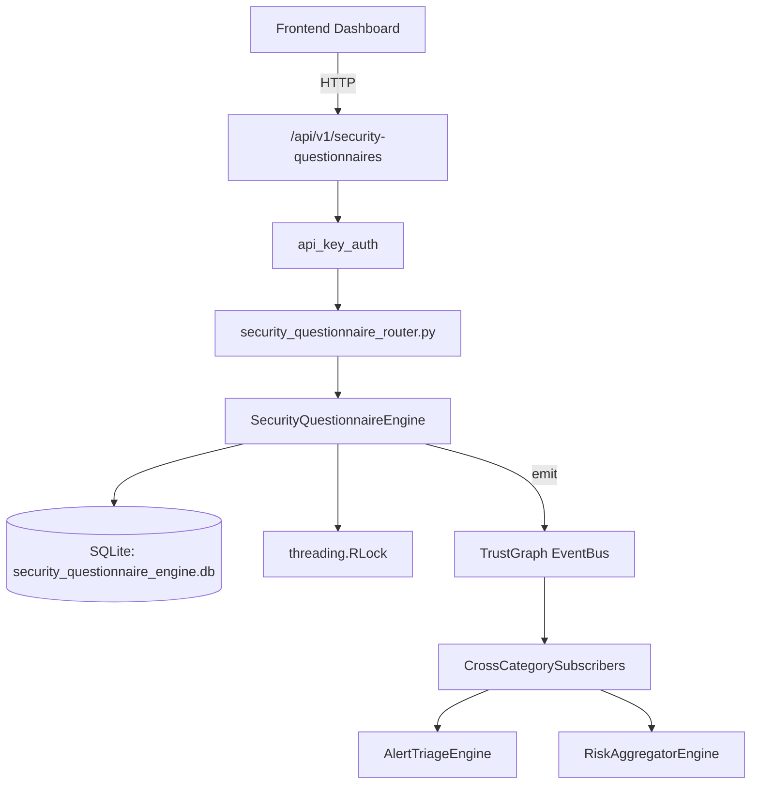

# US-0254: Security Questionnaire

## Sub-Epic: Advanced
**Master Goal**: ALDECI — $35/mo enterprise security intelligence platform replacing $50K-500K/yr tools

## User Story
As a **Robert Kim (Compliance Officer)**, I need to manage vendor questionnaires
so that the platform delivers enterprise-grade advanced capabilities at 1/1000th the cost of legacy tools.

## Why This Matters
Security Questionnaire replaces functionality found in enterprise tools like CrowdStrike, Wiz, Snyk, and Rapid7.
By building this into ALDECI's $35/mo stack, customers save $50K+/yr on standalone Advanced tooling.

## Architecture

## Current State: 95% Complete
- ✅ `create_questionnaire()` — Create a new questionnaire template. (line 150)
- ✅ `add_question()` — Add a question to a questionnaire; increments question_count. (line 190)
- ✅ `send_assessment()` — Send a questionnaire assessment to a vendor. (line 239)
- ✅ `submit_response()` — Submit a response for a question in an assessment. (line 277)
- ✅ `score_assessment()` — Score an assessment. (line 349)
- ✅ `get_assessment()` — Get assessment with its responses. (line 398)
- ❌ TrustGraph event emission — not yet verified

## Key Functions (from `suite-core/core/security_questionnaire_engine.py` — 480 lines)
- `SecurityQuestionnaireEngine.create_questionnaire()` — Create a new questionnaire template. (line 150)
- `SecurityQuestionnaireEngine.add_question()` — Add a question to a questionnaire; increments question_count. (line 190)
- `SecurityQuestionnaireEngine.send_assessment()` — Send a questionnaire assessment to a vendor. (line 239)
- `SecurityQuestionnaireEngine.submit_response()` — Submit a response for a question in an assessment. (line 277)
- `SecurityQuestionnaireEngine.score_assessment()` — Score an assessment. (line 349)
- `SecurityQuestionnaireEngine.get_assessment()` — Get assessment with its responses. (line 398)
- `SecurityQuestionnaireEngine.list_assessments()` — List assessments for an org with optional filters. (line 416)
- `SecurityQuestionnaireEngine.get_overdue_assessments()` — Return sent assessments whose due_date is in the past. (line 436)

## Dependencies
- **Depends on**: standalone
- **Depended by**: Routers, TrustGraph EventBus, CrossCategorySubscribers
- **TrustGraph**: Event emission wired via ResponseInterceptorMiddleware
- **Source file**: `suite-core/core/security_questionnaire_engine.py` (480 lines)
- **Router file**: `suite-api/apps/api/security_questionnaire_router.py`

## API Endpoints
| Method | Path | Description |
|--------|------|-------------|
| POST | `/api/v1/security-questionnaires/questionnaires` | create questionnaire |
| POST | `/api/v1/security-questionnaires/questionnaires/{questionnaire_id}/questions` | add question |
| POST | `/api/v1/security-questionnaires/assessments` | send assessment |
| POST | `/api/v1/security-questionnaires/assessments/{assessment_id}/responses` | submit response |
| POST | `/api/v1/security-questionnaires/assessments/{assessment_id}/score` | score assessment |
| GET | `/api/v1/security-questionnaires/assessments/{assessment_id}` | get assessment |
| GET | `/api/v1/security-questionnaires/assessments` | list assessments |
| GET | `/api/v1/security-questionnaires/overdue` | get overdue assessments |
| GET | `/api/v1/security-questionnaires/vendor/{vendor_id}/summary` | get vendor risk summary |

## Tasks Remaining
1. Verify TrustGraph event emission works end-to-end (2h)
2. Add integration test with real persona workflow (2h)
3. Wire CrossCategorySubscriber consumer chain (1h)
4. Validate with 30-persona walkthrough (1h)
5. Optimize query performance for large datasets (2h)
6. Expand test coverage to edge cases (2h)

## Definition of Done
- [ ] Robert Kim (Compliance Officer) can access /api/v1/security-questionnaires and get meaningful data
- [ ] All CRUD operations return correct HTTP status codes
- [ ] TrustGraph receives events from this engine
- [ ] 39+ tests passing in `tests/test_security_questionnaire_engine.py`
- [ ] 30-persona walkthrough includes this endpoint at 100%
- [ ] No hardcoded org_id — all queries are org-scoped

## Sprint: Wave 50 (est. April 26-28, 2026)

## Test Coverage
- **Test file**: `tests/test_security_questionnaire_engine.py`
- **Tests**: 39 tests
- **Status**: Passing
