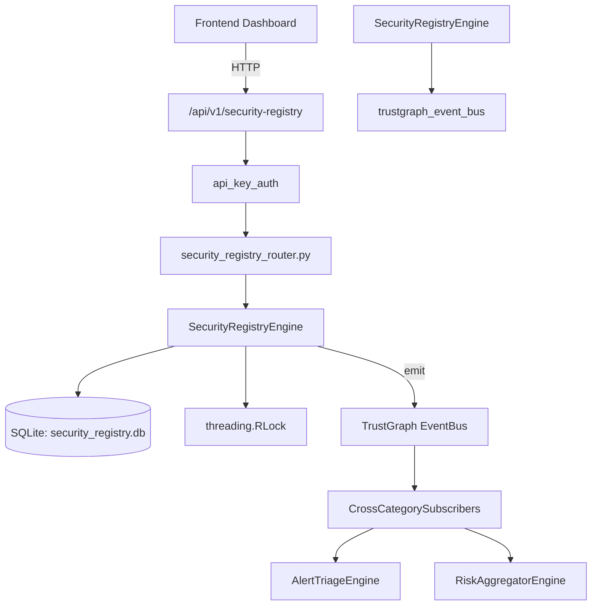

# US-0255: Security Registry

## Sub-Epic: Advanced
**Master Goal**: ALDECI — $35/mo enterprise security intelligence platform replacing $50K-500K/yr tools

## User Story
As a **James Wilson (Security Engineer)**, I need to manage security artifacts
so that the platform delivers enterprise-grade advanced capabilities at 1/1000th the cost of legacy tools.

## Why This Matters
Security Registry replaces functionality found in enterprise tools like CrowdStrike, Wiz, Snyk, and Rapid7.
By building this into ALDECI's $35/mo stack, customers save $50K+/yr on standalone Advanced tooling.

## Architecture

## Current State: 95% Complete
- ✅ `register_artifact()` — Register a new security artifact. (line 167)
- ✅ `list_artifacts()` — List artifacts with optional type/status filters. (line 235)
- ✅ `get_artifact()` — Retrieve a single artifact by ID. Returns None if not found or wrong org. (line 255)
- ✅ `update_artifact_status()` — Update the status of an artifact. Raises KeyError if not found. (line 264)
- ✅ `record_review()` — Record a review for an artifact. If approved, sets artifact to active. (line 295)
- ✅ `list_reviews()` — List reviews with optional filters. (line 350)
- ❌ TrustGraph event emission — not yet verified

## Key Functions (from `suite-core/core/security_registry_engine.py` — 508 lines)
- `SecurityRegistryEngine.register_artifact()` — Register a new security artifact. (line 167)
- `SecurityRegistryEngine.list_artifacts()` — List artifacts with optional type/status filters. (line 235)
- `SecurityRegistryEngine.get_artifact()` — Retrieve a single artifact by ID. Returns None if not found or wrong org. (line 255)
- `SecurityRegistryEngine.update_artifact_status()` — Update the status of an artifact. Raises KeyError if not found. (line 264)
- `SecurityRegistryEngine.record_review()` — Record a review for an artifact. If approved, sets artifact to active. (line 295)
- `SecurityRegistryEngine.list_reviews()` — List reviews with optional filters. (line 350)
- `SecurityRegistryEngine.add_reference()` — Add a cross-reference between two artifacts. Both must exist in org. (line 374)
- `SecurityRegistryEngine.list_references()` — List all references for an artifact. (line 425)

## Dependencies
- **Depends on**: trustgraph_event_bus
- **Depended by**: Routers, TrustGraph EventBus, CrossCategorySubscribers
- **TrustGraph**: Event emission wired via ResponseInterceptorMiddleware
- **Source file**: `suite-core/core/security_registry_engine.py` (508 lines)
- **Router file**: `suite-api/apps/api/security_registry_router.py`

## API Endpoints
| Method | Path | Description |
|--------|------|-------------|
| POST | `/api/v1/security-registry/artifacts` | register artifact |
| GET | `/api/v1/security-registry/artifacts` | list artifacts |
| GET | `/api/v1/security-registry/artifacts/{artifact_id}` | get artifact |
| PATCH | `/api/v1/security-registry/artifacts/{artifact_id}/status` | update artifact status |
| POST | `/api/v1/security-registry/artifacts/{artifact_id}/reviews` | record review |
| GET | `/api/v1/security-registry/reviews` | list reviews |
| POST | `/api/v1/security-registry/artifacts/{artifact_id}/references` | add reference |
| GET | `/api/v1/security-registry/artifacts/{artifact_id}/references` | list references |
| GET | `/api/v1/security-registry/stats` | get registry stats |

## Tasks Remaining
1. Verify TrustGraph event emission works end-to-end (2h)
2. Add integration test with real persona workflow (2h)
3. Wire CrossCategorySubscriber consumer chain (1h)
4. Validate with 30-persona walkthrough (1h)
5. Optimize query performance for large datasets (2h)
6. Expand test coverage to edge cases (2h)

## Definition of Done
- [ ] James Wilson (Security Engineer) can access /api/v1/security-registry and get meaningful data
- [ ] All CRUD operations return correct HTTP status codes
- [ ] TrustGraph receives events from this engine
- [ ] 48+ tests passing in `tests/test_security_registry_engine.py`
- [ ] 30-persona walkthrough includes this endpoint at 100%
- [ ] No hardcoded org_id — all queries are org-scoped

## Sprint: Wave 50 (est. April 26-28, 2026)

## Test Coverage
- **Test file**: `tests/test_security_registry_engine.py`
- **Tests**: 48 tests
- **Status**: Passing
