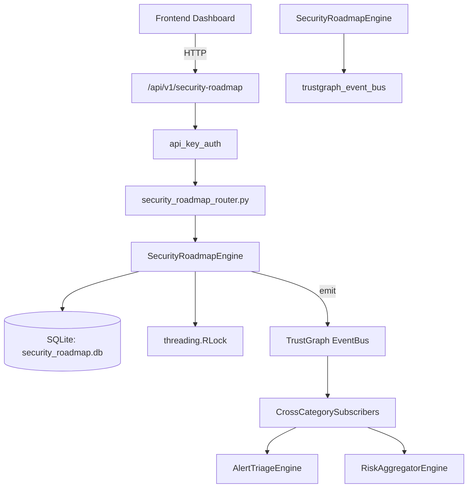

# US-0256: Security Roadmap

## Sub-Epic: Executive
**Master Goal**: ALDECI — $35/mo enterprise security intelligence platform replacing $50K-500K/yr tools

## User Story
As a **Sarah Chen (CISO)**, I need to plan security roadmap
so that the platform delivers enterprise-grade executive capabilities at 1/1000th the cost of legacy tools.

## Why This Matters
Security Roadmap replaces functionality found in enterprise tools like CrowdStrike, Wiz, Snyk, and Rapid7.
By building this into ALDECI's $35/mo stack, customers save $50K+/yr on standalone Executive tooling.

## Architecture

## Current State: 95% Complete
- ✅ `create_initiative()` — Create a new security initiative. Returns the full record. (line 139)
- ✅ `list_initiatives()` — List initiatives for an org, with optional status/category filter. (line 191)
- ✅ `get_initiative()` — Return a single initiative or None if not found / wrong org. (line 211)
- ✅ `update_initiative()` — Update allowed fields: status, owner, budget_usd, target_date. (line 222)
- ✅ `add_milestone()` — Add a milestone to an initiative. Returns the full record. (line 252)
- ✅ `list_milestones()` — List all milestones for an initiative. (line 291)
- ❌ TrustGraph event emission — not yet verified

## Key Functions (from `suite-core/core/security_roadmap_engine.py` — 522 lines)
- `SecurityRoadmapEngine.create_initiative()` — Create a new security initiative. Returns the full record. (line 139)
- `SecurityRoadmapEngine.list_initiatives()` — List initiatives for an org, with optional status/category filter. (line 191)
- `SecurityRoadmapEngine.get_initiative()` — Return a single initiative or None if not found / wrong org. (line 211)
- `SecurityRoadmapEngine.update_initiative()` — Update allowed fields: status, owner, budget_usd, target_date. (line 222)
- `SecurityRoadmapEngine.add_milestone()` — Add a milestone to an initiative. Returns the full record. (line 252)
- `SecurityRoadmapEngine.list_milestones()` — List all milestones for an initiative. (line 291)
- `SecurityRoadmapEngine.complete_milestone()` — Mark a milestone as completed. Returns True on success. (line 306)
- `SecurityRoadmapEngine.add_gap()` — Record a capability / compliance / technology / people gap. (line 325)

## Dependencies
- **Depends on**: trustgraph_event_bus
- **Depended by**: Routers, TrustGraph EventBus, CrossCategorySubscribers
- **TrustGraph**: Event emission wired via ResponseInterceptorMiddleware
- **Source file**: `suite-core/core/security_roadmap_engine.py` (522 lines)
- **Router file**: `suite-api/apps/api/security_roadmap_router.py`

## API Endpoints
| Method | Path | Description |
|--------|------|-------------|
| POST | `/api/v1/security-roadmap/initiatives` | create initiative |
| GET | `/api/v1/security-roadmap/initiatives` | list initiatives |
| GET | `/api/v1/security-roadmap/initiatives/{initiative_id}` | get initiative |
| PATCH | `/api/v1/security-roadmap/initiatives/{initiative_id}` | update initiative |
| POST | `/api/v1/security-roadmap/initiatives/{initiative_id}/milestones` | add milestone |
| GET | `/api/v1/security-roadmap/initiatives/{initiative_id}/milestones` | list milestones |
| POST | `/api/v1/security-roadmap/milestones/{milestone_id}/complete` | complete milestone |
| POST | `/api/v1/security-roadmap/gaps` | add gap |
| GET | `/api/v1/security-roadmap/gaps` | list gaps |
| POST | `/api/v1/security-roadmap/gaps/{gap_id}/link` | link gap to initiative |
| POST | `/api/v1/security-roadmap/initiatives/{initiative_id}/metrics` | add metric |
| GET | `/api/v1/security-roadmap/stats` | get roadmap stats |

## Tasks Remaining
1. Verify TrustGraph event emission works end-to-end (2h)
2. Add integration test with real persona workflow (2h)
3. Wire CrossCategorySubscriber consumer chain (1h)
4. Validate with 30-persona walkthrough (1h)
5. Optimize query performance for large datasets (2h)
6. Expand test coverage to edge cases (2h)

## Definition of Done
- [ ] Sarah Chen (CISO) can access /api/v1/security-roadmap and get meaningful data
- [ ] All CRUD operations return correct HTTP status codes
- [ ] TrustGraph receives events from this engine
- [ ] 36+ tests passing in `tests/test_security_roadmap_engine.py`
- [ ] 30-persona walkthrough includes this endpoint at 100%
- [ ] No hardcoded org_id — all queries are org-scoped

## Sprint: Wave 50 (est. April 26-28, 2026)

## Test Coverage
- **Test file**: `tests/test_security_roadmap_engine.py`
- **Tests**: 36 tests
- **Status**: Passing
