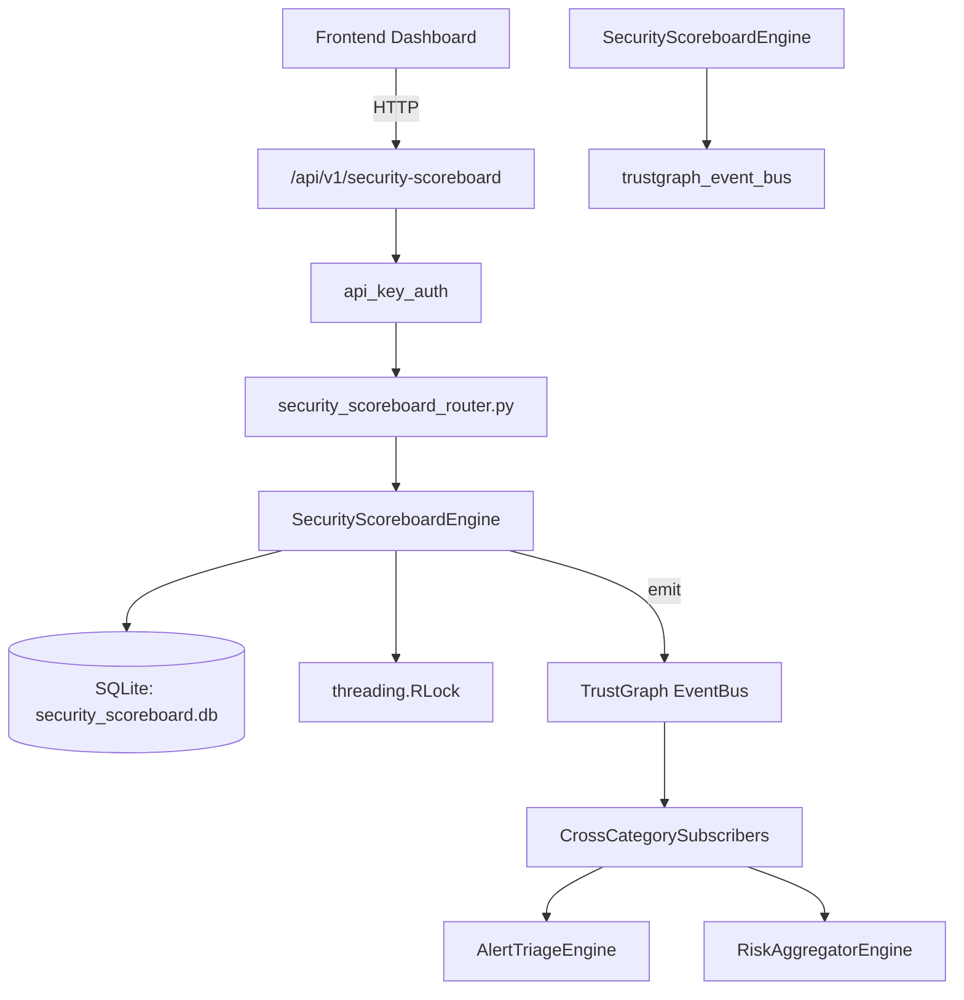

# US-0257: Security Scoreboard

## Sub-Epic: Advanced
**Master Goal**: ALDECI — $35/mo enterprise security intelligence platform replacing $50K-500K/yr tools

## User Story
As a **Emily Chang (Developer Security Champion)**, I need to gamify security metrics
so that the platform delivers enterprise-grade advanced capabilities at 1/1000th the cost of legacy tools.

## Why This Matters
Security Scoreboard replaces functionality found in enterprise tools like CrowdStrike, Wiz, Snyk, and Rapid7.
By building this into ALDECI's $35/mo stack, customers save $50K+/yr on standalone Advanced tooling.

## Architecture

## Current State: 95% Complete
- ✅ `create_team()` — Create a new security team. (line 139)
- ✅ `list_teams()` — List teams with optional type filter. (line 185)
- ✅ `get_team()` — Retrieve a single team by ID. Returns None if not found. (line 199)
- ✅ `record_challenge()` — Create a new security challenge. (line 212)
- ✅ `submit_score()` — Submit a score for a team in a challenge. (line 256)
- ✅ `list_challenges()` — List challenges with optional status filter. (line 327)
- ❌ TrustGraph event emission — not yet verified

## Key Functions (from `suite-core/core/security_scoreboard_engine.py` — 407 lines)
- `SecurityScoreboardEngine.create_team()` — Create a new security team. (line 139)
- `SecurityScoreboardEngine.list_teams()` — List teams with optional type filter. (line 185)
- `SecurityScoreboardEngine.get_team()` — Retrieve a single team by ID. Returns None if not found. (line 199)
- `SecurityScoreboardEngine.record_challenge()` — Create a new security challenge. (line 212)
- `SecurityScoreboardEngine.submit_score()` — Submit a score for a team in a challenge. (line 256)
- `SecurityScoreboardEngine.list_challenges()` — List challenges with optional status filter. (line 327)
- `SecurityScoreboardEngine.get_leaderboard()` — Return teams ordered by score DESC with rank field added. (line 345)
- `SecurityScoreboardEngine.get_scoreboard_stats()` — Return aggregated scoreboard stats for an org. (line 363)

## Dependencies
- **Depends on**: trustgraph_event_bus
- **Depended by**: Routers, TrustGraph EventBus, CrossCategorySubscribers
- **TrustGraph**: Event emission wired via ResponseInterceptorMiddleware
- **Source file**: `suite-core/core/security_scoreboard_engine.py` (407 lines)
- **Router file**: `suite-api/apps/api/security_scoreboard_router.py`

## API Endpoints
| Method | Path | Description |
|--------|------|-------------|
| POST | `/api/v1/security-scoreboard/teams` | create team |
| GET | `/api/v1/security-scoreboard/teams` | list teams |
| GET | `/api/v1/security-scoreboard/teams/{team_id}` | get team |
| POST | `/api/v1/security-scoreboard/challenges` | record challenge |
| POST | `/api/v1/security-scoreboard/challenges/{challenge_id}/score` | submit score |
| GET | `/api/v1/security-scoreboard/challenges` | list challenges |
| GET | `/api/v1/security-scoreboard/leaderboard` | get leaderboard |
| GET | `/api/v1/security-scoreboard/stats` | get scoreboard stats |

## Tasks Remaining
1. Verify TrustGraph event emission works end-to-end (2h)
2. Add integration test with real persona workflow (2h)
3. Wire CrossCategorySubscriber consumer chain (1h)
4. Validate with 30-persona walkthrough (1h)
5. Optimize query performance for large datasets (2h)
6. Expand test coverage to edge cases (2h)

## Definition of Done
- [ ] Emily Chang (Developer Security Champion) can access /api/v1/security-scoreboard and get meaningful data
- [ ] All CRUD operations return correct HTTP status codes
- [ ] TrustGraph receives events from this engine
- [ ] 38+ tests passing in `tests/test_security_scoreboard_engine.py`
- [ ] 30-persona walkthrough includes this endpoint at 100%
- [ ] No hardcoded org_id — all queries are org-scoped

## Sprint: Wave 50 (est. April 26-28, 2026)

## Test Coverage
- **Test file**: `tests/test_security_scoreboard_engine.py`
- **Tests**: 38 tests
- **Status**: Passing
