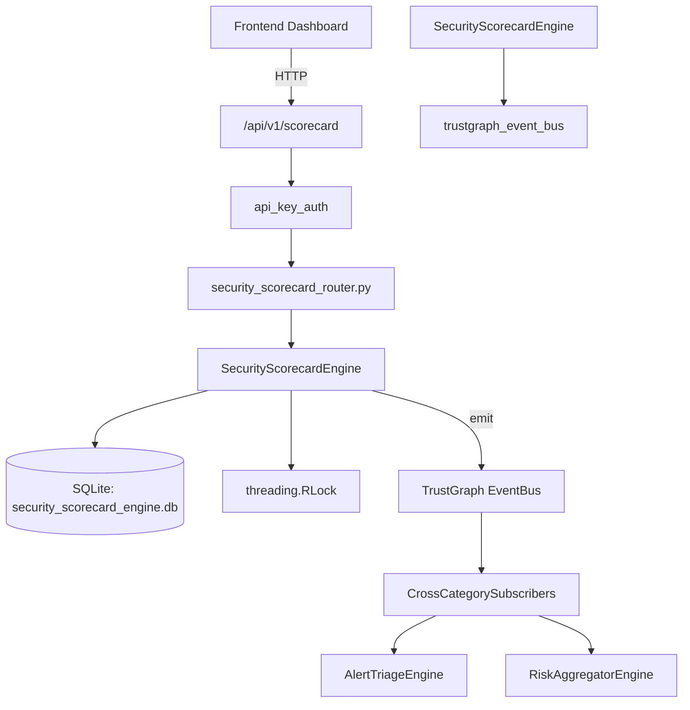

# US-0258: Security Scorecard

## Sub-Epic: Executive
**Master Goal**: ALDECI — $35/mo enterprise security intelligence platform replacing $50K-500K/yr tools

## User Story
As a **Sarah Chen (CISO)**, I need to grade organizational security
so that the platform delivers enterprise-grade executive capabilities at 1/1000th the cost of legacy tools.

## Why This Matters
Security Scorecard replaces functionality found in enterprise tools like CrowdStrike, Wiz, Snyk, and Rapid7.
By building this into ALDECI's $35/mo stack, customers save $50K+/yr on standalone Executive tooling.

## Architecture

## Current State: 95% Complete
- ✅ `create_scorecard()` — Create a scorecard with dimensions. (line 148)
- ✅ `list_scorecards()` — List scorecards for an org, optionally filtered. (line 262)
- ✅ `get_scorecard()` — Get a scorecard by ID with dimensions embedded. (line 283)
- ✅ `get_entity_trend()` — Return trend records for an entity ordered by recorded_at ascending. (line 305)
- ✅ `set_benchmark()` — Upsert a benchmark for an industry/entity_type combination. (line 323)
- ✅ `get_benchmarks()` — List benchmarks, optionally filtered by entity_type. (line 368)
- ❌ TrustGraph event emission — not yet verified

## Key Functions (from `suite-core/core/security_scorecard_engine.py` — 579 lines)
- `SecurityScorecardEngine.create_scorecard()` — Create a scorecard with dimensions. (line 148)
- `SecurityScorecardEngine.list_scorecards()` — List scorecards for an org, optionally filtered. (line 262)
- `SecurityScorecardEngine.get_scorecard()` — Get a scorecard by ID with dimensions embedded. (line 283)
- `SecurityScorecardEngine.get_entity_trend()` — Return trend records for an entity ordered by recorded_at ascending. (line 305)
- `SecurityScorecardEngine.set_benchmark()` — Upsert a benchmark for an industry/entity_type combination. (line 323)
- `SecurityScorecardEngine.get_benchmarks()` — List benchmarks, optionally filtered by entity_type. (line 368)
- `SecurityScorecardEngine.compare_to_benchmark()` — Compare a scorecard to its industry benchmark. (line 383)
- `SecurityScorecardEngine.generate_scorecard()` — Generate a scorecard from a 6-domain weighted score dict. (line 437)

## Dependencies
- **Depends on**: trustgraph_event_bus
- **Depended by**: Routers, TrustGraph EventBus, CrossCategorySubscribers
- **TrustGraph**: Event emission wired via ResponseInterceptorMiddleware
- **Source file**: `suite-core/core/security_scorecard_engine.py` (579 lines)
- **Router file**: `suite-api/apps/api/security_scorecard_router.py`

## API Endpoints
| Method | Path | Description |
|--------|------|-------------|
| GET | `/api/v1/scorecard/categories` | list categories |
| POST | `/api/v1/scorecard/{org_id}/generate` | generate scorecard |
| GET | `/api/v1/scorecard/{org_id}` | get scorecard |
| GET | `/api/v1/scorecard/{org_id}/history` | get score history |
| GET | `/api/v1/scorecard/{org_id}/breakdown` | get category breakdown |
| GET | `/api/v1/scorecard/{org_id}/improvement` | get improvement plan |
| POST | `/api/v1/scorecard/compare` | compare orgs |

## Tasks Remaining
1. Verify TrustGraph event emission works end-to-end (2h)
2. Add integration test with real persona workflow (2h)
3. Wire CrossCategorySubscriber consumer chain (1h)
4. Validate with 30-persona walkthrough (1h)
5. Optimize query performance for large datasets (2h)
6. Expand test coverage to edge cases (2h)

## Definition of Done
- [ ] Sarah Chen (CISO) can access /api/v1/scorecard and get meaningful data
- [ ] All CRUD operations return correct HTTP status codes
- [ ] TrustGraph receives events from this engine
- [ ] 50+ tests passing in `tests/test_security_scorecard_engine.py`
- [ ] 30-persona walkthrough includes this endpoint at 100%
- [ ] No hardcoded org_id — all queries are org-scoped

## Sprint: Wave 50 (est. April 26-28, 2026)

## Test Coverage
- **Test file**: `tests/test_security_scorecard_engine.py`
- **Tests**: 50 tests
- **Status**: Passing
