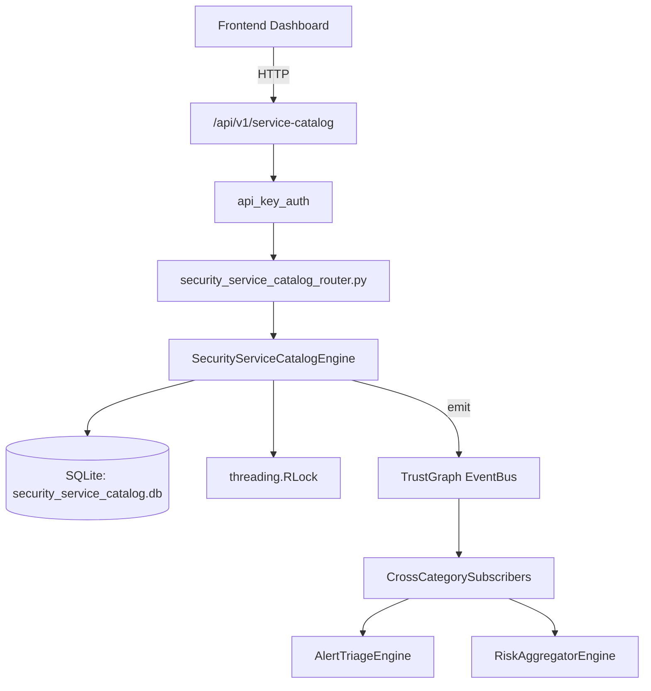

# US-0259: Security Service Catalog

## Sub-Epic: Advanced
**Master Goal**: ALDECI — $35/mo enterprise security intelligence platform replacing $50K-500K/yr tools

## User Story
As a **Daniel Thompson (SecOps Manager)**, I need to manage security service catalog
so that the platform delivers enterprise-grade advanced capabilities at 1/1000th the cost of legacy tools.

## Why This Matters
Security Service Catalog replaces functionality found in enterprise tools like CrowdStrike, Wiz, Snyk, and Rapid7.
By building this into ALDECI's $35/mo stack, customers save $50K+/yr on standalone Advanced tooling.

## Architecture

## Current State: 95% Complete
- ✅ `register_service()` — Register a new service. INSERT OR IGNORE on (org_id, service_name). (line 143)
- ✅ `submit_request()` — Submit a service request and increment service request_count. (line 200)
- ✅ `acknowledge_request()` — Acknowledge a request; compute response_hrs from submitted_at. (line 244)
- ✅ `resolve_request()` — Resolve a request; compute resolution_hrs and sla_met flag. (line 264)
- ✅ `record_outage()` — Record a new outage. resolved_at is empty initially. (line 298)
- ✅ `resolve_outage()` — Resolve outage; compute duration and recompute service availability_pct. (line 339)
- ❌ TrustGraph event emission — not yet verified

## Key Functions (from `suite-core/core/security_service_catalog_engine.py` — 488 lines)
- `SecurityServiceCatalogEngine.register_service()` — Register a new service. INSERT OR IGNORE on (org_id, service_name). (line 143)
- `SecurityServiceCatalogEngine.submit_request()` — Submit a service request and increment service request_count. (line 200)
- `SecurityServiceCatalogEngine.acknowledge_request()` — Acknowledge a request; compute response_hrs from submitted_at. (line 244)
- `SecurityServiceCatalogEngine.resolve_request()` — Resolve a request; compute resolution_hrs and sla_met flag. (line 264)
- `SecurityServiceCatalogEngine.record_outage()` — Record a new outage. resolved_at is empty initially. (line 298)
- `SecurityServiceCatalogEngine.resolve_outage()` — Resolve outage; compute duration and recompute service availability_pct. (line 339)
- `SecurityServiceCatalogEngine.get_service_summary()` — Return catalog-wide statistics. (line 383)
- `SecurityServiceCatalogEngine.get_service_detail()` — Return service + last 10 requests + last 5 outages. (line 433)

## Dependencies
- **Depends on**: standalone
- **Depended by**: Routers, TrustGraph EventBus, CrossCategorySubscribers
- **TrustGraph**: Event emission wired via ResponseInterceptorMiddleware
- **Source file**: `suite-core/core/security_service_catalog_engine.py` (488 lines)
- **Router file**: `suite-api/apps/api/security_service_catalog_router.py`

## API Endpoints
| Method | Path | Description |
|--------|------|-------------|
| POST | `/api/v1/service-catalog/services` | register service |
| POST | `/api/v1/service-catalog/services/{service_id}/requests` | submit request |
| PUT | `/api/v1/service-catalog/requests/{request_id}/acknowledge` | acknowledge request |
| PUT | `/api/v1/service-catalog/requests/{request_id}/resolve` | resolve request |
| POST | `/api/v1/service-catalog/services/{service_id}/outages` | record outage |
| PUT | `/api/v1/service-catalog/outages/{outage_id}/resolve` | resolve outage |
| GET | `/api/v1/service-catalog/summary` | get service summary |
| GET | `/api/v1/service-catalog/services/{service_id}` | get service detail |
| GET | `/api/v1/service-catalog/sla-performance` | get sla performance |

## Tasks Remaining
1. Verify TrustGraph event emission works end-to-end (2h)
2. Add integration test with real persona workflow (2h)
3. Wire CrossCategorySubscriber consumer chain (1h)
4. Validate with 30-persona walkthrough (1h)
5. Optimize query performance for large datasets (2h)
6. Expand test coverage to edge cases (2h)

## Definition of Done
- [ ] Daniel Thompson (SecOps Manager) can access /api/v1/service-catalog and get meaningful data
- [ ] All CRUD operations return correct HTTP status codes
- [ ] TrustGraph receives events from this engine
- [ ] 34+ tests passing in `tests/test_security_service_catalog_engine.py`
- [ ] 30-persona walkthrough includes this endpoint at 100%
- [ ] No hardcoded org_id — all queries are org-scoped

## Sprint: Wave 50 (est. April 26-28, 2026)

## Test Coverage
- **Test file**: `tests/test_security_service_catalog_engine.py`
- **Tests**: 34 tests
- **Status**: Passing
