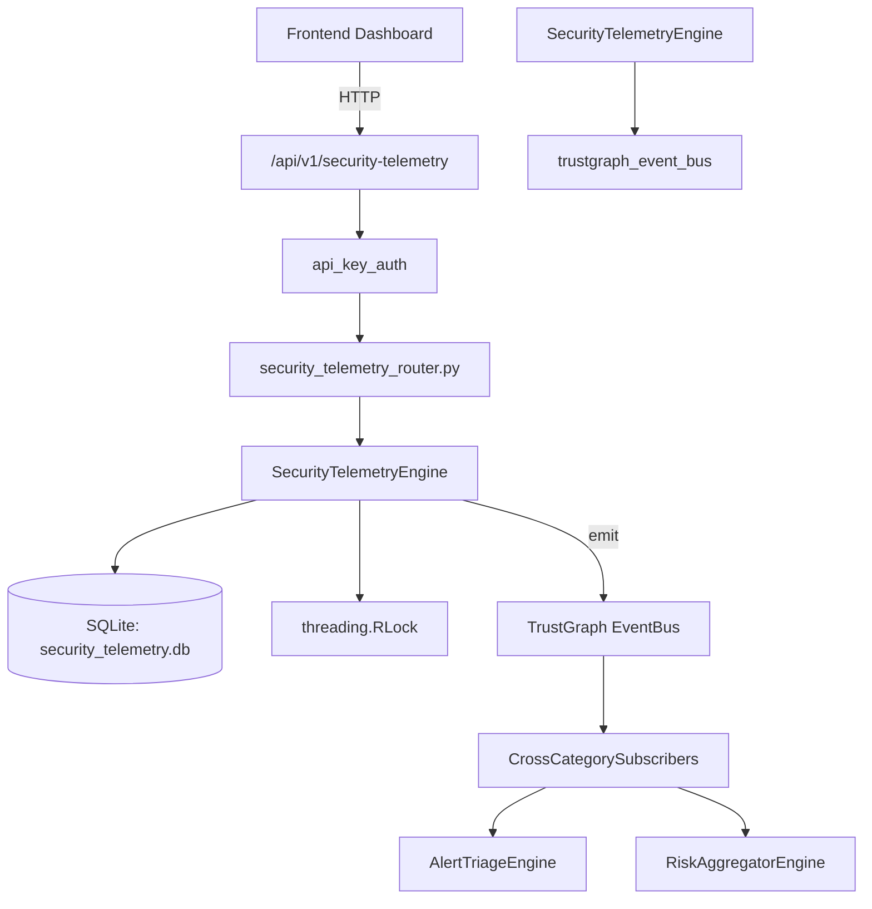

# US-0261: Security Telemetry

## Sub-Epic: Advanced
**Master Goal**: ALDECI — $35/mo enterprise security intelligence platform replacing $50K-500K/yr tools

## User Story
As a **Ryan Murphy (Platform Engineer)**, I need to collect security telemetry
so that the platform delivers enterprise-grade advanced capabilities at 1/1000th the cost of legacy tools.

## Why This Matters
Security Telemetry replaces functionality found in enterprise tools like CrowdStrike, Wiz, Snyk, and Rapid7.
By building this into ALDECI's $35/mo stack, customers save $50K+/yr on standalone Advanced tooling.

## Architecture

## Current State: 95% Complete
- ✅ `ingest_telemetry()` — Ingest a telemetry datapoint. (line 111)
- ✅ `list_telemetry()` — List telemetry datapoints with optional filters, ordered newest first. (line 152)
- ✅ `get_latest()` — Return the most recent datapoint for a telemetry_type (+ optional source). (line 179)
- ✅ `aggregate_telemetry()` — Compute an aggregation over the last N hours for a telemetry type. (line 205)
- ✅ `create_alert_rule()` — Create a telemetry alert rule. (line 273)
- ✅ `list_alert_rules()` — List alert rules, optionally filtered by enabled status. (line 315)
- ❌ TrustGraph event emission — not yet verified

## Key Functions (from `suite-core/core/security_telemetry_engine.py` — 428 lines)
- `SecurityTelemetryEngine.ingest_telemetry()` — Ingest a telemetry datapoint. (line 111)
- `SecurityTelemetryEngine.list_telemetry()` — List telemetry datapoints with optional filters, ordered newest first. (line 152)
- `SecurityTelemetryEngine.get_latest()` — Return the most recent datapoint for a telemetry_type (+ optional source). (line 179)
- `SecurityTelemetryEngine.aggregate_telemetry()` — Compute an aggregation over the last N hours for a telemetry type. (line 205)
- `SecurityTelemetryEngine.create_alert_rule()` — Create a telemetry alert rule. (line 273)
- `SecurityTelemetryEngine.list_alert_rules()` — List alert rules, optionally filtered by enabled status. (line 315)
- `SecurityTelemetryEngine.check_alert_rules()` — Evaluate all enabled rules; return list of triggered rules with current values. (line 336)
- `SecurityTelemetryEngine.get_telemetry_stats()` — Return aggregated telemetry statistics for an org. (line 384)

## Dependencies
- **Depends on**: trustgraph_event_bus
- **Depended by**: Routers, TrustGraph EventBus, CrossCategorySubscribers
- **TrustGraph**: Event emission wired via ResponseInterceptorMiddleware
- **Source file**: `suite-core/core/security_telemetry_engine.py` (428 lines)
- **Router file**: `suite-api/apps/api/security_telemetry_router.py`

## API Endpoints
| Method | Path | Description |
|--------|------|-------------|
| POST | `/api/v1/security-telemetry/datapoints` | ingest telemetry |
| GET | `/api/v1/security-telemetry/datapoints/latest` | get latest |
| GET | `/api/v1/security-telemetry/datapoints` | list telemetry |
| POST | `/api/v1/security-telemetry/aggregate` | aggregate telemetry |
| POST | `/api/v1/security-telemetry/rules` | create alert rule |
| GET | `/api/v1/security-telemetry/rules` | list alert rules |
| POST | `/api/v1/security-telemetry/rules/check` | check alert rules |
| GET | `/api/v1/security-telemetry/stats` | get telemetry stats |

## Tasks Remaining
1. Verify TrustGraph event emission works end-to-end (2h)
2. Add integration test with real persona workflow (2h)
3. Wire CrossCategorySubscriber consumer chain (1h)
4. Validate with 30-persona walkthrough (1h)
5. Optimize query performance for large datasets (2h)
6. Expand test coverage to edge cases (2h)

## Definition of Done
- [ ] Ryan Murphy (Platform Engineer) can access /api/v1/security-telemetry and get meaningful data
- [ ] All CRUD operations return correct HTTP status codes
- [ ] TrustGraph receives events from this engine
- [ ] 44+ tests passing in `tests/test_security_telemetry_engine.py`
- [ ] 30-persona walkthrough includes this endpoint at 100%
- [ ] No hardcoded org_id — all queries are org-scoped

## Sprint: Wave 50 (est. April 26-28, 2026)

## Test Coverage
- **Test file**: `tests/test_security_telemetry_engine.py`
- **Tests**: 44 tests
- **Status**: Passing
