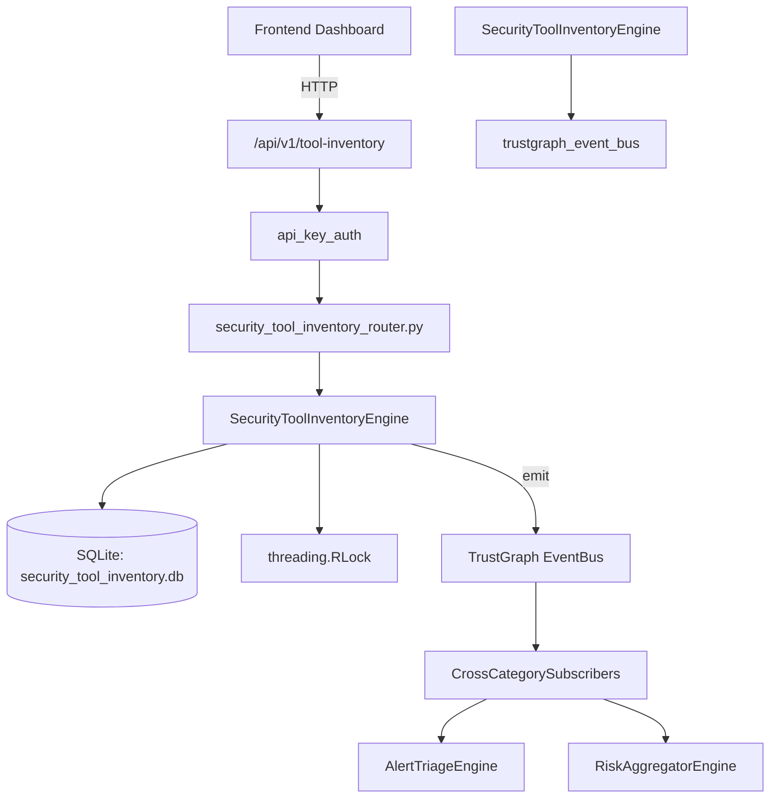

# US-0262: Security Tool Inventory

## Sub-Epic: Advanced
**Master Goal**: ALDECI — $35/mo enterprise security intelligence platform replacing $50K-500K/yr tools

## User Story
As a **Daniel Thompson (SecOps Manager)**, I need to track security tool inventory
so that the platform delivers enterprise-grade advanced capabilities at 1/1000th the cost of legacy tools.

## Why This Matters
Security Tool Inventory replaces functionality found in enterprise tools like CrowdStrike, Wiz, Snyk, and Rapid7.
By building this into ALDECI's $35/mo stack, customers save $50K+/yr on standalone Advanced tooling.

## Architecture

## Current State: 95% Complete
- ✅ `register_tool()` — Register a new security tool. (line 118)
- ✅ `list_tools()` — List tools with optional filters. (line 184)
- ✅ `get_tool()` — Get a single tool by ID with org isolation. (line 205)
- ✅ `update_tool_status()` — Update a tool's status. (line 215)
- ✅ `add_integration()` — Add an integration between tools. (line 235)
- ✅ `list_integrations()` — List integrations with optional filters. (line 270)
- ❌ TrustGraph event emission — not yet verified

## Key Functions (from `suite-core/core/security_tool_inventory_engine.py` — 421 lines)
- `SecurityToolInventoryEngine.register_tool()` — Register a new security tool. (line 118)
- `SecurityToolInventoryEngine.list_tools()` — List tools with optional filters. (line 184)
- `SecurityToolInventoryEngine.get_tool()` — Get a single tool by ID with org isolation. (line 205)
- `SecurityToolInventoryEngine.update_tool_status()` — Update a tool's status. (line 215)
- `SecurityToolInventoryEngine.add_integration()` — Add an integration between tools. (line 235)
- `SecurityToolInventoryEngine.list_integrations()` — List integrations with optional filters. (line 270)
- `SecurityToolInventoryEngine.record_assessment()` — Record a tool assessment with clamped scores. (line 295)
- `SecurityToolInventoryEngine.list_assessments()` — List assessments with optional tool_id filter. (line 338)

## Dependencies
- **Depends on**: trustgraph_event_bus
- **Depended by**: Routers, TrustGraph EventBus, CrossCategorySubscribers
- **TrustGraph**: Event emission wired via ResponseInterceptorMiddleware
- **Source file**: `suite-core/core/security_tool_inventory_engine.py` (421 lines)
- **Router file**: `suite-api/apps/api/security_tool_inventory_router.py`

## API Endpoints
| Method | Path | Description |
|--------|------|-------------|
| POST | `/api/v1/tool-inventory/tools` | register tool |
| GET | `/api/v1/tool-inventory/tools` | list tools |
| GET | `/api/v1/tool-inventory/tools/{tool_id}` | get tool |
| PUT | `/api/v1/tool-inventory/tools/{tool_id}/status` | update tool status |
| POST | `/api/v1/tool-inventory/integrations` | add integration |
| GET | `/api/v1/tool-inventory/integrations` | list integrations |
| POST | `/api/v1/tool-inventory/assessments` | record assessment |
| GET | `/api/v1/tool-inventory/assessments` | list assessments |
| GET | `/api/v1/tool-inventory/stats` | get inventory stats |

## Tasks Remaining
1. Verify TrustGraph event emission works end-to-end (2h)
2. Add integration test with real persona workflow (2h)
3. Wire CrossCategorySubscriber consumer chain (1h)
4. Validate with 30-persona walkthrough (1h)
5. Optimize query performance for large datasets (2h)
6. Expand test coverage to edge cases (2h)

## Definition of Done
- [ ] Daniel Thompson (SecOps Manager) can access /api/v1/tool-inventory and get meaningful data
- [ ] All CRUD operations return correct HTTP status codes
- [ ] TrustGraph receives events from this engine
- [ ] 34+ tests passing in `tests/test_security_tool_inventory_engine.py`
- [ ] 30-persona walkthrough includes this endpoint at 100%
- [ ] No hardcoded org_id — all queries are org-scoped

## Sprint: Wave 50 (est. April 26-28, 2026)

## Test Coverage
- **Test file**: `tests/test_security_tool_inventory_engine.py`
- **Tests**: 34 tests
- **Status**: Passing
