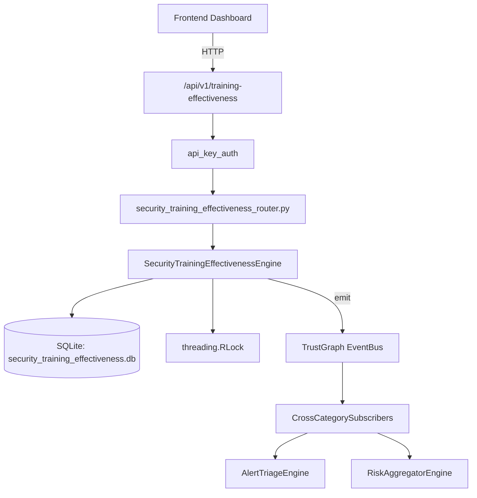

# US-0263: Security Training Effectiveness

## Sub-Epic: Advanced
**Master Goal**: ALDECI — $35/mo enterprise security intelligence platform replacing $50K-500K/yr tools

## User Story
As a **Emily Chang (Developer Security Champion)**, I need to measure training effectiveness
so that the platform delivers enterprise-grade advanced capabilities at 1/1000th the cost of legacy tools.

## Why This Matters
Security Training Effectiveness replaces functionality found in enterprise tools like CrowdStrike, Wiz, Snyk, and Rapid7.
By building this into ALDECI's $35/mo stack, customers save $50K+/yr on standalone Advanced tooling.

## Architecture

## Current State: 95% Complete
- ✅ `create_program()` — Create a new training program. (line 155)
- ✅ `list_programs()` — List programs, optionally filtered by training_type. (line 204)
- ✅ `enroll()` — Enroll an employee in a training program. (line 225)
- ✅ `record_completion()` — Record a training completion with pre/post scores. (line 256)
- ✅ `record_retention()` — Record a knowledge retention assessment. (line 325)
- ✅ `get_effectiveness()` — Return full effectiveness report for a program. (line 364)
- ❌ TrustGraph event emission — not yet verified

## Key Functions (from `suite-core/core/security_training_effectiveness_engine.py` — 501 lines)
- `SecurityTrainingEffectivenessEngine.create_program()` — Create a new training program. (line 155)
- `SecurityTrainingEffectivenessEngine.list_programs()` — List programs, optionally filtered by training_type. (line 204)
- `SecurityTrainingEffectivenessEngine.enroll()` — Enroll an employee in a training program. (line 225)
- `SecurityTrainingEffectivenessEngine.record_completion()` — Record a training completion with pre/post scores. (line 256)
- `SecurityTrainingEffectivenessEngine.record_retention()` — Record a knowledge retention assessment. (line 325)
- `SecurityTrainingEffectivenessEngine.get_effectiveness()` — Return full effectiveness report for a program. (line 364)
- `SecurityTrainingEffectivenessEngine.get_department_compliance()` — Completion rate, avg score, passed count by department. (line 435)
- `SecurityTrainingEffectivenessEngine.get_summary()` — Aggregate summary across all programs for an org. (line 466)

## Dependencies
- **Depends on**: standalone
- **Depended by**: Routers, TrustGraph EventBus, CrossCategorySubscribers
- **TrustGraph**: Event emission wired via ResponseInterceptorMiddleware
- **Source file**: `suite-core/core/security_training_effectiveness_engine.py` (501 lines)
- **Router file**: `suite-api/apps/api/security_training_effectiveness_router.py`

## API Endpoints
| Method | Path | Description |
|--------|------|-------------|
| POST | `/api/v1/training-effectiveness/programs` | create program |
| GET | `/api/v1/training-effectiveness/programs` | list programs |
| GET | `/api/v1/training-effectiveness/programs/{program_id}/effectiveness` | get effectiveness |
| POST | `/api/v1/training-effectiveness/programs/{program_id}/enroll` | enroll |
| POST | `/api/v1/training-effectiveness/programs/{program_id}/complete` | record completion |
| POST | `/api/v1/training-effectiveness/programs/{program_id}/retention` | record retention |
| GET | `/api/v1/training-effectiveness/department-compliance` | get department compliance |
| GET | `/api/v1/training-effectiveness/summary` | get summary |

## Tasks Remaining
1. Verify TrustGraph event emission works end-to-end (2h)
2. Add integration test with real persona workflow (2h)
3. Wire CrossCategorySubscriber consumer chain (1h)
4. Validate with 30-persona walkthrough (1h)
5. Optimize query performance for large datasets (2h)
6. Expand test coverage to edge cases (2h)

## Definition of Done
- [ ] Emily Chang (Developer Security Champion) can access /api/v1/training-effectiveness and get meaningful data
- [ ] All CRUD operations return correct HTTP status codes
- [ ] TrustGraph receives events from this engine
- [ ] 41+ tests passing in `tests/test_security_training_effectiveness_engine.py`
- [ ] 30-persona walkthrough includes this endpoint at 100%
- [ ] No hardcoded org_id — all queries are org-scoped

## Sprint: Wave 50 (est. April 26-28, 2026)

## Test Coverage
- **Test file**: `tests/test_security_training_effectiveness_engine.py`
- **Tests**: 41 tests
- **Status**: Passing
