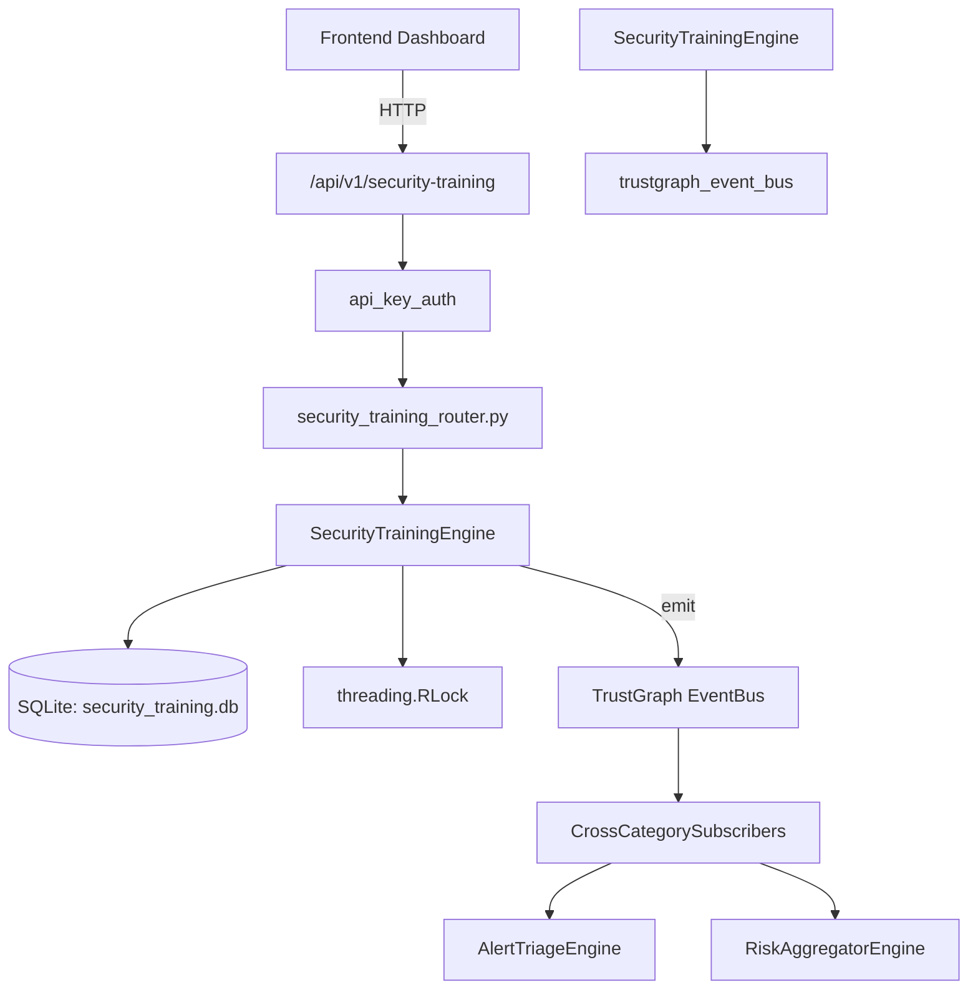

# US-0264: Security Training

## Sub-Epic: Advanced
**Master Goal**: ALDECI — $35/mo enterprise security intelligence platform replacing $50K-500K/yr tools

## User Story
As a **Emily Chang (Developer Security Champion)**, I need to measure training effectiveness
so that the platform delivers enterprise-grade advanced capabilities at 1/1000th the cost of legacy tools.

## Why This Matters
Security Training replaces functionality found in enterprise tools like CrowdStrike, Wiz, Snyk, and Rapid7.
By building this into ALDECI's $35/mo stack, customers save $50K+/yr on standalone Advanced tooling.

## Architecture

## Current State: 95% Complete
- ✅ `create_course()` — Create a training course. Returns the created course record. (line 201)
- ✅ `list_courses()` — List training courses for an org, optionally filtered by category/course_type/ma (line 274)
- ✅ `enroll_user()` — Enroll a user in a course. Returns the enrollment record. (line 305)
- ✅ `assign_training()` — Create a training assignment with auto-computed due_date from course frequency. (line 357)
- ✅ `list_enrollments()` — List enrollments for an org with optional filters. Auto-detects overdue. (line 392)
- ✅ `list_assignments()` — Spec-aligned alias for list_enrollments. (line 434)
- ❌ TrustGraph event emission — not yet verified

## Key Functions (from `suite-core/core/security_training_engine.py` — 944 lines)
- `SecurityTrainingEngine.create_course()` — Create a training course. Returns the created course record. (line 201)
- `SecurityTrainingEngine.list_courses()` — List training courses for an org, optionally filtered by category/course_type/ma (line 274)
- `SecurityTrainingEngine.enroll_user()` — Enroll a user in a course. Returns the enrollment record. (line 305)
- `SecurityTrainingEngine.assign_training()` — Create a training assignment with auto-computed due_date from course frequency. (line 357)
- `SecurityTrainingEngine.list_enrollments()` — List enrollments for an org with optional filters. Auto-detects overdue. (line 392)
- `SecurityTrainingEngine.list_assignments()` — Spec-aligned alias for list_enrollments. (line 434)
- `SecurityTrainingEngine.complete_course()` — Record a course completion. Returns the completion record. (line 450)
- `SecurityTrainingEngine.complete_training()` — Spec-aligned alias for complete_course. (line 585)

## Dependencies
- **Depends on**: trustgraph_event_bus
- **Depended by**: Routers, TrustGraph EventBus, CrossCategorySubscribers
- **TrustGraph**: Event emission wired via ResponseInterceptorMiddleware
- **Source file**: `suite-core/core/security_training_engine.py` (944 lines)
- **Router file**: `suite-api/apps/api/security_training_router.py`

## API Endpoints
| Method | Path | Description |
|--------|------|-------------|
| GET | `/api/v1/security-training/courses` | list courses |
| POST | `/api/v1/security-training/courses` | create course |
| GET | `/api/v1/security-training/enrollments` | list enrollments |
| POST | `/api/v1/security-training/enrollments` | enroll user |
| POST | `/api/v1/security-training/enrollments/{enrollment_id}/complete` | complete enrollment |
| GET | `/api/v1/security-training/campaigns` | list campaigns |
| POST | `/api/v1/security-training/campaigns` | create campaign |
| GET | `/api/v1/security-training/stats` | get stats |
| GET | `/api/v1/security-training/users/{user_id}/progress` | get user progress |

## Tasks Remaining
1. Verify TrustGraph event emission works end-to-end (2h)
2. Add integration test with real persona workflow (2h)
3. Wire CrossCategorySubscriber consumer chain (1h)
4. Validate with 30-persona walkthrough (1h)
5. Optimize query performance for large datasets (2h)
6. Expand test coverage to edge cases (2h)

## Definition of Done
- [ ] Emily Chang (Developer Security Champion) can access /api/v1/security-training and get meaningful data
- [ ] All CRUD operations return correct HTTP status codes
- [ ] TrustGraph receives events from this engine
- [ ] 45+ tests passing in `tests/test_security_training_engine.py`
- [ ] 30-persona walkthrough includes this endpoint at 100%
- [ ] No hardcoded org_id — all queries are org-scoped

## Sprint: Wave 50 (est. April 26-28, 2026)

## Test Coverage
- **Test file**: `tests/test_security_training_engine.py`
- **Tests**: 45 tests
- **Status**: Passing
