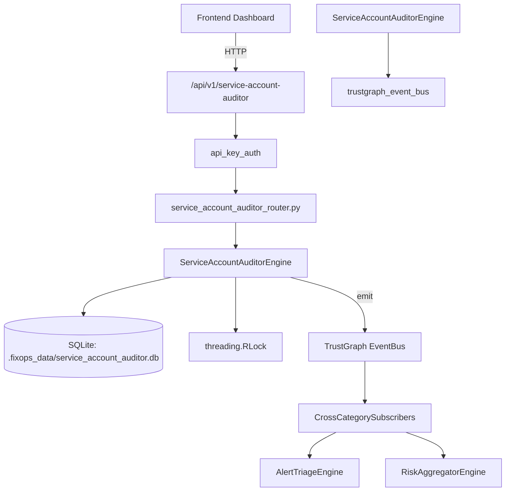

# US-0265: Service Account Auditor

## Sub-Epic: Identity
**Master Goal**: ALDECI — $35/mo enterprise security intelligence platform replacing $50K-500K/yr tools

## User Story
As a **Maria Lopez (IT Director)**, I need to audit service accounts
so that the platform delivers enterprise-grade identity capabilities at 1/1000th the cost of legacy tools.

## Why This Matters
Service Account Auditor replaces functionality found in enterprise tools like CrowdStrike, Wiz, Snyk, and Rapid7.
By building this into ALDECI's $35/mo stack, customers save $50K+/yr on standalone Identity tooling.

## Architecture

## Current State: 95% Complete
- ✅ `register_service_account()` — Register a service account for auditing. (line 243)
- ✅ `list_service_accounts()` — List all service accounts for an org, optionally filtered by system. (line 307)
- ✅ `run_audit()` — Run a security audit for a specific service account. (line 331)
- ✅ `get_unused_accounts()` — Return accounts not used in the last N days. (line 390)
- ✅ `get_overprivileged_accounts()` — Return accounts with risk_score > 70. (line 410)
- ✅ `rotate_credentials()` — Record a credential rotation event for a service account. (line 430)
- ❌ TrustGraph event emission — not yet verified

## Key Functions (from `suite-core/core/service_account_auditor_engine.py` — 554 lines)
- `ServiceAccountAuditorEngine.register_service_account()` — Register a service account for auditing. (line 243)
- `ServiceAccountAuditorEngine.list_service_accounts()` — List all service accounts for an org, optionally filtered by system. (line 307)
- `ServiceAccountAuditorEngine.run_audit()` — Run a security audit for a specific service account. (line 331)
- `ServiceAccountAuditorEngine.get_unused_accounts()` — Return accounts not used in the last N days. (line 390)
- `ServiceAccountAuditorEngine.get_overprivileged_accounts()` — Return accounts with risk_score > 70. (line 410)
- `ServiceAccountAuditorEngine.rotate_credentials()` — Record a credential rotation event for a service account. (line 430)
- `ServiceAccountAuditorEngine.list_rotation_history()` — Return all rotation events for a service account. (line 472)
- `ServiceAccountAuditorEngine.get_audit_stats()` — Return aggregate statistics for an org's service accounts. (line 487)

## Dependencies
- **Depends on**: trustgraph_event_bus
- **Depended by**: Routers, TrustGraph EventBus, CrossCategorySubscribers
- **TrustGraph**: Event emission wired via ResponseInterceptorMiddleware
- **Source file**: `suite-core/core/service_account_auditor_engine.py` (554 lines)
- **Router file**: `suite-api/apps/api/service_account_auditor_router.py`

## API Endpoints
| Method | Path | Description |
|--------|------|-------------|
| POST | `/api/v1/service-account-auditor/accounts` | register account |
| GET | `/api/v1/service-account-auditor/accounts` | list accounts |
| GET | `/api/v1/service-account-auditor/accounts/unused` | get unused |
| GET | `/api/v1/service-account-auditor/accounts/overprivileged` | get overprivileged |
| POST | `/api/v1/service-account-auditor/accounts/{account_id}/audit` | run audit |
| POST | `/api/v1/service-account-auditor/accounts/{account_id}/rotate` | rotate credentials |
| GET | `/api/v1/service-account-auditor/accounts/{account_id}/rotation-history` | rotation history |
| GET | `/api/v1/service-account-auditor/stats` | get stats |

## Tasks Remaining
1. Verify TrustGraph event emission works end-to-end (2h)
2. Add integration test with real persona workflow (2h)
3. Wire CrossCategorySubscriber consumer chain (1h)
4. Validate with 30-persona walkthrough (1h)
5. Optimize query performance for large datasets (2h)
6. Expand test coverage to edge cases (2h)

## Definition of Done
- [ ] Maria Lopez (IT Director) can access /api/v1/service-account-auditor and get meaningful data
- [ ] All CRUD operations return correct HTTP status codes
- [ ] TrustGraph receives events from this engine
- [ ] 41+ tests passing in `tests/test_service_account_auditor_engine.py`
- [ ] 30-persona walkthrough includes this endpoint at 100%
- [ ] No hardcoded org_id — all queries are org-scoped

## Sprint: Wave 50 (est. April 26-28, 2026)

## Test Coverage
- **Test file**: `tests/test_service_account_auditor_engine.py`
- **Tests**: 41 tests
- **Status**: Passing
