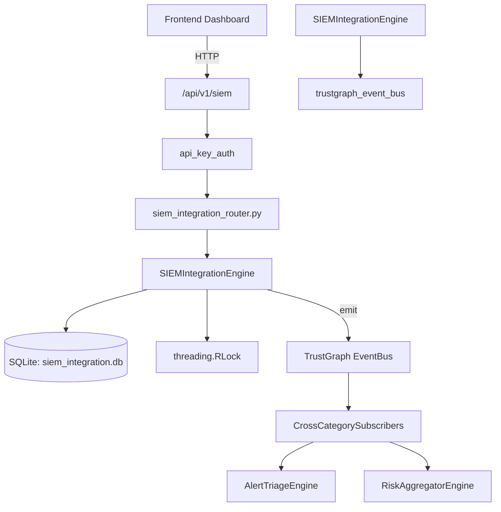

# US-0266: Siem Integration

## Sub-Epic: SOC
**Master Goal**: ALDECI — $35/mo enterprise security intelligence platform replacing $50K-500K/yr tools

## User Story
As a **Priya Sharma (SOC T2 Analyst)**, I need to manage SIEM event integration
so that the platform delivers enterprise-grade soc capabilities at 1/1000th the cost of legacy tools.

## Why This Matters
Siem Integration replaces functionality found in enterprise tools like CrowdStrike, Wiz, Snyk, and Rapid7.
By building this into ALDECI's $35/mo stack, customers save $50K+/yr on standalone SOC tooling.

## Architecture

## Current State: 95% Complete
- ✅ `register_siem()` — Register a new SIEM integration. (line 180)
- ✅ `list_siems()` — List all registered SIEMs for an org. (line 225)
- ✅ `get_siem()` — Get a single SIEM integration. (line 234)
- ✅ `update_siem_status()` — Enable or disable a SIEM integration. (line 243)
- ✅ `ingest_event()` — Normalize and store a SIEM event. (line 257)
- ✅ `list_events()` — List events with optional filters. (line 310)
- ❌ TrustGraph event emission — not yet verified

## Key Functions (from `suite-core/core/siem_integration_engine.py` — 971 lines)
- `SIEMIntegrationEngine.register_siem()` — Register a new SIEM integration. (line 180)
- `SIEMIntegrationEngine.list_siems()` — List all registered SIEMs for an org. (line 225)
- `SIEMIntegrationEngine.get_siem()` — Get a single SIEM integration. (line 234)
- `SIEMIntegrationEngine.update_siem_status()` — Enable or disable a SIEM integration. (line 243)
- `SIEMIntegrationEngine.ingest_event()` — Normalize and store a SIEM event. (line 257)
- `SIEMIntegrationEngine.list_events()` — List events with optional filters. (line 310)
- `SIEMIntegrationEngine.correlate_events()` — Apply a correlation rule and return matched event groups. (line 345)
- `SIEMIntegrationEngine.create_alert()` — Create a SIEM alert. (line 400)

## Dependencies
- **Depends on**: trustgraph_event_bus
- **Depended by**: Routers, TrustGraph EventBus, CrossCategorySubscribers
- **TrustGraph**: Event emission wired via ResponseInterceptorMiddleware
- **Source file**: `suite-core/core/siem_integration_engine.py` (971 lines)
- **Router file**: `suite-api/apps/api/siem_integration_router.py`

## API Endpoints
| Method | Path | Description |
|--------|------|-------------|
| POST | `/api/v1/siem/sources` | create source |
| GET | `/api/v1/siem/sources` | list sources |
| GET | `/api/v1/siem/sources/{source_id}` | get source |
| POST | `/api/v1/siem/events` | ingest event |
| GET | `/api/v1/siem/events` | list events |
| POST | `/api/v1/siem/alerts` | create alert |
| GET | `/api/v1/siem/alerts` | list alerts |
| PUT | `/api/v1/siem/alerts/{alert_id}/acknowledge` | acknowledge alert |
| GET | `/api/v1/siem/stats` | get stats |
| GET | `/api/v1/siem/integrations` | list integrations |
| POST | `/api/v1/siem/integrations` | register integration |
| GET | `/api/v1/siem/integrations/{siem_id}` | get integration |

## Tasks Remaining
1. Verify TrustGraph event emission works end-to-end (2h)
2. Add integration test with real persona workflow (2h)
3. Wire CrossCategorySubscriber consumer chain (1h)
4. Validate with 30-persona walkthrough (1h)
5. Optimize query performance for large datasets (2h)
6. Expand test coverage to edge cases (2h)

## Definition of Done
- [ ] Priya Sharma (SOC T2 Analyst) can access /api/v1/siem and get meaningful data
- [ ] All CRUD operations return correct HTTP status codes
- [ ] TrustGraph receives events from this engine
- [ ] 43+ tests passing in `tests/test_siem_integration_engine.py`
- [ ] 30-persona walkthrough includes this endpoint at 100%
- [ ] No hardcoded org_id — all queries are org-scoped

## Sprint: Wave 50 (est. April 26-28, 2026)

## Test Coverage
- **Test file**: `tests/test_siem_integration_engine.py`
- **Tests**: 43 tests
- **Status**: Passing
