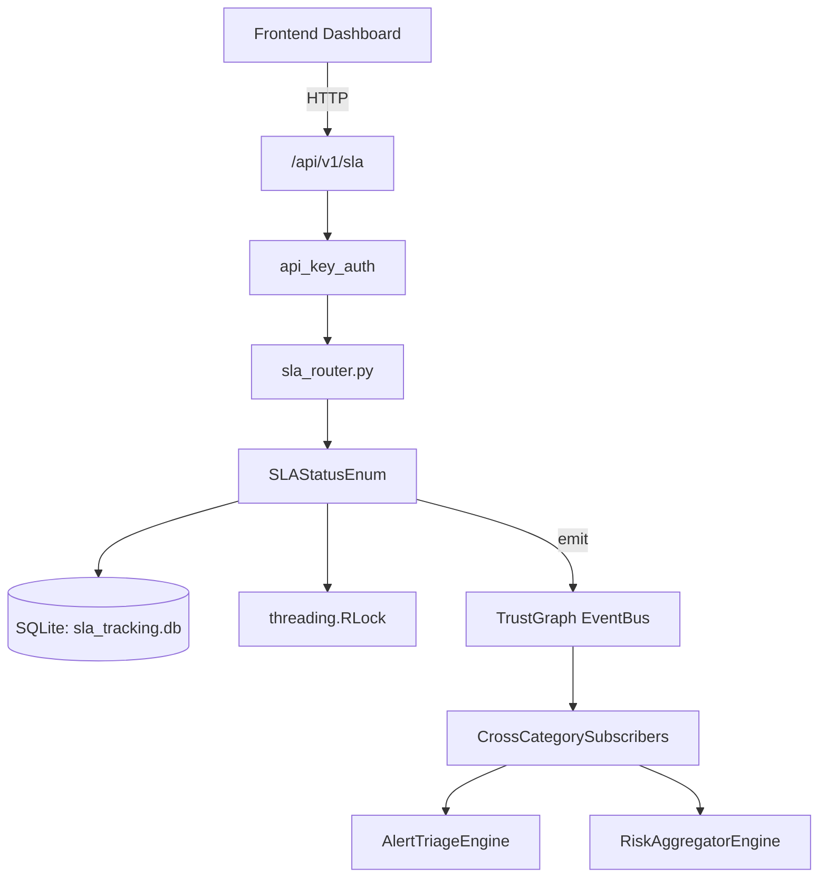

# US-0267: Sla

## Sub-Epic: Advanced
**Master Goal**: ALDECI — $35/mo enterprise security intelligence platform replacing $50K-500K/yr tools

## User Story
As a **Marcus Johnson (VP Engineering)**, I need to track security SLA compliance
so that the platform delivers enterprise-grade advanced capabilities at 1/1000th the cost of legacy tools.

## Why This Matters
Sla replaces functionality found in enterprise tools like CrowdStrike, Wiz, Snyk, and Rapid7.
By building this into ALDECI's $35/mo stack, customers save $50K+/yr on standalone Advanced tooling.

## Architecture

## Current State: 95% Complete
- ✅ `create_sla_policy()` — Create a named SLA policy. Updates existing policy with same name+org. (line 264)
- ✅ `track_finding()` — Start tracking a finding against SLA. Returns tracking record. (line 301)
- ✅ `check_status()` — Check SLA status for a finding. Returns ON_TRACK, AT_RISK, BREACHED, or RESOLVED (line 350)
- ✅ `get_at_risk_findings()` — Get all findings at risk of SLA breach (AT_RISK or BREACHED, not RESOLVED). (line 359)
- ✅ `record_resolution()` — Record that a finding has been resolved. Marks SLA as RESOLVED. (line 372)
- ✅ `calculate_compliance_rate()` — Calculate SLA compliance rate for past N days (findings resolved within deadline (line 392)
- ❌ TrustGraph event emission — not yet verified

## Key Functions (from `suite-core/core/sla_engine.py` — 474 lines)
- `SLAEngine.create_sla_policy()` — Create a named SLA policy. Updates existing policy with same name+org. (line 264)
- `SLAEngine.track_finding()` — Start tracking a finding against SLA. Returns tracking record. (line 301)
- `SLAEngine.check_status()` — Check SLA status for a finding. Returns ON_TRACK, AT_RISK, BREACHED, or RESOLVED (line 350)
- `SLAEngine.get_at_risk_findings()` — Get all findings at risk of SLA breach (AT_RISK or BREACHED, not RESOLVED). (line 359)
- `SLAEngine.record_resolution()` — Record that a finding has been resolved. Marks SLA as RESOLVED. (line 372)
- `SLAEngine.calculate_compliance_rate()` — Calculate SLA compliance rate for past N days (findings resolved within deadline (line 392)
- `SLAEngine.send_breach_alerts()` — Send alerts for findings about to breach (>90% of deadline). Returns alert IDs. (line 415)
- `SLAEngine.get_dashboard()` — Return aggregated SLA dashboard metrics. (line 449)

## Dependencies
- **Depends on**: standalone
- **Depended by**: Routers, TrustGraph EventBus, CrossCategorySubscribers
- **TrustGraph**: Event emission wired via ResponseInterceptorMiddleware
- **Source file**: `suite-core/core/sla_engine.py` (474 lines)
- **Router file**: `suite-api/apps/api/sla_router.py`

## API Endpoints
| Method | Path | Description |
|--------|------|-------------|
| POST | `/api/v1/sla/policies` | create or update policy |
| GET | `/api/v1/sla/policies` | get policy |
| POST | `/api/v1/sla/track` | track finding |
| POST | `/api/v1/sla/track/bulk` | bulk track |
| GET | `/api/v1/sla/status/{finding_id}` | get sla status |
| GET | `/api/v1/sla/breached` | get breached |
| GET | `/api/v1/sla/at-risk` | get at risk |
| GET | `/api/v1/sla/compliance` | get compliance |
| GET | `/api/v1/sla/dashboard` | get dashboard |
| POST | `/api/v1/sla/escalate` | run escalation |
| GET | `/api/v1/sla/dashboard-legacy` | sla dashboard legacy |
| GET | `/api/v1/sla/metrics` | sla metrics |

## Tasks Remaining
1. Verify TrustGraph event emission works end-to-end (2h)
2. Add integration test with real persona workflow (2h)
3. Wire CrossCategorySubscriber consumer chain (1h)
4. Validate with 30-persona walkthrough (1h)
5. Optimize query performance for large datasets (2h)
6. Expand test coverage to edge cases (2h)

## Definition of Done
- [ ] Marcus Johnson (VP Engineering) can access /api/v1/sla and get meaningful data
- [ ] All CRUD operations return correct HTTP status codes
- [ ] TrustGraph receives events from this engine
- [ ] 28+ tests passing in `tests/test_sla_engine.py`
- [ ] 30-persona walkthrough includes this endpoint at 100%
- [ ] No hardcoded org_id — all queries are org-scoped

## Sprint: Wave 50 (est. April 26-28, 2026)

## Test Coverage
- **Test file**: `tests/test_sla_engine.py`
- **Tests**: 28 tests
- **Status**: Passing
