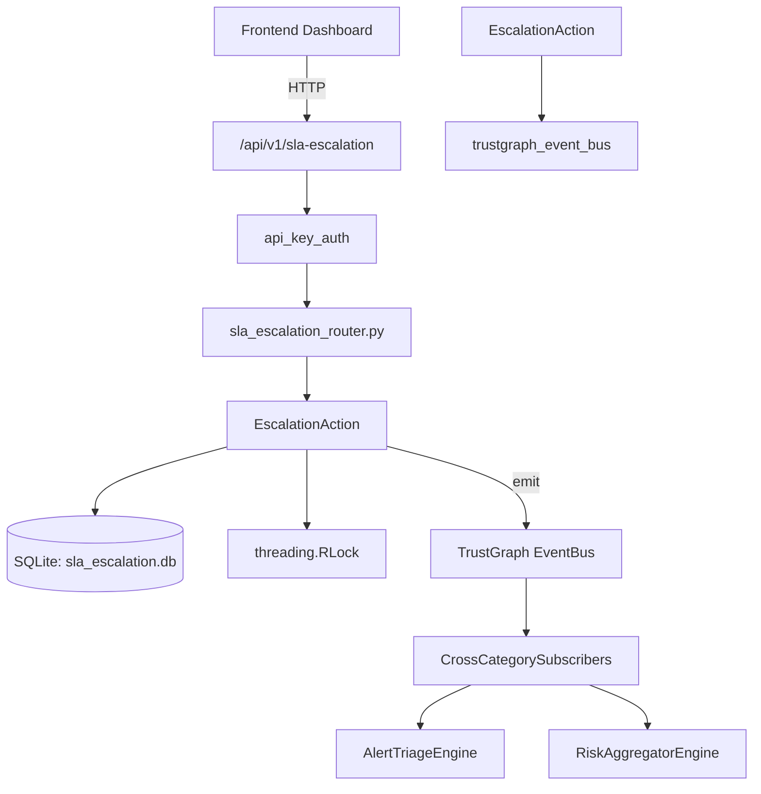

# US-0268: Sla Escalation

## Sub-Epic: Advanced
**Master Goal**: ALDECI — $35/mo enterprise security intelligence platform replacing $50K-500K/yr tools

## User Story
As a **Marcus Johnson (VP Engineering)**, I need to track security SLA compliance
so that the platform delivers enterprise-grade advanced capabilities at 1/1000th the cost of legacy tools.

## Why This Matters
Sla Escalation replaces functionality found in enterprise tools like CrowdStrike, Wiz, Snyk, and Rapid7.
By building this into ALDECI's $35/mo stack, customers save $50K+/yr on standalone Advanced tooling.

## Architecture

## Current State: 95% Complete
- ✅ `check_sla_breaches()` — Scan all tracked findings for SLA breaches. (line 168)
- ✅ `escalate()` — Execute an escalation action for a finding. (line 218)
- ✅ `get_escalation_history()` — List escalation events, optionally filtered by finding_id. (line 273)
- ✅ `run_escalation_cycle()` — Full cycle: check breaches → auto-escalate per policy → return summary. (line 303)
- ✅ `set_escalation_policy()` — Configure escalation policy for an org. (line 350)
- ✅ `get_escalation_policy()` — Return the escalation policy for an org, or sensible defaults. (line 394)
- ❌ TrustGraph event emission — not yet verified

## Key Functions (from `suite-core/core/sla_escalation_engine.py` — 461 lines)
- `SLAEscalationEngine.check_sla_breaches()` — Scan all tracked findings for SLA breaches. (line 168)
- `SLAEscalationEngine.escalate()` — Execute an escalation action for a finding. (line 218)
- `SLAEscalationEngine.get_escalation_history()` — List escalation events, optionally filtered by finding_id. (line 273)
- `SLAEscalationEngine.run_escalation_cycle()` — Full cycle: check breaches → auto-escalate per policy → return summary. (line 303)
- `SLAEscalationEngine.set_escalation_policy()` — Configure escalation policy for an org. (line 350)
- `SLAEscalationEngine.get_escalation_policy()` — Return the escalation policy for an org, or sensible defaults. (line 394)
- `SLAEscalationEngine.track_finding()` — Register a finding so the engine can monitor its SLA deadline. (line 424)

## Dependencies
- **Depends on**: trustgraph_event_bus
- **Depended by**: Routers, TrustGraph EventBus, CrossCategorySubscribers
- **TrustGraph**: Event emission wired via ResponseInterceptorMiddleware
- **Source file**: `suite-core/core/sla_escalation_engine.py` (461 lines)
- **Router file**: `suite-api/apps/api/sla_escalation_router.py`

## API Endpoints
| Method | Path | Description |
|--------|------|-------------|
| GET | `/api/v1/sla-escalation/check` | check breaches |
| POST | `/api/v1/sla-escalation/cycle` | run cycle |
| GET | `/api/v1/sla-escalation/history` | get history |
| PUT | `/api/v1/sla-escalation/policy` | set policy |
| GET | `/api/v1/sla-escalation/policy` | get policy |

## Tasks Remaining
1. Verify TrustGraph event emission works end-to-end (2h)
2. Add integration test with real persona workflow (2h)
3. Wire CrossCategorySubscriber consumer chain (1h)
4. Validate with 30-persona walkthrough (1h)
5. Optimize query performance for large datasets (2h)
6. Expand test coverage to edge cases (2h)

## Definition of Done
- [ ] Marcus Johnson (VP Engineering) can access /api/v1/sla-escalation and get meaningful data
- [ ] All CRUD operations return correct HTTP status codes
- [ ] TrustGraph receives events from this engine
- [ ] 28+ tests passing in `tests/test_sla_escalation_engine.py`
- [ ] 30-persona walkthrough includes this endpoint at 100%
- [ ] No hardcoded org_id — all queries are org-scoped

## Sprint: Wave 50 (est. April 26-28, 2026)

## Test Coverage
- **Test file**: `tests/test_sla_escalation_engine.py`
- **Tests**: 28 tests
- **Status**: Passing
