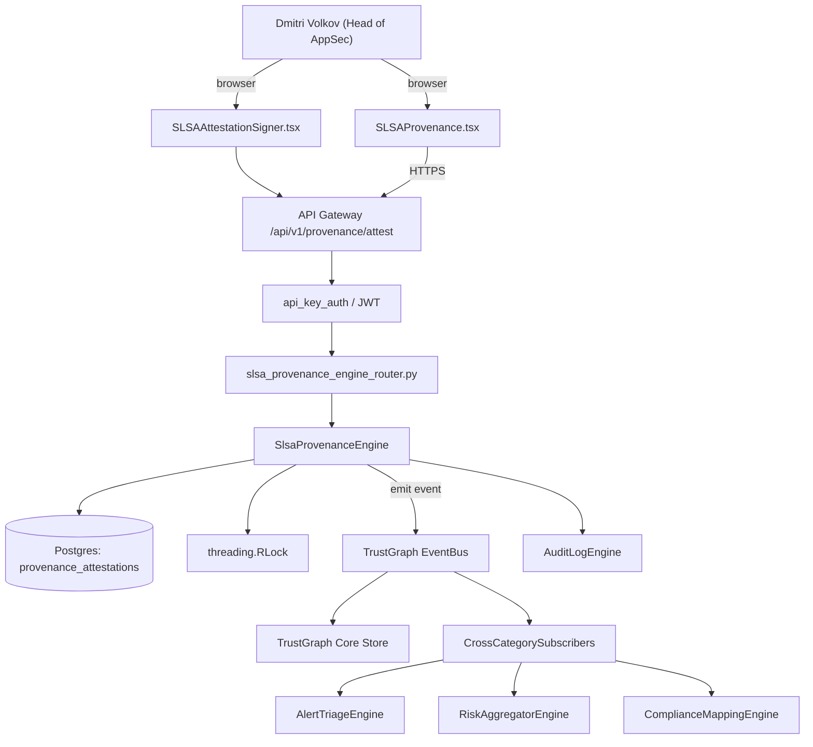

# US-0018: Add SLSA provenance attestation signer + verifier (screen exists; engine missing)

## Sub-Epic: ASPM
**Master Goal**: ALDECI — tiered $199-$1,499/mo enterprise security intelligence platform replacing $50K-$500K/yr tools

## User Story
As a **Dmitri Volkov (Head of AppSec)**, I need to add SLSA provenance attestation signer + verifier so that Fixops matches Apiiro/Cycode ASPM depth and wins replacement deals.

## Why This Matters
Per competitor-emerging.md §4 and §5, SLSA attestations are now a required artifact for regulated supply chains. Fixops inventory shows `SLSAProvenance.tsx` screens but no engine named for generation/verification. Build signer + verifier + attestation store.

This work is called out as a P1 gap in `competitor-emerging.md`. Shipping it is load-bearing for ALDECI's tiered $199-$1,499/mo positioning against $50K-$500K/yr incumbents: every delayed gap becomes a displacement deal we lose.

## Architecture

## Current State: 0% — MISSING (new engine)
- [ ] Engine module `suite-core/core/slsa_provenance_engine.py` does not exist yet
- [ ] Router `suite-api/apps/api/slsa_provenance_engine_router.py` does not exist yet
- [ ] DB tables listed under Data Model do not exist yet
- [ ] Frontend screens listed under Key Functions do not exist yet
- [ ] No TrustGraph events emitted yet

## Key Functions
**Backend (engine methods):**
- `create_attest()` — backs `POST /api/v1/provenance/attest`
- `get_verify()` — backs `GET /api/v1/provenance/{artifact}/verify`
- `get_attestation()` — backs `GET /api/v1/provenance/{artifact}/attestation`

**Frontend screens:**
- `SLSAProvenance.tsx` — operator-facing UI surface for this gap
- `SLSAAttestationSigner.tsx` — operator-facing UI surface for this gap

## API Endpoints
| Method | Path | Auth | Purpose |
|--------|------|------|---------|
| POST | `/api/v1/provenance/attest` | api_key_auth | provenance attest |
| GET | `/api/v1/provenance/{artifact}/verify` | api_key_auth | {artifact} verify |
| GET | `/api/v1/provenance/{artifact}/attestation` | api_key_auth | {artifact} attestation |

## Data Model
- add provenance_attestations table: id, artifact_digest, builder_id, source_commit, slsa_level, dsse_envelope, verified (bool), verified_at

## Dependencies
**Depends on**: none explicit
**Depended by**: Router layer, TrustGraph EventBus, CrossCategorySubscribers, CrossCategoryEvidenceBuilder, AuditLogEngine
**New engine module**: `suite-core/core/slsa_provenance_engine.py`
**New router module**: `suite-api/apps/api/slsa_provenance_engine_router.py`
**Master gap id**: `GAP-018` (priority P1, effort M)

## Tasks Remaining
1. Schema migration: add provenance_attestations table (4h)
2. Implement endpoint POST /api/v1/provenance/attest (6h)
3. Implement endpoint GET /api/v1/provenance/{artifact}/verify (6h)
4. Implement endpoint GET /api/v1/provenance/{artifact}/attestation (6h)
5. Wire frontend screen SLSAProvenance.tsx (5h)
6. Wire frontend screen SLSAAttestationSigner.tsx (5h)
7. Write 4 pytest cases: test_attestation_signed_for_artifact, test_verifier_confirms_signature… (6h)
8. Wire TrustGraph event emission + CrossCategorySubscriber consumers (4h)
9. Persona walkthrough + integration test (3h)
10. Docs + API reference update (2h)

## Definition of Done
- [ ] Given an artifact built in the fixops-action, When the action signs provenance, Then an in-toto SLSA v1.0 attestation is produced and stored.
- [ ] Given an uploaded artifact and its attestation, When verifier runs, Then it confirms signature chain, binds to source commit, and produces verdict=verified.
- [ ] Given an attestation whose builder is not on the allow-list, When verified, Then verdict=unverified_builder.
- [ ] Given SLSAAttestationSigner.tsx, When a user opens a pipeline, Then the UI shows each artifact with attestation status (signed/verified/unverified).
- [ ] Given POST /api/v1/provenance/attest, When called with an artifact digest, Then the attestation is produced, signed with the tenant's KMS key, and returned in DSSE envelope.
- [ ] All endpoints are org-scoped (no hardcoded org_id) and gated by `api_key_auth`.
- [ ] TrustGraph emits at least one event type for this engine and a CrossCategorySubscriber consumes it.
- [ ] `Dmitri Volkov (Head of AppSec)` can execute the full workflow in the 30-persona walkthrough.

## Tests Required
- `test_attestation_signed_for_artifact`
- `test_verifier_confirms_signature`
- `test_untrusted_builder_marked`
- `test_attestation_ui_reflects_state`

## Sprint: Wave 48 (est. May 27-Jun 02, 2026)

## Citation
Source research: `competitor-emerging.md` (gap `GAP-018`, priority `P1`, effort `M`)
