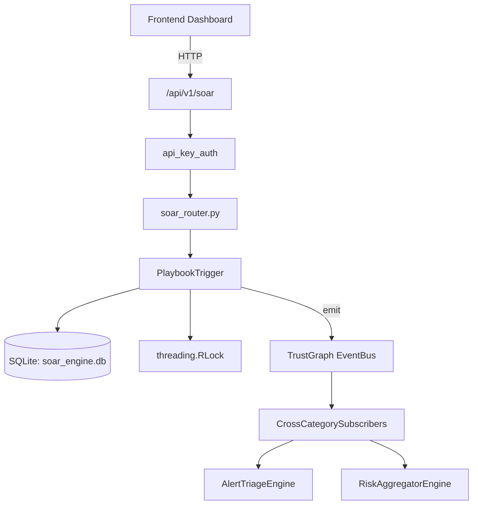

# US-0269: Soar

## Sub-Epic: SOC
**Master Goal**: ALDECI — $35/mo enterprise security intelligence platform replacing $50K-500K/yr tools

## User Story
As a **Daniel Thompson (SecOps Manager)**, I need to orchestrate automated response
so that the platform delivers enterprise-grade soc capabilities at 1/1000th the cost of legacy tools.

## Why This Matters
Soar replaces functionality found in enterprise tools like CrowdStrike, Wiz, Snyk, and Rapid7.
By building this into ALDECI's $35/mo stack, customers save $50K+/yr on standalone SOC tooling.

## Architecture

## Current State: 95% Complete
- ✅ `create_playbook()` — Define a new automated response playbook. (line 447)
- ✅ `get_playbook()` — Retrieve a single playbook by ID. (line 469)
- ✅ `list_playbooks()` — List all playbooks for an org. (line 478)
- ✅ `evaluate_trigger()` — Match an incoming event against enabled playbooks and execute matches. (line 487)
- ✅ `execute_playbook()` — Manually execute a playbook by ID regardless of trigger conditions. (line 528)
- ✅ `get_execution_history()` — Return past executions for an org, optionally filtered by playbook. (line 637)
- ❌ TrustGraph event emission — not yet verified

## Key Functions (from `suite-core/core/soar_engine.py` — 746 lines)
- `SOAREngine.create_playbook()` — Define a new automated response playbook. (line 447)
- `SOAREngine.get_playbook()` — Retrieve a single playbook by ID. (line 469)
- `SOAREngine.list_playbooks()` — List all playbooks for an org. (line 478)
- `SOAREngine.evaluate_trigger()` — Match an incoming event against enabled playbooks and execute matches. (line 487)
- `SOAREngine.execute_playbook()` — Manually execute a playbook by ID regardless of trigger conditions. (line 528)
- `SOAREngine.get_execution_history()` — Return past executions for an org, optionally filtered by playbook. (line 637)
- `SOAREngine.get_playbook_stats()` — Return aggregate playbook statistics for an org. (line 656)
- `SOAREngine.get_mean_time_to_respond()` — Return MTTR in seconds — average time from started_at to completed_at (line 705)

## Dependencies
- **Depends on**: standalone
- **Depended by**: Routers, TrustGraph EventBus, CrossCategorySubscribers
- **TrustGraph**: Event emission wired via ResponseInterceptorMiddleware
- **Source file**: `suite-core/core/soar_engine.py` (746 lines)
- **Router file**: `suite-api/apps/api/soar_router.py`

## API Endpoints
| Method | Path | Description |
|--------|------|-------------|
| POST | `/api/v1/soar/playbooks` | create playbook |
| GET | `/api/v1/soar/playbooks` | list playbooks |
| GET | `/api/v1/soar/playbooks/{playbook_id}` | get playbook |
| POST | `/api/v1/soar/trigger` | evaluate trigger |
| POST | `/api/v1/soar/playbooks/{playbook_id}/execute` | execute playbook |
| GET | `/api/v1/soar/executions` | get execution history |
| GET | `/api/v1/soar/stats` | get playbook stats |
| GET | `/api/v1/soar/mttr` | get mean time to respond |

## Tasks Remaining
1. Verify TrustGraph event emission works end-to-end (2h)
2. Add integration test with real persona workflow (2h)
3. Wire CrossCategorySubscriber consumer chain (1h)
4. Validate with 30-persona walkthrough (1h)
5. Optimize query performance for large datasets (2h)
6. Expand test coverage to edge cases (2h)

## Definition of Done
- [ ] Daniel Thompson (SecOps Manager) can access /api/v1/soar and get meaningful data
- [ ] All CRUD operations return correct HTTP status codes
- [ ] TrustGraph receives events from this engine
- [ ] 48+ tests passing in `tests/test_soar_engine.py`
- [ ] 30-persona walkthrough includes this endpoint at 100%
- [ ] No hardcoded org_id — all queries are org-scoped

## Sprint: Wave 50 (est. April 26-28, 2026)

## Test Coverage
- **Test file**: `tests/test_soar_engine.py`
- **Tests**: 48 tests
- **Status**: Passing
