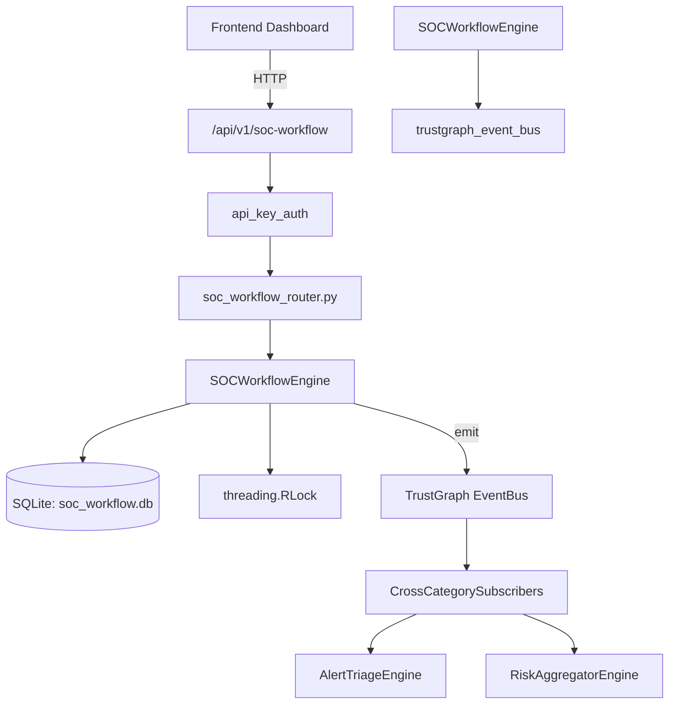

# US-0271: Soc Workflow

## Sub-Epic: SOC
**Master Goal**: ALDECI — $35/mo enterprise security intelligence platform replacing $50K-500K/yr tools

## User Story
As a **Alex Rivera (SOC T1 Analyst)**, I need to manage SOC workflow and triage
so that the platform delivers enterprise-grade soc capabilities at 1/1000th the cost of legacy tools.

## Why This Matters
Soc Workflow replaces functionality found in enterprise tools like CrowdStrike, Wiz, Snyk, and Rapid7.
By building this into ALDECI's $35/mo stack, customers save $50K+/yr on standalone SOC tooling.

## Architecture

## Current State: 95% Complete
- ✅ `create_workflow()` — Create a new SOC workflow. (line 121)
- ✅ `list_workflows()` — List workflows with optional filters. (line 177)
- ✅ `get_workflow()` — Retrieve a single workflow by ID. Returns None if not found. (line 205)
- ✅ `start_execution()` — Start a workflow execution. (line 225)
- ✅ `update_execution()` — Append a step result to an execution log and advance current_step. (line 266)
- ✅ `complete_execution()` — Mark an execution as completed. Returns None if not found. (line 334)
- ❌ TrustGraph event emission — not yet verified

## Key Functions (from `suite-core/core/soc_workflow_engine.py` — 470 lines)
- `SOCWorkflowEngine.create_workflow()` — Create a new SOC workflow. (line 121)
- `SOCWorkflowEngine.list_workflows()` — List workflows with optional filters. (line 177)
- `SOCWorkflowEngine.get_workflow()` — Retrieve a single workflow by ID. Returns None if not found. (line 205)
- `SOCWorkflowEngine.start_execution()` — Start a workflow execution. (line 225)
- `SOCWorkflowEngine.update_execution()` — Append a step result to an execution log and advance current_step. (line 266)
- `SOCWorkflowEngine.complete_execution()` — Mark an execution as completed. Returns None if not found. (line 334)
- `SOCWorkflowEngine.list_executions()` — List executions with optional filters, ordered by started_at DESC. (line 367)
- `SOCWorkflowEngine.get_soc_stats()` — Return aggregated SOC workflow stats for an org. (line 403)

## Dependencies
- **Depends on**: trustgraph_event_bus
- **Depended by**: Routers, TrustGraph EventBus, CrossCategorySubscribers
- **TrustGraph**: Event emission wired via ResponseInterceptorMiddleware
- **Source file**: `suite-core/core/soc_workflow_engine.py` (470 lines)
- **Router file**: `suite-api/apps/api/soc_workflow_router.py`

## API Endpoints
| Method | Path | Description |
|--------|------|-------------|
| POST | `/api/v1/soc-workflow/workflows` | create workflow |
| GET | `/api/v1/soc-workflow/workflows` | list workflows |
| GET | `/api/v1/soc-workflow/workflows/{workflow_id}` | get workflow |
| POST | `/api/v1/soc-workflow/executions` | start execution |
| PUT | `/api/v1/soc-workflow/executions/{execution_id}/step` | update execution step |
| PUT | `/api/v1/soc-workflow/executions/{execution_id}/complete` | complete execution |
| GET | `/api/v1/soc-workflow/executions` | list executions |
| GET | `/api/v1/soc-workflow/stats` | get soc stats |

## Tasks Remaining
1. Verify TrustGraph event emission works end-to-end (2h)
2. Add integration test with real persona workflow (2h)
3. Wire CrossCategorySubscriber consumer chain (1h)
4. Validate with 30-persona walkthrough (1h)
5. Optimize query performance for large datasets (2h)
6. Expand test coverage to edge cases (2h)

## Definition of Done
- [ ] Alex Rivera (SOC T1 Analyst) can access /api/v1/soc-workflow and get meaningful data
- [ ] All CRUD operations return correct HTTP status codes
- [ ] TrustGraph receives events from this engine
- [ ] 35+ tests passing in `tests/test_soc_workflow_engine.py`
- [ ] 30-persona walkthrough includes this endpoint at 100%
- [ ] No hardcoded org_id — all queries are org-scoped

## Sprint: Wave 51 (est. April 27-29, 2026)

## Test Coverage
- **Test file**: `tests/test_soc_workflow_engine.py`
- **Tests**: 35 tests
- **Status**: Passing
