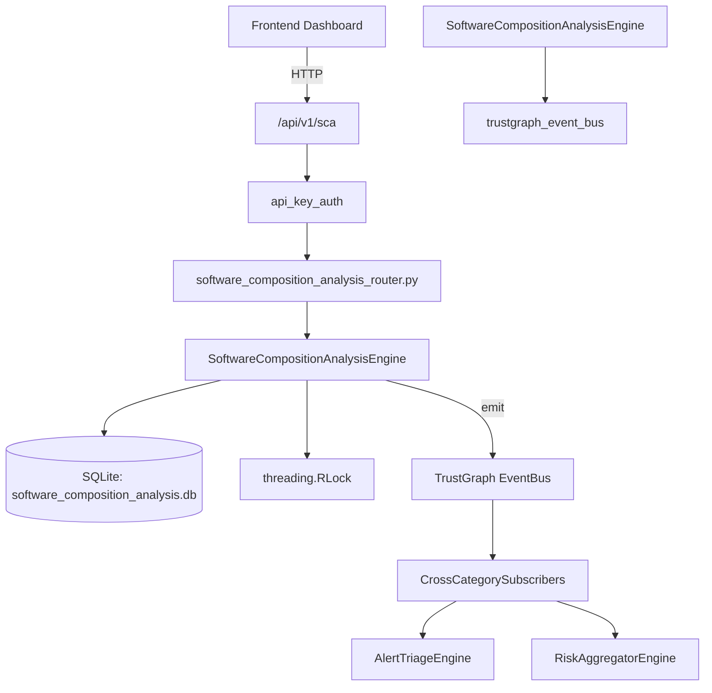

# US-0272: Software Composition Analysis

## Sub-Epic: Advanced
**Master Goal**: ALDECI — $35/mo enterprise security intelligence platform replacing $50K-500K/yr tools

## User Story
As a **Amanda Scott (Supply Chain Security)**, I need to analyze software composition
so that the platform delivers enterprise-grade advanced capabilities at 1/1000th the cost of legacy tools.

## Why This Matters
Software Composition Analysis replaces functionality found in enterprise tools like CrowdStrike, Wiz, Snyk, and Rapid7.
By building this into ALDECI's $35/mo stack, customers save $50K+/yr on standalone Advanced tooling.

## Architecture

## Current State: 95% Complete
- ✅ `register_project()` — Register a new software project for SCA tracking. (line 140)
- ✅ `list_projects()` — List all projects for an org. (line 177)
- ✅ `get_project()` — Retrieve a single project by ID. (line 186)
- ✅ `submit_scan()` — Submit a dependency scan result for a project. (line 199)
- ✅ `list_scans()` — List scans, optionally filtered by project. (line 262)
- ✅ `get_scan()` — Retrieve a single scan by ID. (line 276)
- ❌ TrustGraph event emission — not yet verified

## Key Functions (from `suite-core/core/software_composition_analysis_engine.py` — 347 lines)
- `SoftwareCompositionAnalysisEngine.register_project()` — Register a new software project for SCA tracking. (line 140)
- `SoftwareCompositionAnalysisEngine.list_projects()` — List all projects for an org. (line 177)
- `SoftwareCompositionAnalysisEngine.get_project()` — Retrieve a single project by ID. (line 186)
- `SoftwareCompositionAnalysisEngine.submit_scan()` — Submit a dependency scan result for a project. (line 199)
- `SoftwareCompositionAnalysisEngine.list_scans()` — List scans, optionally filtered by project. (line 262)
- `SoftwareCompositionAnalysisEngine.get_scan()` — Retrieve a single scan by ID. (line 276)
- `SoftwareCompositionAnalysisEngine.get_vulnerable_dependencies()` — Return only dependencies with known CVEs from a scan. (line 285)
- `SoftwareCompositionAnalysisEngine.get_license_report()` — Return license distribution and risky license list for a scan. (line 294)

## Dependencies
- **Depends on**: trustgraph_event_bus
- **Depended by**: Routers, TrustGraph EventBus, CrossCategorySubscribers
- **TrustGraph**: Event emission wired via ResponseInterceptorMiddleware
- **Source file**: `suite-core/core/software_composition_analysis_engine.py` (347 lines)
- **Router file**: `suite-api/apps/api/software_composition_analysis_router.py`

## API Endpoints
| Method | Path | Description |
|--------|------|-------------|
| POST | `/api/v1/sca/projects` | register project |
| GET | `/api/v1/sca/projects` | list projects |
| GET | `/api/v1/sca/projects/{project_id}` | get project |
| POST | `/api/v1/sca/projects/{project_id}/scans` | submit scan |
| GET | `/api/v1/sca/scans` | list scans |
| GET | `/api/v1/sca/scans/{scan_id}` | get scan |
| GET | `/api/v1/sca/scans/{scan_id}/vulnerable-deps` | get vulnerable dependencies |
| GET | `/api/v1/sca/scans/{scan_id}/license-report` | get license report |
| GET | `/api/v1/sca/stats` | get sca stats |

## Tasks Remaining
1. Verify TrustGraph event emission works end-to-end (2h)
2. Add integration test with real persona workflow (2h)
3. Wire CrossCategorySubscriber consumer chain (1h)
4. Validate with 30-persona walkthrough (1h)
5. Optimize query performance for large datasets (2h)
6. Expand test coverage to edge cases (2h)

## Definition of Done
- [ ] Amanda Scott (Supply Chain Security) can access /api/v1/sca and get meaningful data
- [ ] All CRUD operations return correct HTTP status codes
- [ ] TrustGraph receives events from this engine
- [ ] 30+ tests passing in `tests/test_software_composition_analysis_engine.py`
- [ ] 30-persona walkthrough includes this endpoint at 100%
- [ ] No hardcoded org_id — all queries are org-scoped

## Sprint: Wave 51 (est. April 27-29, 2026)

## Test Coverage
- **Test file**: `tests/test_software_composition_analysis_engine.py`
- **Tests**: 30 tests
- **Status**: Passing
