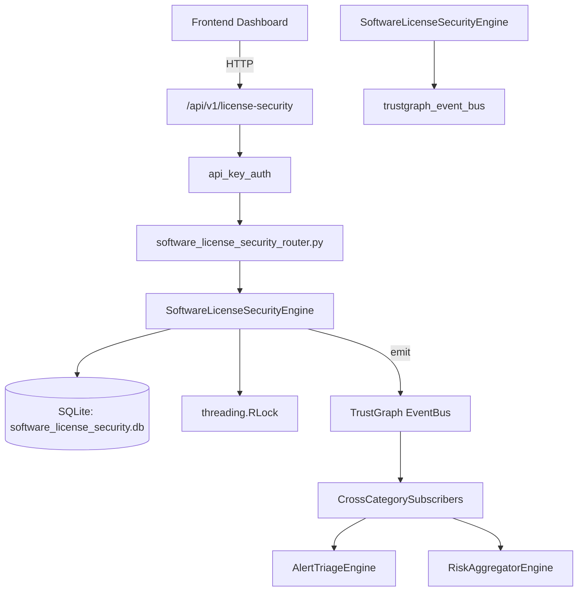

# US-0273: Software License Security

## Sub-Epic: Advanced
**Master Goal**: ALDECI — $35/mo enterprise security intelligence platform replacing $50K-500K/yr tools

## User Story
As a **Amanda Scott (Supply Chain Security)**, I need to assess OSS license risks
so that the platform delivers enterprise-grade advanced capabilities at 1/1000th the cost of legacy tools.

## Why This Matters
Software License Security replaces functionality found in enterprise tools like CrowdStrike, Wiz, Snyk, and Rapid7.
By building this into ALDECI's $35/mo stack, customers save $50K+/yr on standalone Advanced tooling.

## Architecture

## Current State: 95% Complete
- ✅ `add_license_record()` — Add a license record for a package. (line 159)
- ✅ `list_license_records()` — List license records with optional filters. (line 222)
- ✅ `get_license_record()` — Retrieve a single license record; None if not found or wrong org. (line 246)
- ✅ `approve_license()` — Approve a license record. Raises KeyError if not found. (line 257)
- ✅ `record_violation()` — Record a license violation. Validates that record_id exists in org. (line 277)
- ✅ `resolve_violation()` — Resolve a violation (waived/remediated). Raises KeyError if not found. (line 329)
- ❌ TrustGraph event emission — not yet verified

## Key Functions (from `suite-core/core/software_license_security_engine.py` — 484 lines)
- `SoftwareLicenseSecurityEngine.add_license_record()` — Add a license record for a package. (line 159)
- `SoftwareLicenseSecurityEngine.list_license_records()` — List license records with optional filters. (line 222)
- `SoftwareLicenseSecurityEngine.get_license_record()` — Retrieve a single license record; None if not found or wrong org. (line 246)
- `SoftwareLicenseSecurityEngine.approve_license()` — Approve a license record. Raises KeyError if not found. (line 257)
- `SoftwareLicenseSecurityEngine.record_violation()` — Record a license violation. Validates that record_id exists in org. (line 277)
- `SoftwareLicenseSecurityEngine.resolve_violation()` — Resolve a violation (waived/remediated). Raises KeyError if not found. (line 329)
- `SoftwareLicenseSecurityEngine.list_violations()` — List violations with optional severity/status filters. (line 356)
- `SoftwareLicenseSecurityEngine.create_policy()` — Create a license policy. (line 380)

## Dependencies
- **Depends on**: trustgraph_event_bus
- **Depended by**: Routers, TrustGraph EventBus, CrossCategorySubscribers
- **TrustGraph**: Event emission wired via ResponseInterceptorMiddleware
- **Source file**: `suite-core/core/software_license_security_engine.py` (484 lines)
- **Router file**: `suite-api/apps/api/software_license_security_router.py`

## API Endpoints
| Method | Path | Description |
|--------|------|-------------|
| POST | `/api/v1/license-security/records` | add license record |
| GET | `/api/v1/license-security/records` | list license records |
| GET | `/api/v1/license-security/records/{record_id}` | get license record |
| PUT | `/api/v1/license-security/records/{record_id}/approve` | approve license |
| POST | `/api/v1/license-security/violations` | record violation |
| PUT | `/api/v1/license-security/violations/{violation_id}/resolve` | resolve violation |
| GET | `/api/v1/license-security/violations` | list violations |
| POST | `/api/v1/license-security/policies` | create policy |
| GET | `/api/v1/license-security/policies` | list policies |
| GET | `/api/v1/license-security/stats` | get license stats |

## Tasks Remaining
1. Verify TrustGraph event emission works end-to-end (2h)
2. Add integration test with real persona workflow (2h)
3. Wire CrossCategorySubscriber consumer chain (1h)
4. Validate with 30-persona walkthrough (1h)
5. Optimize query performance for large datasets (2h)
6. Expand test coverage to edge cases (2h)

## Definition of Done
- [ ] Amanda Scott (Supply Chain Security) can access /api/v1/license-security and get meaningful data
- [ ] All CRUD operations return correct HTTP status codes
- [ ] TrustGraph receives events from this engine
- [ ] 39+ tests passing in `tests/test_software_license_security_engine.py`
- [ ] 30-persona walkthrough includes this endpoint at 100%
- [ ] No hardcoded org_id — all queries are org-scoped

## Sprint: Wave 51 (est. April 27-29, 2026)

## Test Coverage
- **Test file**: `tests/test_software_license_security_engine.py`
- **Tests**: 39 tests
- **Status**: Passing
