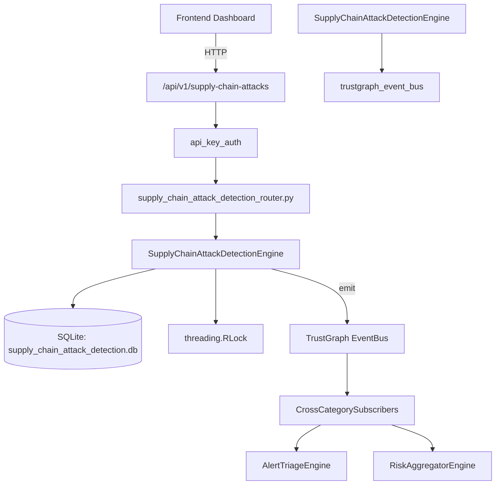

# US-0274: Supply Chain Attack Detection

## Sub-Epic: Advanced
**Master Goal**: ALDECI — $35/mo enterprise security intelligence platform replacing $50K-500K/yr tools

## User Story
As a **Amanda Scott (Supply Chain Security)**, I need to monitor supply chain risks
so that the platform delivers enterprise-grade advanced capabilities at 1/1000th the cost of legacy tools.

## Why This Matters
Supply Chain Attack Detection replaces functionality found in enterprise tools like CrowdStrike, Wiz, Snyk, and Rapid7.
By building this into ALDECI's $35/mo stack, customers save $50K+/yr on standalone Advanced tooling.

## Architecture

## Current State: 95% Complete
- ✅ `register_package()` — Register a package for supply chain tracking. Returns the package record. (line 134)
- ✅ `list_packages()` — List packages for org, optionally filtered by ecosystem or status. (line 164)
- ✅ `get_package()` — Fetch a single package scoped to org_id, or None if not found. (line 184)
- ✅ `update_package_status()` — Update package status (and optionally attack_type). (line 193)
- ✅ `record_detection()` — Record a supply chain attack detection. Returns the detection record. (line 229)
- ✅ `list_detections()` — List detections for org, optionally filtered. (line 275)
- ❌ TrustGraph event emission — not yet verified

## Key Functions (from `suite-core/core/supply_chain_attack_detection_engine.py` — 453 lines)
- `SupplyChainAttackDetectionEngine.register_package()` — Register a package for supply chain tracking. Returns the package record. (line 134)
- `SupplyChainAttackDetectionEngine.list_packages()` — List packages for org, optionally filtered by ecosystem or status. (line 164)
- `SupplyChainAttackDetectionEngine.get_package()` — Fetch a single package scoped to org_id, or None if not found. (line 184)
- `SupplyChainAttackDetectionEngine.update_package_status()` — Update package status (and optionally attack_type). (line 193)
- `SupplyChainAttackDetectionEngine.record_detection()` — Record a supply chain attack detection. Returns the detection record. (line 229)
- `SupplyChainAttackDetectionEngine.list_detections()` — List detections for org, optionally filtered. (line 275)
- `SupplyChainAttackDetectionEngine.confirm_detection()` — Update detection status to confirmed or false_positive. (line 309)
- `SupplyChainAttackDetectionEngine.create_policy()` — Create a supply chain attack policy. (line 333)

## Dependencies
- **Depends on**: trustgraph_event_bus
- **Depended by**: Routers, TrustGraph EventBus, CrossCategorySubscribers
- **TrustGraph**: Event emission wired via ResponseInterceptorMiddleware
- **Source file**: `suite-core/core/supply_chain_attack_detection_engine.py` (453 lines)
- **Router file**: `suite-api/apps/api/supply_chain_attack_detection_router.py`

## API Endpoints
| Method | Path | Description |
|--------|------|-------------|
| POST | `/api/v1/supply-chain-attacks/packages` | register package |
| GET | `/api/v1/supply-chain-attacks/packages` | list packages |
| GET | `/api/v1/supply-chain-attacks/packages/{package_id}` | get package |
| PUT | `/api/v1/supply-chain-attacks/packages/{package_id}/status` | update package status |
| POST | `/api/v1/supply-chain-attacks/detections` | record detection |
| GET | `/api/v1/supply-chain-attacks/detections` | list detections |
| PUT | `/api/v1/supply-chain-attacks/detections/{detection_id}/confirm` | confirm detection |
| POST | `/api/v1/supply-chain-attacks/policies` | create policy |
| GET | `/api/v1/supply-chain-attacks/policies` | list policies |
| GET | `/api/v1/supply-chain-attacks/stats` | get attack stats |

## Tasks Remaining
1. Verify TrustGraph event emission works end-to-end (2h)
2. Add integration test with real persona workflow (2h)
3. Wire CrossCategorySubscriber consumer chain (1h)
4. Validate with 30-persona walkthrough (1h)
5. Optimize query performance for large datasets (2h)
6. Expand test coverage to edge cases (2h)

## Definition of Done
- [ ] Amanda Scott (Supply Chain Security) can access /api/v1/supply-chain-attacks and get meaningful data
- [ ] All CRUD operations return correct HTTP status codes
- [ ] TrustGraph receives events from this engine
- [ ] 45+ tests passing in `tests/test_supply_chain_attack_detection_engine.py`
- [ ] 30-persona walkthrough includes this endpoint at 100%
- [ ] No hardcoded org_id — all queries are org-scoped

## Sprint: Wave 51 (est. April 27-29, 2026)

## Test Coverage
- **Test file**: `tests/test_supply_chain_attack_detection_engine.py`
- **Tests**: 45 tests
- **Status**: Passing
