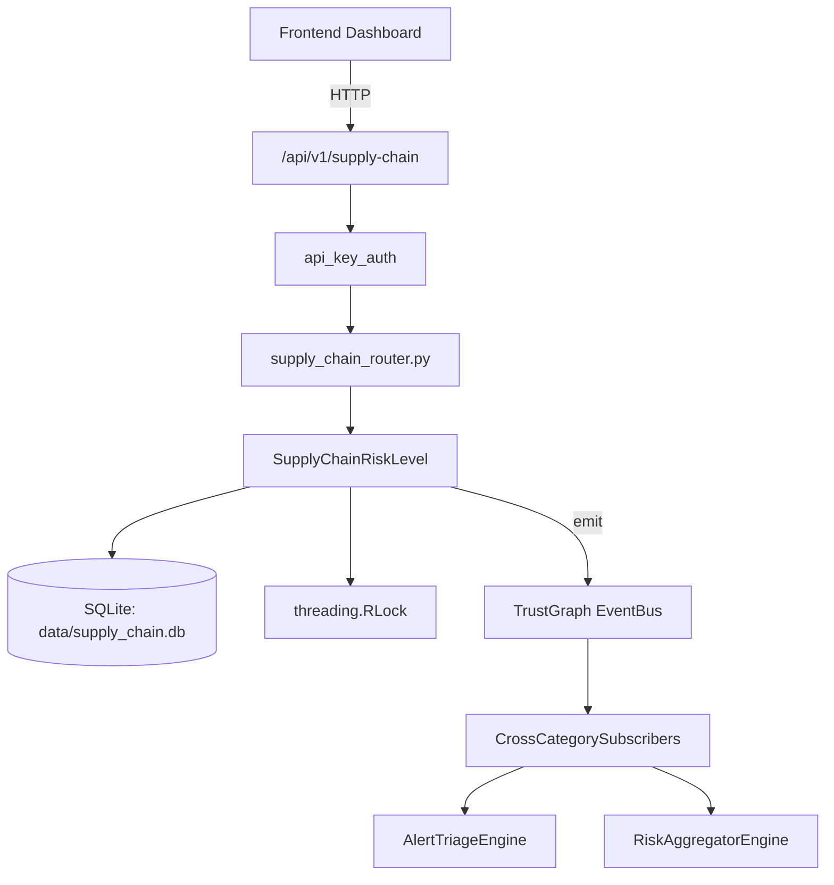

# US-0275: Supply Chain

## Sub-Epic: Advanced
**Master Goal**: ALDECI — $35/mo enterprise security intelligence platform replacing $50K-500K/yr tools

## User Story
As a **Amanda Scott (Supply Chain Security)**, I need to monitor supply chain risks
so that the platform delivers enterprise-grade advanced capabilities at 1/1000th the cost of legacy tools.

## Why This Matters
Supply Chain replaces functionality found in enterprise tools like CrowdStrike, Wiz, Snyk, and Rapid7.
By building this into ALDECI's $35/mo stack, customers save $50K+/yr on standalone Advanced tooling.

## Architecture

## Current State: 95% Complete
- ✅ `to_dict()` — implemented (line 72)
- ✅ `to_dict()` — implemented (line 102)
- ✅ `to_dict()` — implemented (line 129)
- ✅ `analyze_packages()` — Analyze a list of packages for supply chain risks. (line 263)
- ✅ `analyze_sbom()` — Analyze supply chain from an SBOM (CycloneDX or SPDX). (line 340)
- ❌ TrustGraph event emission — not yet verified

## Key Functions (from `suite-core/core/supply_chain_engine.py` — 570 lines)
- `SupplyChainFinding.to_dict()` — Handle to dict (line 72)
- `PackageRiskScore.to_dict()` — Handle to dict (line 102)
- `SupplyChainAnalysisResult.to_dict()` — Handle to dict (line 129)
- `SupplyChainEngine.analyze_packages()` — Analyze a list of packages for supply chain risks. (line 263)
- `SupplyChainEngine.analyze_sbom()` — Analyze supply chain from an SBOM (CycloneDX or SPDX). (line 340)

## Dependencies
- **Depends on**: standalone
- **Depended by**: Routers, TrustGraph EventBus, CrossCategorySubscribers
- **TrustGraph**: Event emission wired via ResponseInterceptorMiddleware
- **Source file**: `suite-core/core/supply_chain_engine.py` (570 lines)
- **Router file**: `suite-api/apps/api/supply_chain_router.py`

## API Endpoints
| Method | Path | Description |
|--------|------|-------------|
| POST | `/api/v1/supply-chain/sbom/upload` | upload sbom |
| GET | `/api/v1/supply-chain/components` | list components |
| GET | `/api/v1/supply-chain/risks` | get risk dashboard |
| POST | `/api/v1/supply-chain/scan` | trigger scan |
| GET | `/api/v1/supply-chain/policies` | list policies |
| POST | `/api/v1/supply-chain/policies` | create policy |
| GET | `/api/v1/supply-chain/vendors` | list vendors |
| POST | `/api/v1/supply-chain/vendors` | upsert vendor |
| GET | `/api/v1/supply-chain/provenance/{component_name}` | get provenance |
| POST | `/api/v1/supply-chain/sbom` | generate sbom |
| POST | `/api/v1/supply-chain/osv-scan` | osv scan |
| GET | `/api/v1/supply-chain/license-audit` | license audit |

## Tasks Remaining
1. Verify TrustGraph event emission works end-to-end (2h)
2. Add integration test with real persona workflow (2h)
3. Wire CrossCategorySubscriber consumer chain (1h)
4. Validate with 30-persona walkthrough (1h)
5. Optimize query performance for large datasets (2h)
6. Expand test coverage to edge cases (2h)

## Definition of Done
- [ ] Amanda Scott (Supply Chain Security) can access /api/v1/supply-chain and get meaningful data
- [ ] All CRUD operations return correct HTTP status codes
- [ ] TrustGraph receives events from this engine
- [ ] 21+ tests passing in `tests/test_supply_chain_engine.py`
- [ ] 30-persona walkthrough includes this endpoint at 100%
- [ ] No hardcoded org_id — all queries are org-scoped

## Sprint: Wave 51 (est. April 27-29, 2026)

## Test Coverage
- **Test file**: `tests/test_supply_chain_engine.py`
- **Tests**: 21 tests
- **Status**: Passing
