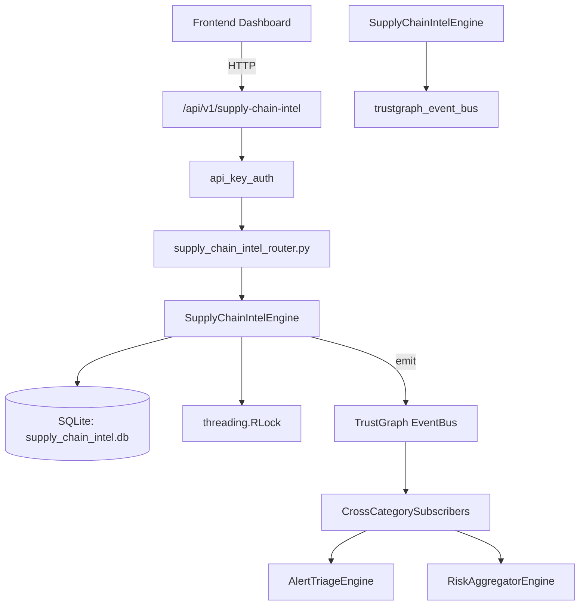

# US-0276: Supply Chain Intel

## Sub-Epic: Advanced
**Master Goal**: ALDECI — $35/mo enterprise security intelligence platform replacing $50K-500K/yr tools

## User Story
As a **Amanda Scott (Supply Chain Security)**, I need to monitor supply chain risks
so that the platform delivers enterprise-grade advanced capabilities at 1/1000th the cost of legacy tools.

## Why This Matters
Supply Chain Intel replaces functionality found in enterprise tools like CrowdStrike, Wiz, Snyk, and Rapid7.
By building this into ALDECI's $35/mo stack, customers save $50K+/yr on standalone Advanced tooling.

## Architecture

## Current State: 95% Complete
- ✅ `track_package()` — Track a new package. Returns the created record. (line 178)
- ✅ `list_packages()` — List tracked packages, optionally filtered. (line 225)
- ✅ `add_vulnerability()` — Add a vulnerability to a tracked package. (line 248)
- ✅ `list_vulnerabilities()` — List vulnerabilities. patched=False returns only unpatched. (line 279)
- ✅ `flag_malicious()` — Flag a package as malicious. (line 305)
- ✅ `list_malicious()` — List malicious packages, optionally filtered by ecosystem. (line 342)
- ❌ TrustGraph event emission — not yet verified

## Key Functions (from `suite-core/core/supply_chain_intel_engine.py` — 581 lines)
- `SupplyChainIntelEngine.track_package()` — Track a new package. Returns the created record. (line 178)
- `SupplyChainIntelEngine.list_packages()` — List tracked packages, optionally filtered. (line 225)
- `SupplyChainIntelEngine.add_vulnerability()` — Add a vulnerability to a tracked package. (line 248)
- `SupplyChainIntelEngine.list_vulnerabilities()` — List vulnerabilities. patched=False returns only unpatched. (line 279)
- `SupplyChainIntelEngine.flag_malicious()` — Flag a package as malicious. (line 305)
- `SupplyChainIntelEngine.list_malicious()` — List malicious packages, optionally filtered by ecosystem. (line 342)
- `SupplyChainIntelEngine.check_package()` — Fast-path check for a package by name + ecosystem. (line 359)
- `SupplyChainIntelEngine.create_sbom_snapshot()` — Create an SBOM snapshot from a list of package dicts. (line 423)

## Dependencies
- **Depends on**: trustgraph_event_bus
- **Depended by**: Routers, TrustGraph EventBus, CrossCategorySubscribers
- **TrustGraph**: Event emission wired via ResponseInterceptorMiddleware
- **Source file**: `suite-core/core/supply_chain_intel_engine.py` (581 lines)
- **Router file**: `suite-api/apps/api/supply_chain_intel_router.py`

## API Endpoints
| Method | Path | Description |
|--------|------|-------------|
| POST | `/api/v1/supply-chain-intel/packages` | track package |
| GET | `/api/v1/supply-chain-intel/packages` | list packages |
| POST | `/api/v1/supply-chain-intel/packages/{pkg_id}/vulns` | add vulnerability |
| GET | `/api/v1/supply-chain-intel/vulns` | list vulnerabilities |
| POST | `/api/v1/supply-chain-intel/malicious` | flag malicious |
| GET | `/api/v1/supply-chain-intel/malicious` | list malicious |
| GET | `/api/v1/supply-chain-intel/check` | check package |
| POST | `/api/v1/supply-chain-intel/sbom/snapshots` | create sbom snapshot |
| GET | `/api/v1/supply-chain-intel/sbom/snapshots` | list snapshots |
| GET | `/api/v1/supply-chain-intel/stats` | get supply chain stats |

## Tasks Remaining
1. Verify TrustGraph event emission works end-to-end (2h)
2. Add integration test with real persona workflow (2h)
3. Wire CrossCategorySubscriber consumer chain (1h)
4. Validate with 30-persona walkthrough (1h)
5. Optimize query performance for large datasets (2h)
6. Expand test coverage to edge cases (2h)

## Definition of Done
- [ ] Amanda Scott (Supply Chain Security) can access /api/v1/supply-chain-intel and get meaningful data
- [ ] All CRUD operations return correct HTTP status codes
- [ ] TrustGraph receives events from this engine
- [ ] 32+ tests passing in `tests/test_supply_chain_intel_engine.py`
- [ ] 30-persona walkthrough includes this endpoint at 100%
- [ ] No hardcoded org_id — all queries are org-scoped

## Sprint: Wave 51 (est. April 27-29, 2026)

## Test Coverage
- **Test file**: `tests/test_supply_chain_intel_engine.py`
- **Tests**: 32 tests
- **Status**: Passing
