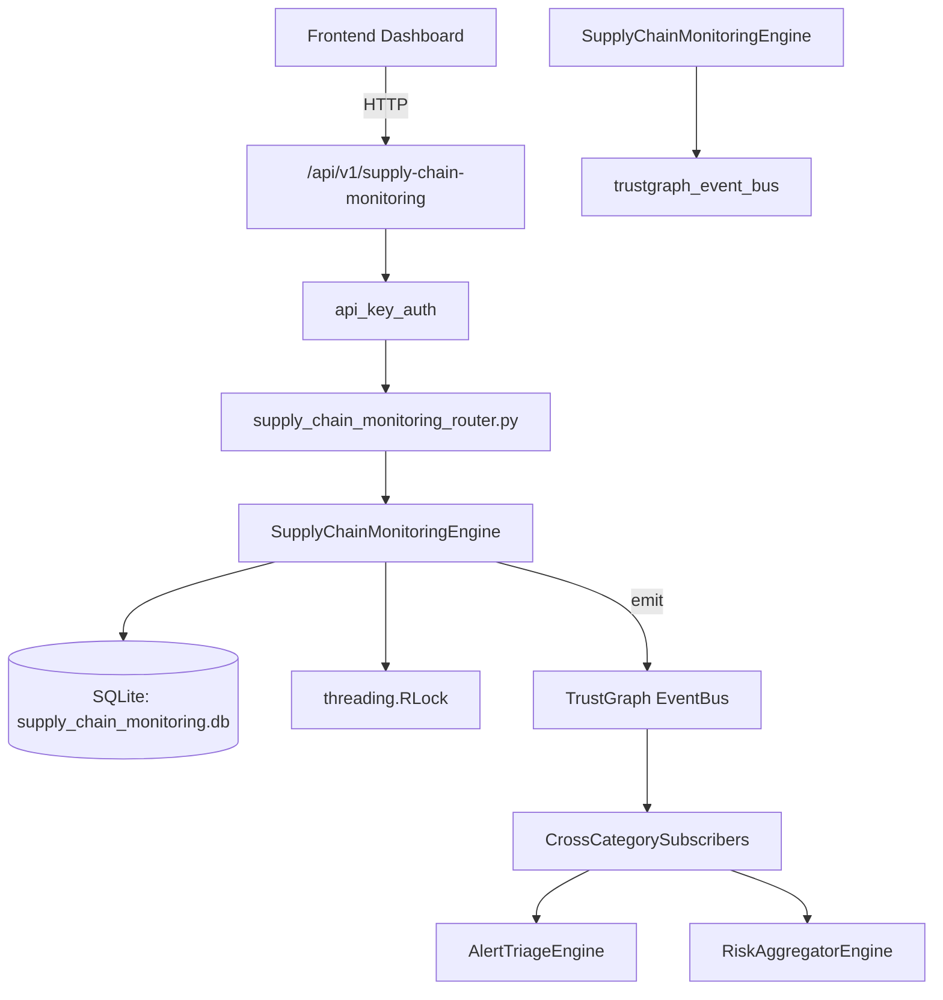

# US-0277: Supply Chain Monitoring

## Sub-Epic: Advanced
**Master Goal**: ALDECI — $35/mo enterprise security intelligence platform replacing $50K-500K/yr tools

## User Story
As a **Amanda Scott (Supply Chain Security)**, I need to monitor supply chain risks
so that the platform delivers enterprise-grade advanced capabilities at 1/1000th the cost of legacy tools.

## Why This Matters
Supply Chain Monitoring replaces functionality found in enterprise tools like CrowdStrike, Wiz, Snyk, and Rapid7.
By building this into ALDECI's $35/mo stack, customers save $50K+/yr on standalone Advanced tooling.

## Architecture

## Current State: 95% Complete
- ✅ `register_supplier()` — Register a new supplier. Validates name, supplier_type, and risk_tier. (line 106)
- ✅ `list_suppliers()` — List suppliers for an org with optional type/tier filters. (line 170)
- ✅ `get_supplier()` — Return a single supplier or None if not found. (line 191)
- ✅ `assess_supplier_risk()` — Run a risk assessment against a supplier. (line 200)
- ✅ `record_supply_chain_event()` — Record a supply chain event (breach, disruption, etc.). (line 270)
- ✅ `list_events()` — List supply chain events with optional filters. (line 325)
- ❌ TrustGraph event emission — not yet verified

## Key Functions (from `suite-core/core/supply_chain_monitoring_engine.py` — 430 lines)
- `SupplyChainMonitoringEngine.register_supplier()` — Register a new supplier. Validates name, supplier_type, and risk_tier. (line 106)
- `SupplyChainMonitoringEngine.list_suppliers()` — List suppliers for an org with optional type/tier filters. (line 170)
- `SupplyChainMonitoringEngine.get_supplier()` — Return a single supplier or None if not found. (line 191)
- `SupplyChainMonitoringEngine.assess_supplier_risk()` — Run a risk assessment against a supplier. (line 200)
- `SupplyChainMonitoringEngine.record_supply_chain_event()` — Record a supply chain event (breach, disruption, etc.). (line 270)
- `SupplyChainMonitoringEngine.list_events()` — List supply chain events with optional filters. (line 325)
- `SupplyChainMonitoringEngine.resolve_event()` — Resolve a supply chain event. (line 350)
- `SupplyChainMonitoringEngine.get_supply_chain_stats()` — Return aggregate supply chain stats for an org. (line 379)

## Dependencies
- **Depends on**: trustgraph_event_bus
- **Depended by**: Routers, TrustGraph EventBus, CrossCategorySubscribers
- **TrustGraph**: Event emission wired via ResponseInterceptorMiddleware
- **Source file**: `suite-core/core/supply_chain_monitoring_engine.py` (430 lines)
- **Router file**: `suite-api/apps/api/supply_chain_monitoring_router.py`

## API Endpoints
| Method | Path | Description |
|--------|------|-------------|
| POST | `/api/v1/supply-chain-monitoring/suppliers` | register supplier |
| GET | `/api/v1/supply-chain-monitoring/suppliers` | list suppliers |
| GET | `/api/v1/supply-chain-monitoring/suppliers/{supplier_id}` | get supplier |
| POST | `/api/v1/supply-chain-monitoring/suppliers/{supplier_id}/assess` | assess supplier |
| POST | `/api/v1/supply-chain-monitoring/events` | record event |
| GET | `/api/v1/supply-chain-monitoring/events` | list events |
| PUT | `/api/v1/supply-chain-monitoring/events/{event_id}/resolve` | resolve event |
| GET | `/api/v1/supply-chain-monitoring/stats` | get stats |

## Tasks Remaining
1. Verify TrustGraph event emission works end-to-end (2h)
2. Add integration test with real persona workflow (2h)
3. Wire CrossCategorySubscriber consumer chain (1h)
4. Validate with 30-persona walkthrough (1h)
5. Optimize query performance for large datasets (2h)
6. Expand test coverage to edge cases (2h)

## Definition of Done
- [ ] Amanda Scott (Supply Chain Security) can access /api/v1/supply-chain-monitoring and get meaningful data
- [ ] All CRUD operations return correct HTTP status codes
- [ ] TrustGraph receives events from this engine
- [ ] 32+ tests passing in `tests/test_supply_chain_monitoring_engine.py`
- [ ] 30-persona walkthrough includes this endpoint at 100%
- [ ] No hardcoded org_id — all queries are org-scoped

## Sprint: Wave 51 (est. April 27-29, 2026)

## Test Coverage
- **Test file**: `tests/test_supply_chain_monitoring_engine.py`
- **Tests**: 32 tests
- **Status**: Passing
