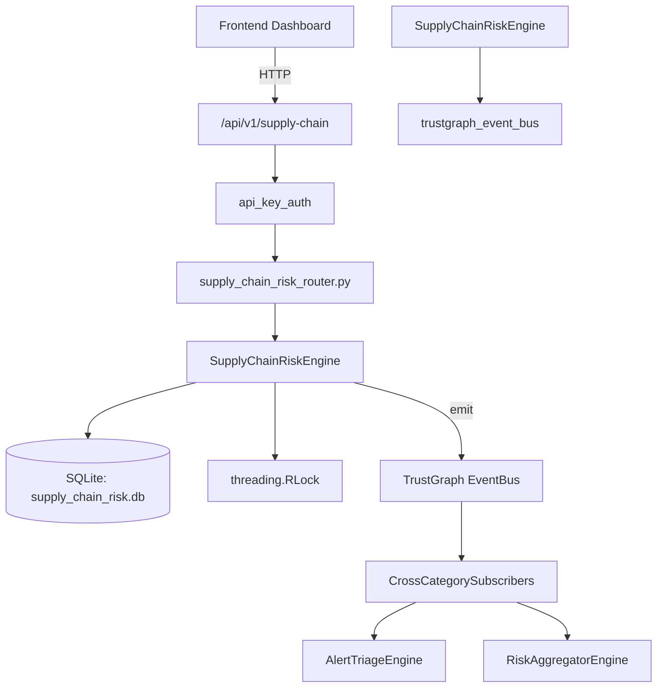

# US-0278: Supply Chain Risk

## Sub-Epic: Advanced
**Master Goal**: ALDECI — $35/mo enterprise security intelligence platform replacing $50K-500K/yr tools

## User Story
As a **Amanda Scott (Supply Chain Security)**, I need to monitor supply chain risks
so that the platform delivers enterprise-grade advanced capabilities at 1/1000th the cost of legacy tools.

## Why This Matters
Supply Chain Risk replaces functionality found in enterprise tools like CrowdStrike, Wiz, Snyk, and Rapid7.
By building this into ALDECI's $35/mo stack, customers save $50K+/yr on standalone Advanced tooling.

## Architecture

## Current State: 95% Complete
- ✅ `add_supplier()` — Register a new supplier. (line 170)
- ✅ `list_suppliers()` — List suppliers, optionally filtered by risk tier. (line 227)
- ✅ `add_component()` — Add a software/hardware component for a supplier. (line 248)
- ✅ `list_components()` — List components, optionally filtered by supplier and/or EOL status. (line 293)
- ✅ `add_risk()` — Register a supply-chain risk. (line 318)
- ✅ `list_risks()` — List supply-chain risks, optionally filtered by status. (line 362)
- ❌ TrustGraph event emission — not yet verified

## Key Functions (from `suite-core/core/supply_chain_risk_engine.py` — 488 lines)
- `SupplyChainRiskEngine.add_supplier()` — Register a new supplier. (line 170)
- `SupplyChainRiskEngine.list_suppliers()` — List suppliers, optionally filtered by risk tier. (line 227)
- `SupplyChainRiskEngine.add_component()` — Add a software/hardware component for a supplier. (line 248)
- `SupplyChainRiskEngine.list_components()` — List components, optionally filtered by supplier and/or EOL status. (line 293)
- `SupplyChainRiskEngine.add_risk()` — Register a supply-chain risk. (line 318)
- `SupplyChainRiskEngine.list_risks()` — List supply-chain risks, optionally filtered by status. (line 362)
- `SupplyChainRiskEngine.import_sbom()` — Parse an SBOM dict and store entries. (line 383)
- `SupplyChainRiskEngine.get_supply_chain_stats()` — Return aggregated supply-chain statistics for an org. (line 457)

## Dependencies
- **Depends on**: trustgraph_event_bus
- **Depended by**: Routers, TrustGraph EventBus, CrossCategorySubscribers
- **TrustGraph**: Event emission wired via ResponseInterceptorMiddleware
- **Source file**: `suite-core/core/supply_chain_risk_engine.py` (488 lines)
- **Router file**: `suite-api/apps/api/supply_chain_risk_router.py`

## API Endpoints
| Method | Path | Description |
|--------|------|-------------|
| GET | `/api/v1/supply-chain/suppliers` | list suppliers |
| POST | `/api/v1/supply-chain/suppliers` | add supplier |
| GET | `/api/v1/supply-chain/components` | list components |
| POST | `/api/v1/supply-chain/components` | add component |
| GET | `/api/v1/supply-chain/risks` | list risks |
| POST | `/api/v1/supply-chain/risks` | add risk |
| POST | `/api/v1/supply-chain/sbom/import` | import sbom |
| GET | `/api/v1/supply-chain/stats` | get stats |

## Tasks Remaining
1. Verify TrustGraph event emission works end-to-end (2h)
2. Add integration test with real persona workflow (2h)
3. Wire CrossCategorySubscriber consumer chain (1h)
4. Validate with 30-persona walkthrough (1h)
5. Optimize query performance for large datasets (2h)
6. Expand test coverage to edge cases (2h)

## Definition of Done
- [ ] Amanda Scott (Supply Chain Security) can access /api/v1/supply-chain and get meaningful data
- [ ] All CRUD operations return correct HTTP status codes
- [ ] TrustGraph receives events from this engine
- [ ] 32+ tests passing in `tests/test_supply_chain_risk_engine.py`
- [ ] 30-persona walkthrough includes this endpoint at 100%
- [ ] No hardcoded org_id — all queries are org-scoped

## Sprint: Wave 51 (est. April 27-29, 2026)

## Test Coverage
- **Test file**: `tests/test_supply_chain_risk_engine.py`
- **Tests**: 32 tests
- **Status**: Passing
