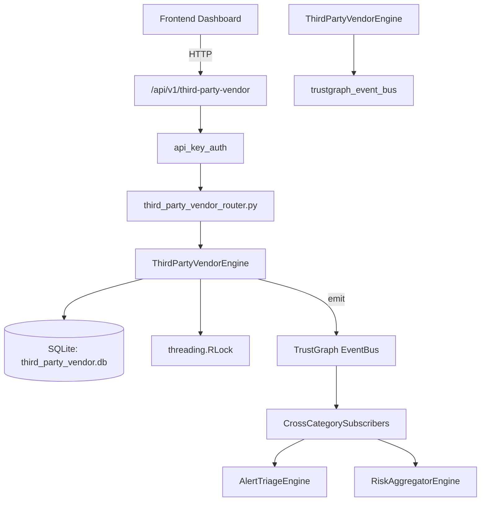

# US-0279: Third Party Vendor

## Sub-Epic: Advanced
**Master Goal**: ALDECI — $35/mo enterprise security intelligence platform replacing $50K-500K/yr tools

## User Story
As a **David Park (Risk Manager)**, I need to assess third-party vendor risk
so that the platform delivers enterprise-grade advanced capabilities at 1/1000th the cost of legacy tools.

## Why This Matters
Third Party Vendor replaces functionality found in enterprise tools like CrowdStrike, Wiz, Snyk, and Rapid7.
By building this into ALDECI's $35/mo stack, customers save $50K+/yr on standalone Advanced tooling.

## Architecture

## Current State: 95% Complete
- ✅ `register_vendor()` — Register a new third-party vendor. (line 145)
- ✅ `list_vendors()` — List vendors with optional filters. (line 195)
- ✅ `get_vendor()` — Get a single vendor by ID. (line 220)
- ✅ `conduct_assessment()` — Conduct a security assessment for a vendor. (line 234)
- ✅ `list_assessments()` — List assessments with optional filters. (line 292)
- ✅ `add_incident()` — Record a vendor-related security incident. (line 317)
- ❌ TrustGraph event emission — not yet verified

## Key Functions (from `suite-core/core/third_party_vendor_engine.py` — 422 lines)
- `ThirdPartyVendorEngine.register_vendor()` — Register a new third-party vendor. (line 145)
- `ThirdPartyVendorEngine.list_vendors()` — List vendors with optional filters. (line 195)
- `ThirdPartyVendorEngine.get_vendor()` — Get a single vendor by ID. (line 220)
- `ThirdPartyVendorEngine.conduct_assessment()` — Conduct a security assessment for a vendor. (line 234)
- `ThirdPartyVendorEngine.list_assessments()` — List assessments with optional filters. (line 292)
- `ThirdPartyVendorEngine.add_incident()` — Record a vendor-related security incident. (line 317)
- `ThirdPartyVendorEngine.list_incidents()` — List incidents with optional filters. (line 345)
- `ThirdPartyVendorEngine.get_vendor_stats()` — Return aggregated third-party vendor statistics for the org. (line 374)

## Dependencies
- **Depends on**: trustgraph_event_bus
- **Depended by**: Routers, TrustGraph EventBus, CrossCategorySubscribers
- **TrustGraph**: Event emission wired via ResponseInterceptorMiddleware
- **Source file**: `suite-core/core/third_party_vendor_engine.py` (422 lines)
- **Router file**: `suite-api/apps/api/third_party_vendor_router.py`

## API Endpoints
| Method | Path | Description |
|--------|------|-------------|
| POST | `/api/v1/third-party-vendor/vendors` | register vendor |
| GET | `/api/v1/third-party-vendor/vendors` | list vendors |
| GET | `/api/v1/third-party-vendor/vendors/{vendor_id}` | get vendor |
| POST | `/api/v1/third-party-vendor/vendors/{vendor_id}/assess` | conduct assessment |
| GET | `/api/v1/third-party-vendor/assessments` | list assessments |
| POST | `/api/v1/third-party-vendor/vendors/{vendor_id}/incidents` | add incident |
| GET | `/api/v1/third-party-vendor/incidents` | list incidents |
| GET | `/api/v1/third-party-vendor/stats` | get vendor stats |

## Tasks Remaining
1. Verify TrustGraph event emission works end-to-end (2h)
2. Add integration test with real persona workflow (2h)
3. Wire CrossCategorySubscriber consumer chain (1h)
4. Validate with 30-persona walkthrough (1h)
5. Optimize query performance for large datasets (2h)
6. Expand test coverage to edge cases (2h)

## Definition of Done
- [ ] David Park (Risk Manager) can access /api/v1/third-party-vendor and get meaningful data
- [ ] All CRUD operations return correct HTTP status codes
- [ ] TrustGraph receives events from this engine
- [ ] 38+ tests passing in `tests/test_third_party_vendor_engine.py`
- [ ] 30-persona walkthrough includes this endpoint at 100%
- [ ] No hardcoded org_id — all queries are org-scoped

## Sprint: Wave 51 (est. April 27-29, 2026)

## Test Coverage
- **Test file**: `tests/test_third_party_vendor_engine.py`
- **Tests**: 38 tests
- **Status**: Passing
