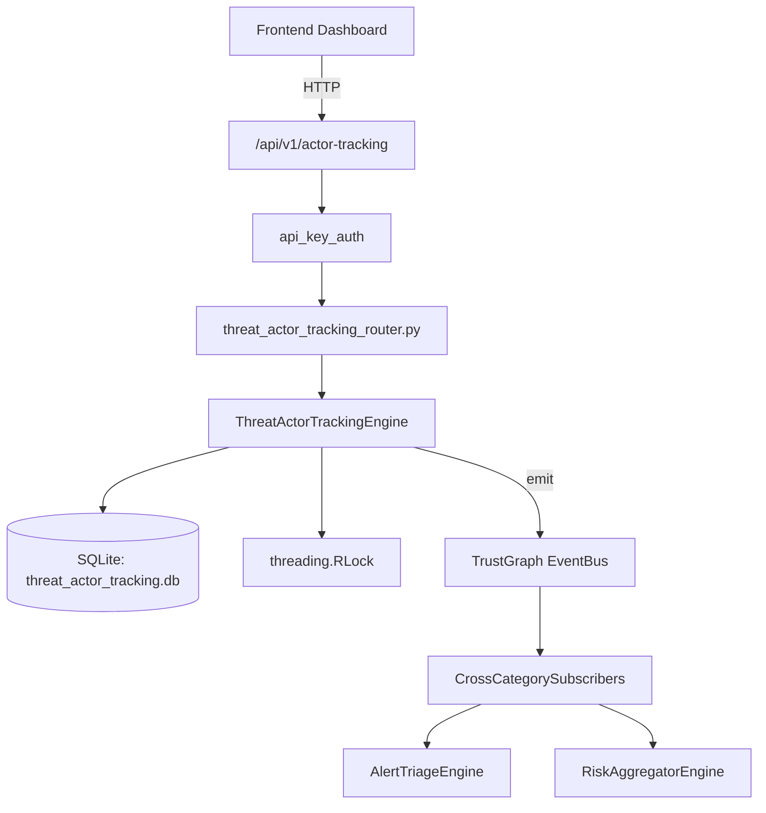

# US-0281: Threat Actor Tracking

## Sub-Epic: AI Intelligence
**Master Goal**: ALDECI — $35/mo enterprise security intelligence platform replacing $50K-500K/yr tools

## User Story
As a **Nina Patel (Threat Intel Analyst)**, I need to track threat actor TTPs
so that the platform delivers enterprise-grade ai intelligence capabilities at 1/1000th the cost of legacy tools.

## Why This Matters
Threat Actor Tracking replaces functionality found in enterprise tools like CrowdStrike, Wiz, Snyk, and Rapid7.
By building this into ALDECI's $35/mo stack, customers save $50K+/yr on standalone AI Intelligence tooling.

## Architecture

## Current State: 95% Complete
- ✅ `track_actor()` — Register a new threat actor for tracking. (line 138)
- ✅ `update_actor_activity()` — Update last_activity timestamp for an actor. (line 168)
- ✅ `record_activity()` — Record an observed activity for a threat actor. (line 182)
- ✅ `add_intelligence()` — Add intelligence entry for a threat actor. Confidence clamped 0-1. (line 219)
- ✅ `get_actor()` — Get actor with recent activities (last 10) and all intelligence. (line 248)
- ✅ `list_actors()` — List tracked actors with optional filters. (line 273)
- ❌ TrustGraph event emission — not yet verified

## Key Functions (from `suite-core/core/threat_actor_tracking_engine.py` — 380 lines)
- `ThreatActorTrackingEngine.track_actor()` — Register a new threat actor for tracking. (line 138)
- `ThreatActorTrackingEngine.update_actor_activity()` — Update last_activity timestamp for an actor. (line 168)
- `ThreatActorTrackingEngine.record_activity()` — Record an observed activity for a threat actor. (line 182)
- `ThreatActorTrackingEngine.add_intelligence()` — Add intelligence entry for a threat actor. Confidence clamped 0-1. (line 219)
- `ThreatActorTrackingEngine.get_actor()` — Get actor with recent activities (last 10) and all intelligence. (line 248)
- `ThreatActorTrackingEngine.list_actors()` — List tracked actors with optional filters. (line 273)
- `ThreatActorTrackingEngine.get_active_threats()` — Get actors with last_activity within the past 90 days. (line 298)
- `ThreatActorTrackingEngine.get_actor_ttp_summary()` — Aggregate TTPs across all actors, frequency count per TTP, top 10. (line 310)

## Dependencies
- **Depends on**: standalone
- **Depended by**: Routers, TrustGraph EventBus, CrossCategorySubscribers
- **TrustGraph**: Event emission wired via ResponseInterceptorMiddleware
- **Source file**: `suite-core/core/threat_actor_tracking_engine.py` (380 lines)
- **Router file**: `suite-api/apps/api/threat_actor_tracking_router.py`

## API Endpoints
| Method | Path | Description |
|--------|------|-------------|
| POST | `/api/v1/actor-tracking/actors` | track actor |
| PATCH | `/api/v1/actor-tracking/actors/{actor_id}/activity` | update actor activity |
| POST | `/api/v1/actor-tracking/actors/{actor_id}/activities` | record activity |
| POST | `/api/v1/actor-tracking/actors/{actor_id}/intelligence` | add intelligence |
| GET | `/api/v1/actor-tracking/actors/{actor_id}` | get actor |
| GET | `/api/v1/actor-tracking/actors` | list actors |
| GET | `/api/v1/actor-tracking/active` | get active threats |
| GET | `/api/v1/actor-tracking/ttp-summary` | get ttp summary |
| GET | `/api/v1/actor-tracking/summary` | get summary |

## Tasks Remaining
1. Verify TrustGraph event emission works end-to-end (2h)
2. Add integration test with real persona workflow (2h)
3. Wire CrossCategorySubscriber consumer chain (1h)
4. Validate with 30-persona walkthrough (1h)
5. Optimize query performance for large datasets (2h)
6. Expand test coverage to edge cases (2h)

## Definition of Done
- [ ] Nina Patel (Threat Intel Analyst) can access /api/v1/actor-tracking and get meaningful data
- [ ] All CRUD operations return correct HTTP status codes
- [ ] TrustGraph receives events from this engine
- [ ] 37+ tests passing in `tests/test_threat_actor_tracking_engine.py`
- [ ] 30-persona walkthrough includes this endpoint at 100%
- [ ] No hardcoded org_id — all queries are org-scoped

## Sprint: Wave 51 (est. April 27-29, 2026)

## Test Coverage
- **Test file**: `tests/test_threat_actor_tracking_engine.py`
- **Tests**: 37 tests
- **Status**: Passing
