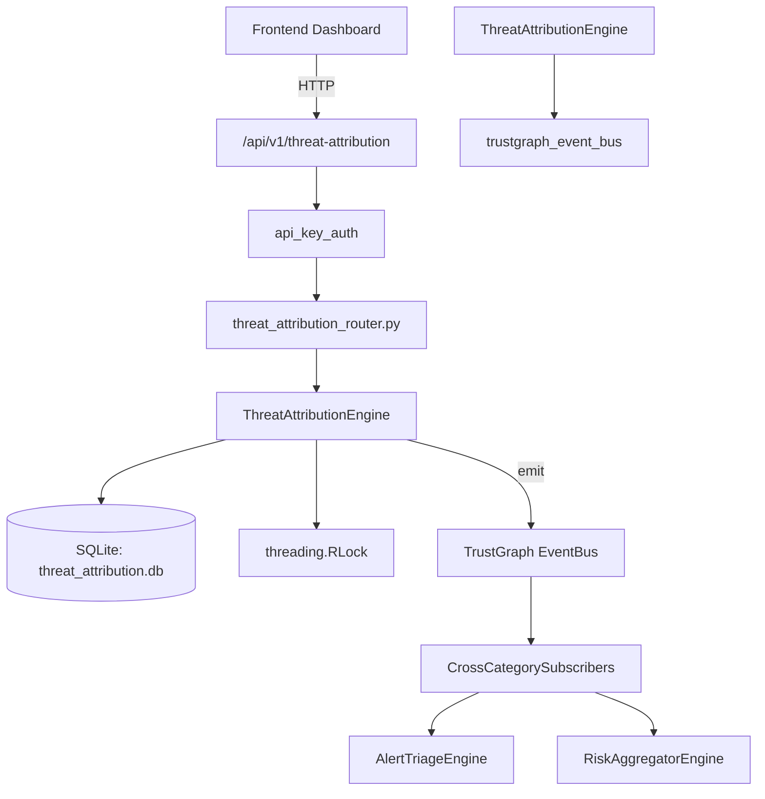

# US-0282: Threat Attribution

## Sub-Epic: AI Intelligence
**Master Goal**: ALDECI — $35/mo enterprise security intelligence platform replacing $50K-500K/yr tools

## User Story
As a **Nina Patel (Threat Intel Analyst)**, I need to attribute attacks to actors
so that the platform delivers enterprise-grade ai intelligence capabilities at 1/1000th the cost of legacy tools.

## Why This Matters
Threat Attribution replaces functionality found in enterprise tools like CrowdStrike, Wiz, Snyk, and Rapid7.
By building this into ALDECI's $35/mo stack, customers save $50K+/yr on standalone AI Intelligence tooling.

## Architecture

## Current State: 95% Complete
- ✅ `create_threat_actor()` — Create a new threat actor record. (line 140)
- ✅ `list_threat_actors()` — List threat actors with optional filters. (line 194)
- ✅ `get_threat_actor()` — Get a single threat actor by id (org-isolated). (line 217)
- ✅ `create_attribution()` — Create a new attribution linking an incident to a threat actor. (line 230)
- ✅ `update_attribution_status()` — Update the status (and optionally notes) of an attribution. (line 275)
- ✅ `list_attributions()` — List attributions with optional filters. (line 316)
- ❌ TrustGraph event emission — not yet verified

## Key Functions (from `suite-core/core/threat_attribution_engine.py` — 421 lines)
- `ThreatAttributionEngine.create_threat_actor()` — Create a new threat actor record. (line 140)
- `ThreatAttributionEngine.list_threat_actors()` — List threat actors with optional filters. (line 194)
- `ThreatAttributionEngine.get_threat_actor()` — Get a single threat actor by id (org-isolated). (line 217)
- `ThreatAttributionEngine.create_attribution()` — Create a new attribution linking an incident to a threat actor. (line 230)
- `ThreatAttributionEngine.update_attribution_status()` — Update the status (and optionally notes) of an attribution. (line 275)
- `ThreatAttributionEngine.list_attributions()` — List attributions with optional filters. (line 316)
- `ThreatAttributionEngine.add_indicator()` — Add an indicator to an attribution. (line 343)
- `ThreatAttributionEngine.get_attribution_stats()` — Return aggregate threat attribution statistics. (line 383)

## Dependencies
- **Depends on**: trustgraph_event_bus
- **Depended by**: Routers, TrustGraph EventBus, CrossCategorySubscribers
- **TrustGraph**: Event emission wired via ResponseInterceptorMiddleware
- **Source file**: `suite-core/core/threat_attribution_engine.py` (421 lines)
- **Router file**: `suite-api/apps/api/threat_attribution_router.py`

## API Endpoints
| Method | Path | Description |
|--------|------|-------------|
| POST | `/api/v1/threat-attribution/actors` | create actor |
| GET | `/api/v1/threat-attribution/actors` | list actors |
| GET | `/api/v1/threat-attribution/stats` | get stats |
| GET | `/api/v1/threat-attribution/attributions` | list attributions |
| POST | `/api/v1/threat-attribution/attributions` | create attribution |
| GET | `/api/v1/threat-attribution/actors/{actor_id}` | get actor |
| PATCH | `/api/v1/threat-attribution/attributions/{attribution_id}/status` | update attribution status |
| POST | `/api/v1/threat-attribution/attributions/{attribution_id}/indicators` | add indicator |

## Tasks Remaining
1. Verify TrustGraph event emission works end-to-end (2h)
2. Add integration test with real persona workflow (2h)
3. Wire CrossCategorySubscriber consumer chain (1h)
4. Validate with 30-persona walkthrough (1h)
5. Optimize query performance for large datasets (2h)
6. Expand test coverage to edge cases (2h)

## Definition of Done
- [ ] Nina Patel (Threat Intel Analyst) can access /api/v1/threat-attribution and get meaningful data
- [ ] All CRUD operations return correct HTTP status codes
- [ ] TrustGraph receives events from this engine
- [ ] 39+ tests passing in `tests/test_threat_attribution_engine.py`
- [ ] 30-persona walkthrough includes this endpoint at 100%
- [ ] No hardcoded org_id — all queries are org-scoped

## Sprint: Wave 51 (est. April 27-29, 2026)

## Test Coverage
- **Test file**: `tests/test_threat_attribution_engine.py`
- **Tests**: 39 tests
- **Status**: Passing
