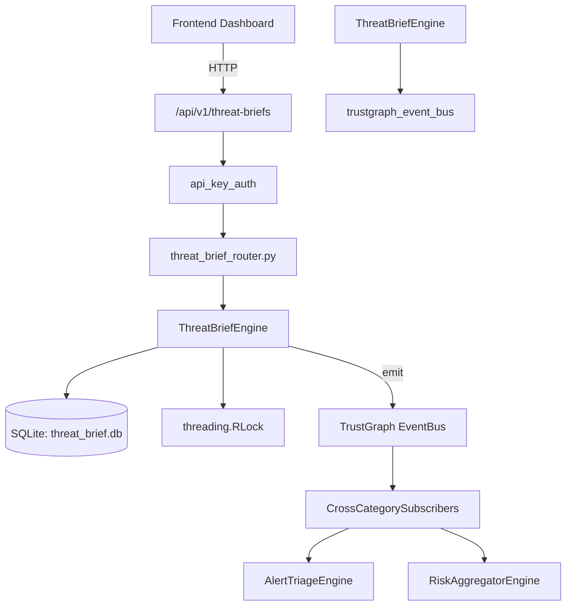

# US-0283: Threat Brief

## Sub-Epic: AI Intelligence
**Master Goal**: ALDECI — $35/mo enterprise security intelligence platform replacing $50K-500K/yr tools

## User Story
As a **Nina Patel (Threat Intel Analyst)**, I need to distribute threat briefings
so that the platform delivers enterprise-grade ai intelligence capabilities at 1/1000th the cost of legacy tools.

## Why This Matters
Threat Brief replaces functionality found in enterprise tools like CrowdStrike, Wiz, Snyk, and Rapid7.
By building this into ALDECI's $35/mo stack, customers save $50K+/yr on standalone AI Intelligence tooling.

## Architecture

## Current State: 95% Complete
- ✅ `create_brief()` — Create a new threat brief. Title is required. (line 130)
- ✅ `list_briefs()` — List threat briefs with optional filters. (line 196)
- ✅ `get_brief()` — Return a single brief or None. (line 217)
- ✅ `distribute_brief()` — Mark brief as distributed and create recipient records. (line 226)
- ✅ `list_recipients()` — List recipients with optional filters. (line 284)
- ✅ `add_threat()` — Add a threat record to a brief. (line 309)
- ❌ TrustGraph event emission — not yet verified

## Key Functions (from `suite-core/core/threat_brief_engine.py` — 426 lines)
- `ThreatBriefEngine.create_brief()` — Create a new threat brief. Title is required. (line 130)
- `ThreatBriefEngine.list_briefs()` — List threat briefs with optional filters. (line 196)
- `ThreatBriefEngine.get_brief()` — Return a single brief or None. (line 217)
- `ThreatBriefEngine.distribute_brief()` — Mark brief as distributed and create recipient records. (line 226)
- `ThreatBriefEngine.list_recipients()` — List recipients with optional filters. (line 284)
- `ThreatBriefEngine.add_threat()` — Add a threat record to a brief. (line 309)
- `ThreatBriefEngine.list_threats()` — List threats with optional brief_id filter. (line 352)
- `ThreatBriefEngine.get_brief_stats()` — Return aggregate statistics for the org. (line 373)

## Dependencies
- **Depends on**: trustgraph_event_bus
- **Depended by**: Routers, TrustGraph EventBus, CrossCategorySubscribers
- **TrustGraph**: Event emission wired via ResponseInterceptorMiddleware
- **Source file**: `suite-core/core/threat_brief_engine.py` (426 lines)
- **Router file**: `suite-api/apps/api/threat_brief_router.py`

## API Endpoints
| Method | Path | Description |
|--------|------|-------------|
| POST | `/api/v1/threat-briefs/briefs` | create brief |
| GET | `/api/v1/threat-briefs/briefs` | list briefs |
| GET | `/api/v1/threat-briefs/briefs/{brief_id}` | get brief |
| POST | `/api/v1/threat-briefs/briefs/{brief_id}/distribute` | distribute brief |
| GET | `/api/v1/threat-briefs/recipients` | list recipients |
| POST | `/api/v1/threat-briefs/briefs/{brief_id}/threats` | add threat |
| GET | `/api/v1/threat-briefs/threats` | list threats |
| GET | `/api/v1/threat-briefs/stats` | get brief stats |

## Tasks Remaining
1. Verify TrustGraph event emission works end-to-end (2h)
2. Add integration test with real persona workflow (2h)
3. Wire CrossCategorySubscriber consumer chain (1h)
4. Validate with 30-persona walkthrough (1h)
5. Optimize query performance for large datasets (2h)
6. Expand test coverage to edge cases (2h)

## Definition of Done
- [ ] Nina Patel (Threat Intel Analyst) can access /api/v1/threat-briefs and get meaningful data
- [ ] All CRUD operations return correct HTTP status codes
- [ ] TrustGraph receives events from this engine
- [ ] 37+ tests passing in `tests/test_threat_brief_engine.py`
- [ ] 30-persona walkthrough includes this endpoint at 100%
- [ ] No hardcoded org_id — all queries are org-scoped

## Sprint: Wave 51 (est. April 27-29, 2026)

## Test Coverage
- **Test file**: `tests/test_threat_brief_engine.py`
- **Tests**: 37 tests
- **Status**: Passing
