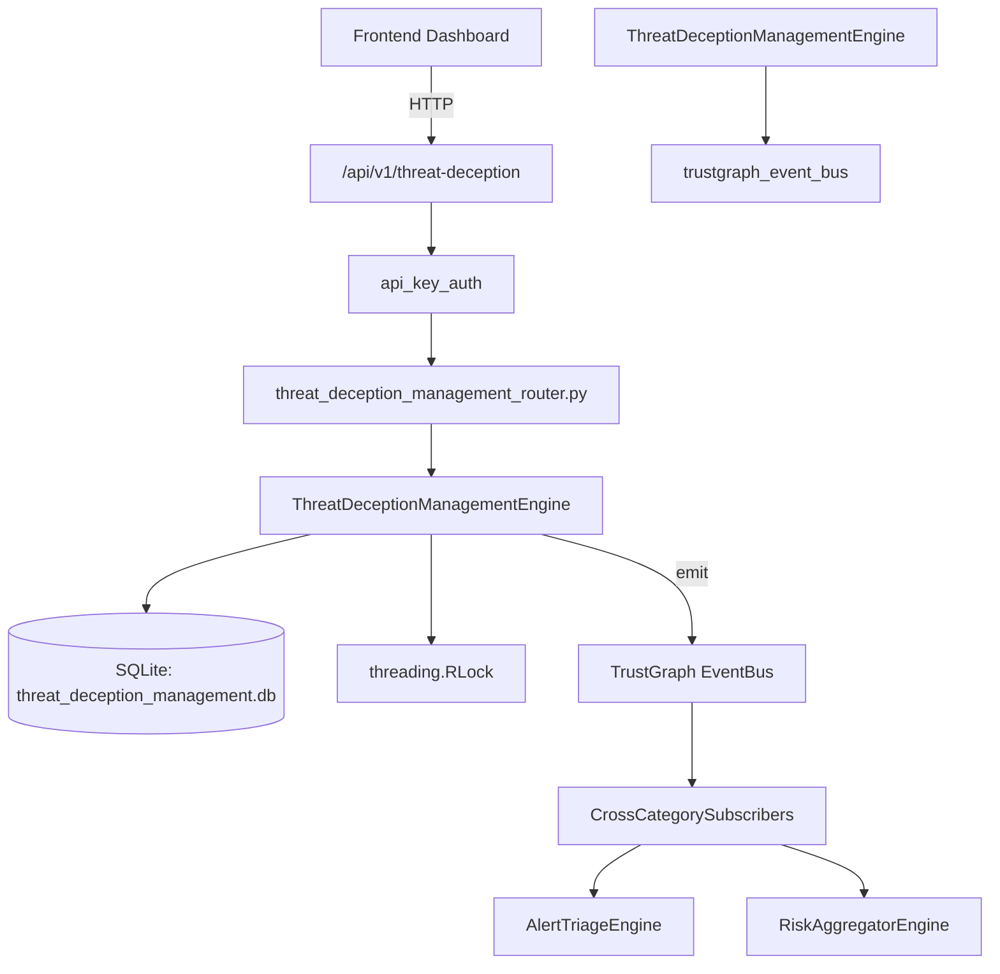

# US-0285: Threat Deception Management

## Sub-Epic: Advanced
**Master Goal**: ALDECI — $35/mo enterprise security intelligence platform replacing $50K-500K/yr tools

## User Story
As a **Lisa Zhang (Pentester)**, I need to manage deception campaigns
so that the platform delivers enterprise-grade advanced capabilities at 1/1000th the cost of legacy tools.

## Why This Matters
Threat Deception Management replaces functionality found in enterprise tools like CrowdStrike, Wiz, Snyk, and Rapid7.
By building this into ALDECI's $35/mo stack, customers save $50K+/yr on standalone Advanced tooling.

## Architecture

## Current State: 95% Complete
- ✅ `create_decoy()` — Create a new deception decoy asset. (line 127)
- ✅ `list_decoys()` — List decoys with optional type/active filters. (line 179)
- ✅ `get_decoy()` — Retrieve a single decoy by ID with org isolation. (line 199)
- ✅ `record_interaction()` — Record an attacker interaction with a decoy. (line 212)
- ✅ `list_interactions()` — List interactions with optional filters, ordered by occurred_at DESC. (line 260)
- ✅ `create_campaign()` — Create a deception campaign. (line 284)
- ❌ TrustGraph event emission — not yet verified

## Key Functions (from `suite-core/core/threat_deception_management_engine.py` — 390 lines)
- `ThreatDeceptionManagementEngine.create_decoy()` — Create a new deception decoy asset. (line 127)
- `ThreatDeceptionManagementEngine.list_decoys()` — List decoys with optional type/active filters. (line 179)
- `ThreatDeceptionManagementEngine.get_decoy()` — Retrieve a single decoy by ID with org isolation. (line 199)
- `ThreatDeceptionManagementEngine.record_interaction()` — Record an attacker interaction with a decoy. (line 212)
- `ThreatDeceptionManagementEngine.list_interactions()` — List interactions with optional filters, ordered by occurred_at DESC. (line 260)
- `ThreatDeceptionManagementEngine.create_campaign()` — Create a deception campaign. (line 284)
- `ThreatDeceptionManagementEngine.list_campaigns()` — List campaigns with optional status filter. (line 321)
- `ThreatDeceptionManagementEngine.get_deception_stats()` — Return aggregated deception statistics for an org. (line 339)

## Dependencies
- **Depends on**: trustgraph_event_bus
- **Depended by**: Routers, TrustGraph EventBus, CrossCategorySubscribers
- **TrustGraph**: Event emission wired via ResponseInterceptorMiddleware
- **Source file**: `suite-core/core/threat_deception_management_engine.py` (390 lines)
- **Router file**: `suite-api/apps/api/threat_deception_management_router.py`

## API Endpoints
| Method | Path | Description |
|--------|------|-------------|
| POST | `/api/v1/threat-deception/decoys` | create decoy |
| GET | `/api/v1/threat-deception/decoys` | list decoys |
| GET | `/api/v1/threat-deception/decoys/{decoy_id}` | get decoy |
| POST | `/api/v1/threat-deception/decoys/{decoy_id}/interactions` | record interaction |
| GET | `/api/v1/threat-deception/interactions` | list interactions |
| POST | `/api/v1/threat-deception/campaigns` | create campaign |
| GET | `/api/v1/threat-deception/campaigns` | list campaigns |
| GET | `/api/v1/threat-deception/stats` | get deception stats |

## Tasks Remaining
1. Verify TrustGraph event emission works end-to-end (2h)
2. Add integration test with real persona workflow (2h)
3. Wire CrossCategorySubscriber consumer chain (1h)
4. Validate with 30-persona walkthrough (1h)
5. Optimize query performance for large datasets (2h)
6. Expand test coverage to edge cases (2h)

## Definition of Done
- [ ] Lisa Zhang (Pentester) can access /api/v1/threat-deception and get meaningful data
- [ ] All CRUD operations return correct HTTP status codes
- [ ] TrustGraph receives events from this engine
- [ ] 33+ tests passing in `tests/test_threat_deception_management_engine.py`
- [ ] 30-persona walkthrough includes this endpoint at 100%
- [ ] No hardcoded org_id — all queries are org-scoped

## Sprint: Wave 51 (est. April 27-29, 2026)

## Test Coverage
- **Test file**: `tests/test_threat_deception_management_engine.py`
- **Tests**: 33 tests
- **Status**: Passing
