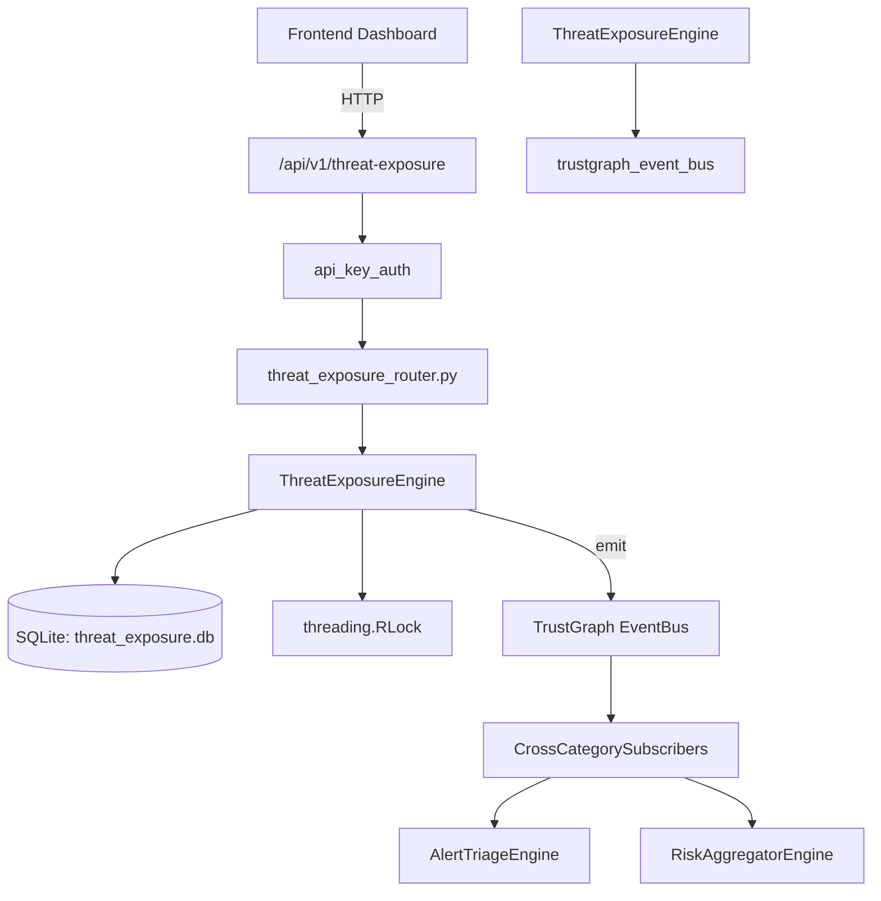

# US-0286: Threat Exposure

## Sub-Epic: Advanced
**Master Goal**: ALDECI — $35/mo enterprise security intelligence platform replacing $50K-500K/yr tools

## User Story
As a **David Park (Risk Manager)**, I need to score threat exposure risk
so that the platform delivers enterprise-grade advanced capabilities at 1/1000th the cost of legacy tools.

## Why This Matters
Threat Exposure replaces functionality found in enterprise tools like CrowdStrike, Wiz, Snyk, and Rapid7.
By building this into ALDECI's $35/mo stack, customers save $50K+/yr on standalone Advanced tooling.

## Architecture

## Current State: 95% Complete
- ✅ `register_asset()` — Register a new asset for exposure tracking. (line 150)
- ✅ `list_assets()` — List assets with optional type and exposure_level filters. (line 203)
- ✅ `get_asset()` — Retrieve a single asset record. (line 223)
- ✅ `correlate_threat()` — Correlate a threat with an asset and increment threat_count. (line 236)
- ✅ `list_correlations()` — List threat correlations with optional filters. (line 296)
- ✅ `calculate_exposure()` — Recalculate exposure score from all correlations and save history. (line 320)
- ❌ TrustGraph event emission — not yet verified

## Key Functions (from `suite-core/core/threat_exposure_engine.py` — 444 lines)
- `ThreatExposureEngine.register_asset()` — Register a new asset for exposure tracking. (line 150)
- `ThreatExposureEngine.list_assets()` — List assets with optional type and exposure_level filters. (line 203)
- `ThreatExposureEngine.get_asset()` — Retrieve a single asset record. (line 223)
- `ThreatExposureEngine.correlate_threat()` — Correlate a threat with an asset and increment threat_count. (line 236)
- `ThreatExposureEngine.list_correlations()` — List threat correlations with optional filters. (line 296)
- `ThreatExposureEngine.calculate_exposure()` — Recalculate exposure score from all correlations and save history. (line 320)
- `ThreatExposureEngine.get_exposure_history()` — Return exposure history for an asset, ordered by recorded_at DESC. (line 364)
- `ThreatExposureEngine.get_top_exposed_assets()` — Return assets ordered by exposure_score DESC. (line 376)

## Dependencies
- **Depends on**: trustgraph_event_bus
- **Depended by**: Routers, TrustGraph EventBus, CrossCategorySubscribers
- **TrustGraph**: Event emission wired via ResponseInterceptorMiddleware
- **Source file**: `suite-core/core/threat_exposure_engine.py` (444 lines)
- **Router file**: `suite-api/apps/api/threat_exposure_router.py`

## API Endpoints
| Method | Path | Description |
|--------|------|-------------|
| POST | `/api/v1/threat-exposure/assets` | register asset |
| GET | `/api/v1/threat-exposure/assets` | list assets |
| GET | `/api/v1/threat-exposure/top-exposed` | get top exposed assets |
| GET | `/api/v1/threat-exposure/stats` | get exposure stats |
| GET | `/api/v1/threat-exposure/assets/{asset_id}` | get asset |
| POST | `/api/v1/threat-exposure/correlations` | correlate threat |
| GET | `/api/v1/threat-exposure/correlations` | list correlations |
| POST | `/api/v1/threat-exposure/assets/{asset_id}/calculate` | calculate exposure |
| GET | `/api/v1/threat-exposure/assets/{asset_id}/history` | get exposure history |

## Tasks Remaining
1. Verify TrustGraph event emission works end-to-end (2h)
2. Add integration test with real persona workflow (2h)
3. Wire CrossCategorySubscriber consumer chain (1h)
4. Validate with 30-persona walkthrough (1h)
5. Optimize query performance for large datasets (2h)
6. Expand test coverage to edge cases (2h)

## Definition of Done
- [ ] David Park (Risk Manager) can access /api/v1/threat-exposure and get meaningful data
- [ ] All CRUD operations return correct HTTP status codes
- [ ] TrustGraph receives events from this engine
- [ ] 36+ tests passing in `tests/test_threat_exposure_engine.py`
- [ ] 30-persona walkthrough includes this endpoint at 100%
- [ ] No hardcoded org_id — all queries are org-scoped

## Sprint: Wave 51 (est. April 27-29, 2026)

## Test Coverage
- **Test file**: `tests/test_threat_exposure_engine.py`
- **Tests**: 36 tests
- **Status**: Passing
