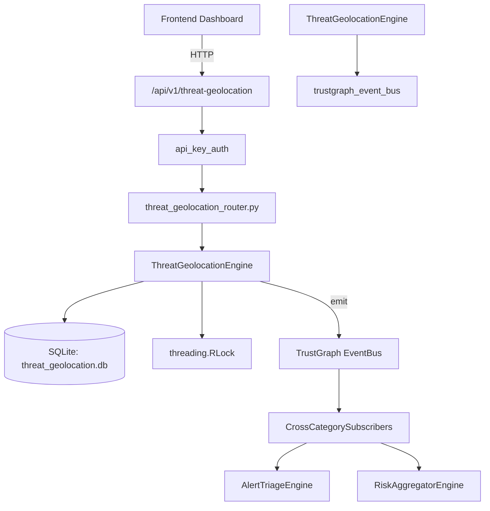

# US-0288: Threat Geolocation

## Sub-Epic: AI Intelligence
**Master Goal**: ALDECI — $35/mo enterprise security intelligence platform replacing $50K-500K/yr tools

## User Story
As a **Nina Patel (Threat Intel Analyst)**, I need to map threats geographically
so that the platform delivers enterprise-grade ai intelligence capabilities at 1/1000th the cost of legacy tools.

## Why This Matters
Threat Geolocation replaces functionality found in enterprise tools like CrowdStrike, Wiz, Snyk, and Rapid7.
By building this into ALDECI's $35/mo stack, customers save $50K+/yr on standalone AI Intelligence tooling.

## Architecture

## Current State: 95% Complete
- ✅ `record_geo_event()` — Record a geographic threat event. (line 131)
- ✅ `list_geo_events()` — Return geo events filtered by optional country_code and/or risk_level. (line 196)
- ✅ `get_country_heatmap()` — Aggregate geo events by country for the last N hours. (line 223)
- ✅ `detect_impossible_travel()` — Detect impossible travel in a list of geo events for a user. (line 281)
- ✅ `create_geo_block_rule()` — Create a country-level block rule. (line 331)
- ✅ `list_geo_block_rules()` — Return all block rules for the org. (line 370)
- ❌ TrustGraph event emission — not yet verified

## Key Functions (from `suite-core/core/threat_geolocation_engine.py` — 446 lines)
- `ThreatGeolocationEngine.record_geo_event()` — Record a geographic threat event. (line 131)
- `ThreatGeolocationEngine.list_geo_events()` — Return geo events filtered by optional country_code and/or risk_level. (line 196)
- `ThreatGeolocationEngine.get_country_heatmap()` — Aggregate geo events by country for the last N hours. (line 223)
- `ThreatGeolocationEngine.detect_impossible_travel()` — Detect impossible travel in a list of geo events for a user. (line 281)
- `ThreatGeolocationEngine.create_geo_block_rule()` — Create a country-level block rule. (line 331)
- `ThreatGeolocationEngine.list_geo_block_rules()` — Return all block rules for the org. (line 370)
- `ThreatGeolocationEngine.check_ip_allowed()` — Check whether an IP from a given country is allowed under block rules. (line 380)
- `ThreatGeolocationEngine.get_geo_stats()` — Return summary statistics for the org. (line 407)

## Dependencies
- **Depends on**: trustgraph_event_bus
- **Depended by**: Routers, TrustGraph EventBus, CrossCategorySubscribers
- **TrustGraph**: Event emission wired via ResponseInterceptorMiddleware
- **Source file**: `suite-core/core/threat_geolocation_engine.py` (446 lines)
- **Router file**: `suite-api/apps/api/threat_geolocation_router.py`

## API Endpoints
| Method | Path | Description |
|--------|------|-------------|
| POST | `/api/v1/threat-geolocation/events` | record geo event |
| GET | `/api/v1/threat-geolocation/events` | list geo events |
| GET | `/api/v1/threat-geolocation/heatmap` | get country heatmap |
| POST | `/api/v1/threat-geolocation/impossible-travel` | detect impossible travel |
| POST | `/api/v1/threat-geolocation/block-rules` | create geo block rule |
| GET | `/api/v1/threat-geolocation/block-rules` | list geo block rules |
| POST | `/api/v1/threat-geolocation/check-ip` | check ip allowed |
| GET | `/api/v1/threat-geolocation/stats` | get geo stats |

## Tasks Remaining
1. Verify TrustGraph event emission works end-to-end (2h)
2. Add integration test with real persona workflow (2h)
3. Wire CrossCategorySubscriber consumer chain (1h)
4. Validate with 30-persona walkthrough (1h)
5. Optimize query performance for large datasets (2h)
6. Expand test coverage to edge cases (2h)

## Definition of Done
- [ ] Nina Patel (Threat Intel Analyst) can access /api/v1/threat-geolocation and get meaningful data
- [ ] All CRUD operations return correct HTTP status codes
- [ ] TrustGraph receives events from this engine
- [ ] 43+ tests passing in `tests/test_threat_geolocation_engine.py`
- [ ] 30-persona walkthrough includes this endpoint at 100%
- [ ] No hardcoded org_id — all queries are org-scoped

## Sprint: Wave 51 (est. April 27-29, 2026)

## Test Coverage
- **Test file**: `tests/test_threat_geolocation_engine.py`
- **Tests**: 43 tests
- **Status**: Passing
