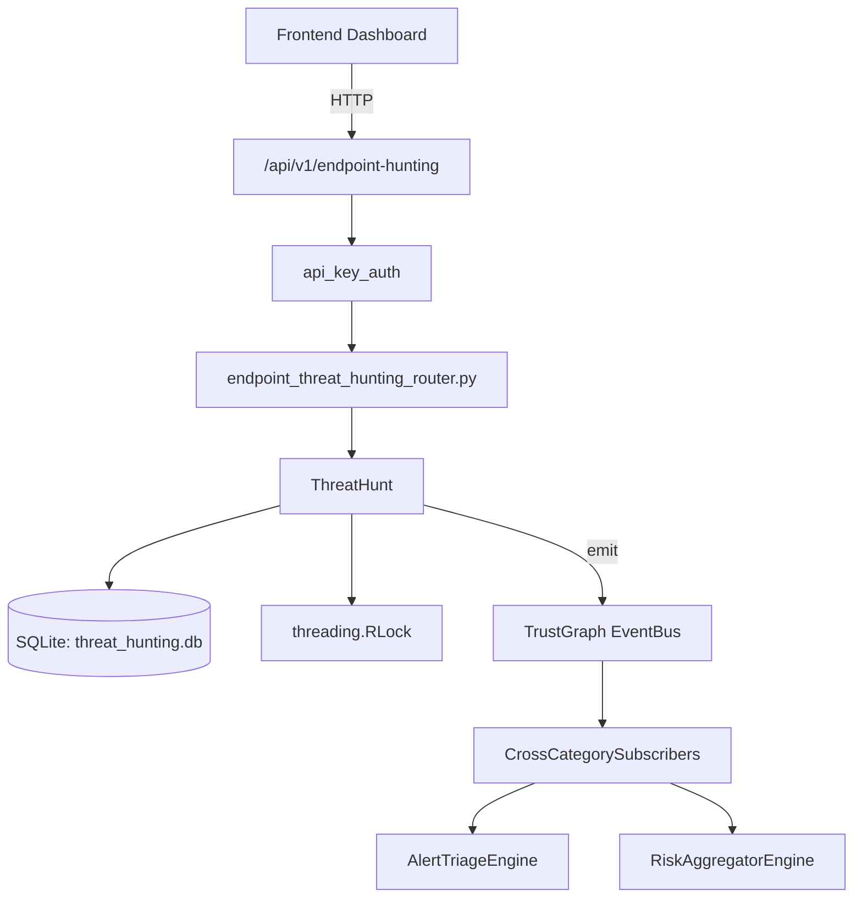

# US-0289: Threat Hunting

## Sub-Epic: CTEM
**Master Goal**: ALDECI — $35/mo enterprise security intelligence platform replacing $50K-500K/yr tools

## User Story
As a **Priya Sharma (SOC T2 Analyst)**, I need to run proactive threat hunts
so that the platform delivers enterprise-grade ctem capabilities at 1/1000th the cost of legacy tools.

## Why This Matters
Threat Hunting replaces functionality found in enterprise tools like CrowdStrike, Wiz, Snyk, and Rapid7.
By building this into ALDECI's $35/mo stack, customers save $50K+/yr on standalone CTEM tooling.

## Architecture

## Current State: 95% Complete
- ✅ `to_dict()` — implemented (line 64)
- ✅ `create_hunt()` — Create a new hunt definition. (line 149)
- ✅ `run_hunt()` — Execute a hunt. (line 196)
- ✅ `schedule_hunt()` — Schedule a hunt to run periodically. Returns schedule record. (line 248)
- ✅ `get_hunt()` — Return hunt dict or None if not found. (line 277)
- ✅ `list_hunts()` — List hunts for an org, optionally filtered by hunt_type. (line 288)
- ❌ TrustGraph event emission — not yet verified

## Key Functions (from `suite-core/core/threat_hunting_engine.py` — 650 lines)
- `ThreatHunt.to_dict()` — Handle to dict (line 64)
- `ThreatHuntingEngine.create_hunt()` — Create a new hunt definition. (line 149)
- `ThreatHuntingEngine.run_hunt()` — Execute a hunt. (line 196)
- `ThreatHuntingEngine.schedule_hunt()` — Schedule a hunt to run periodically. Returns schedule record. (line 248)
- `ThreatHuntingEngine.get_hunt()` — Return hunt dict or None if not found. (line 277)
- `ThreatHuntingEngine.list_hunts()` — List hunts for an org, optionally filtered by hunt_type. (line 288)
- `ThreatHuntingEngine.get_results()` — Get all result runs for a hunt. (line 308)
- `ThreatHuntingEngine.delete_hunt()` — Delete a hunt and its results. Returns True if deleted, False if not found. (line 331)

## Dependencies
- **Depends on**: standalone
- **Depended by**: Routers, TrustGraph EventBus, CrossCategorySubscribers
- **TrustGraph**: Event emission wired via ResponseInterceptorMiddleware
- **Source file**: `suite-core/core/threat_hunting_engine.py` (650 lines)
- **Router file**: `suite-api/apps/api/endpoint_threat_hunting_router.py`

## API Endpoints
| Method | Path | Description |
|--------|------|-------------|
| POST | `/api/v1/endpoint-hunting/hunts` | create hunt |
| GET | `/api/v1/endpoint-hunting/hunts` | list hunts |
| GET | `/api/v1/endpoint-hunting/hunts/{hunt_id}` | get hunt |
| PUT | `/api/v1/endpoint-hunting/hunts/{hunt_id}/start` | start hunt |
| PUT | `/api/v1/endpoint-hunting/hunts/{hunt_id}/complete` | complete hunt |
| POST | `/api/v1/endpoint-hunting/findings` | record finding |
| GET | `/api/v1/endpoint-hunting/findings` | list findings |
| PUT | `/api/v1/endpoint-hunting/findings/{finding_id}/status` | update finding status |
| POST | `/api/v1/endpoint-hunting/iocs` | add ioc |
| GET | `/api/v1/endpoint-hunting/iocs` | list iocs |
| GET | `/api/v1/endpoint-hunting/stats` | get hunting stats |

## Tasks Remaining
1. Verify TrustGraph event emission works end-to-end (2h)
2. Add integration test with real persona workflow (2h)
3. Wire CrossCategorySubscriber consumer chain (1h)
4. Validate with 30-persona walkthrough (1h)
5. Optimize query performance for large datasets (2h)
6. Expand test coverage to edge cases (2h)

## Definition of Done
- [ ] Priya Sharma (SOC T2 Analyst) can access /api/v1/endpoint-hunting and get meaningful data
- [ ] All CRUD operations return correct HTTP status codes
- [ ] TrustGraph receives events from this engine
- [ ] 67+ tests passing in `tests/test_threat_hunting_engine.py`
- [ ] 30-persona walkthrough includes this endpoint at 100%
- [ ] No hardcoded org_id — all queries are org-scoped

## Sprint: Wave 51 (est. April 27-29, 2026)

## Test Coverage
- **Test file**: `tests/test_threat_hunting_engine.py`
- **Tests**: 67 tests
- **Status**: Passing
