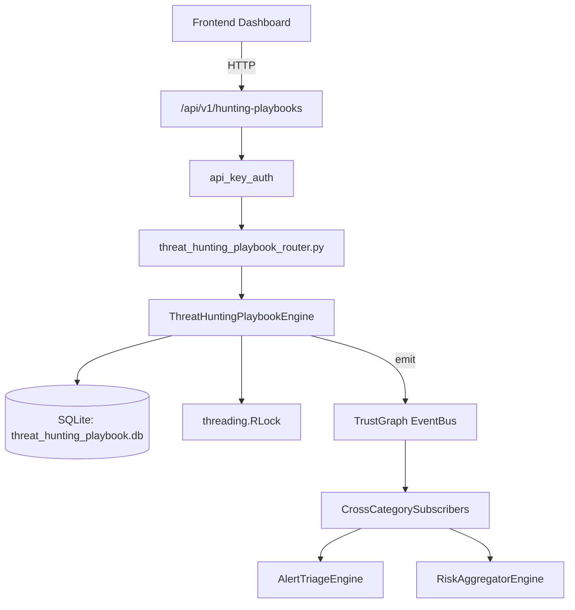

# US-0290: Threat Hunting Playbook

## Sub-Epic: CTEM
**Master Goal**: ALDECI — $35/mo enterprise security intelligence platform replacing $50K-500K/yr tools

## User Story
As a **Priya Sharma (SOC T2 Analyst)**, I need to run proactive threat hunts
so that the platform delivers enterprise-grade ctem capabilities at 1/1000th the cost of legacy tools.

## Why This Matters
Threat Hunting Playbook replaces functionality found in enterprise tools like CrowdStrike, Wiz, Snyk, and Rapid7.
By building this into ALDECI's $35/mo stack, customers save $50K+/yr on standalone CTEM tooling.

## Architecture

## Current State: 95% Complete
- ✅ `create_playbook()` — Create a new threat hunting playbook in draft status. (line 130)
- ✅ `get_playbook()` — Return playbook dict with nested executions and hypotheses. (line 170)
- ✅ `list_playbooks()` — List playbooks for org, optionally filtered. (line 194)
- ✅ `add_hypothesis()` — Add a hypothesis to a playbook. (line 218)
- ✅ `validate_hypothesis()` — Mark a hypothesis as validated and store evidence. (line 258)
- ✅ `start_execution()` — Start a hunt execution. Sets start_time=now, outcome=in_progress, increments exe (line 292)
- ❌ TrustGraph event emission — not yet verified

## Key Functions (from `suite-core/core/threat_hunting_playbook_engine.py` — 460 lines)
- `ThreatHuntingPlaybookEngine.create_playbook()` — Create a new threat hunting playbook in draft status. (line 130)
- `ThreatHuntingPlaybookEngine.get_playbook()` — Return playbook dict with nested executions and hypotheses. (line 170)
- `ThreatHuntingPlaybookEngine.list_playbooks()` — List playbooks for org, optionally filtered. (line 194)
- `ThreatHuntingPlaybookEngine.add_hypothesis()` — Add a hypothesis to a playbook. (line 218)
- `ThreatHuntingPlaybookEngine.validate_hypothesis()` — Mark a hypothesis as validated and store evidence. (line 258)
- `ThreatHuntingPlaybookEngine.start_execution()` — Start a hunt execution. Sets start_time=now, outcome=in_progress, increments exe (line 292)
- `ThreatHuntingPlaybookEngine.complete_execution()` — Complete a hunt execution. Computes duration, recomputes success_rate and avg_du (line 332)
- `ThreatHuntingPlaybookEngine.get_hunt_stats()` — Return aggregate hunt stats for the org. (line 418)

## Dependencies
- **Depends on**: standalone
- **Depended by**: Routers, TrustGraph EventBus, CrossCategorySubscribers
- **TrustGraph**: Event emission wired via ResponseInterceptorMiddleware
- **Source file**: `suite-core/core/threat_hunting_playbook_engine.py` (460 lines)
- **Router file**: `suite-api/apps/api/threat_hunting_playbook_router.py`

## API Endpoints
| Method | Path | Description |
|--------|------|-------------|
| POST | `/api/v1/hunting-playbooks/playbooks` | create playbook |
| GET | `/api/v1/hunting-playbooks/playbooks` | list playbooks |
| GET | `/api/v1/hunting-playbooks/playbooks/{playbook_id}` | get playbook |
| POST | `/api/v1/hunting-playbooks/playbooks/{playbook_id}/hypotheses` | add hypothesis |
| POST | `/api/v1/hunting-playbooks/hypotheses/{hypothesis_id}/validate` | validate hypothesis |
| POST | `/api/v1/hunting-playbooks/playbooks/{playbook_id}/executions` | start execution |
| POST | `/api/v1/hunting-playbooks/executions/{execution_id}/complete` | complete execution |
| GET | `/api/v1/hunting-playbooks/stats` | get hunt stats |

## Tasks Remaining
1. Verify TrustGraph event emission works end-to-end (2h)
2. Add integration test with real persona workflow (2h)
3. Wire CrossCategorySubscriber consumer chain (1h)
4. Validate with 30-persona walkthrough (1h)
5. Optimize query performance for large datasets (2h)
6. Expand test coverage to edge cases (2h)

## Definition of Done
- [ ] Priya Sharma (SOC T2 Analyst) can access /api/v1/hunting-playbooks and get meaningful data
- [ ] All CRUD operations return correct HTTP status codes
- [ ] TrustGraph receives events from this engine
- [ ] 42+ tests passing in `tests/test_threat_hunting_playbook_engine.py`
- [ ] 30-persona walkthrough includes this endpoint at 100%
- [ ] No hardcoded org_id — all queries are org-scoped

## Sprint: Wave 51 (est. April 27-29, 2026)

## Test Coverage
- **Test file**: `tests/test_threat_hunting_playbook_engine.py`
- **Tests**: 42 tests
- **Status**: Passing
