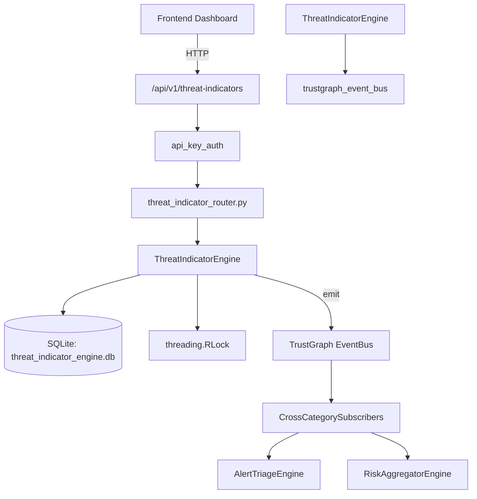

# US-0291: Threat Indicator

## Sub-Epic: AI Intelligence
**Master Goal**: ALDECI — $35/mo enterprise security intelligence platform replacing $50K-500K/yr tools

## User Story
As a **Nina Patel (Threat Intel Analyst)**, I need to manage IOC lifecycle
so that the platform delivers enterprise-grade ai intelligence capabilities at 1/1000th the cost of legacy tools.

## Why This Matters
Threat Indicator replaces functionality found in enterprise tools like CrowdStrike, Wiz, Snyk, and Rapid7.
By building this into ALDECI's $35/mo stack, customers save $50K+/yr on standalone AI Intelligence tooling.

## Architecture

## Current State: 95% Complete
- ✅ `add_indicator()` — Add a new threat indicator (IOC). (line 142)
- ✅ `get_indicator()` — Get indicator with its enrichments and sightings. (line 206)
- ✅ `get_active_indicators()` — Return active indicators not yet expired. (line 230)
- ✅ `get_expired_indicators()` — Return indicators that are active but past their expiry_at timestamp. (line 254)
- ✅ `search_indicators()` — LIKE search on indicator_value. (line 267)
- ✅ `mark_false_positive()` — Mark an indicator as a false positive and deactivate it. (line 286)
- ❌ TrustGraph event emission — not yet verified

## Key Functions (from `suite-core/core/threat_indicator_engine.py` — 456 lines)
- `ThreatIndicatorEngine.add_indicator()` — Add a new threat indicator (IOC). (line 142)
- `ThreatIndicatorEngine.get_indicator()` — Get indicator with its enrichments and sightings. (line 206)
- `ThreatIndicatorEngine.get_active_indicators()` — Return active indicators not yet expired. (line 230)
- `ThreatIndicatorEngine.get_expired_indicators()` — Return indicators that are active but past their expiry_at timestamp. (line 254)
- `ThreatIndicatorEngine.search_indicators()` — LIKE search on indicator_value. (line 267)
- `ThreatIndicatorEngine.mark_false_positive()` — Mark an indicator as a false positive and deactivate it. (line 286)
- `ThreatIndicatorEngine.expire_indicator()` — Manually expire (deactivate) an indicator. (line 304)
- `ThreatIndicatorEngine.get_summary()` — Return aggregated indicator summary for the org. (line 320)

## Dependencies
- **Depends on**: trustgraph_event_bus
- **Depended by**: Routers, TrustGraph EventBus, CrossCategorySubscribers
- **TrustGraph**: Event emission wired via ResponseInterceptorMiddleware
- **Source file**: `suite-core/core/threat_indicator_engine.py` (456 lines)
- **Router file**: `suite-api/apps/api/threat_indicator_router.py`

## API Endpoints
| Method | Path | Description |
|--------|------|-------------|
| POST | `/api/v1/threat-indicators/indicators` | add indicator |
| GET | `/api/v1/threat-indicators/indicators` | get active indicators |
| GET | `/api/v1/threat-indicators/indicators/{indicator_id}` | get indicator |
| POST | `/api/v1/threat-indicators/indicators/{indicator_id}/enrich` | enrich indicator |
| POST | `/api/v1/threat-indicators/indicators/{indicator_id}/sighting` | record sighting |
| POST | `/api/v1/threat-indicators/indicators/{indicator_id}/false-positive` | mark false positive |
| POST | `/api/v1/threat-indicators/indicators/{indicator_id}/expire` | expire indicator |
| GET | `/api/v1/threat-indicators/expired` | get expired indicators |
| GET | `/api/v1/threat-indicators/search` | search indicators |
| GET | `/api/v1/threat-indicators/summary` | get summary |

## Tasks Remaining
1. Verify TrustGraph event emission works end-to-end (2h)
2. Add integration test with real persona workflow (2h)
3. Wire CrossCategorySubscriber consumer chain (1h)
4. Validate with 30-persona walkthrough (1h)
5. Optimize query performance for large datasets (2h)
6. Expand test coverage to edge cases (2h)

## Definition of Done
- [ ] Nina Patel (Threat Intel Analyst) can access /api/v1/threat-indicators and get meaningful data
- [ ] All CRUD operations return correct HTTP status codes
- [ ] TrustGraph receives events from this engine
- [ ] 40+ tests passing in `tests/test_threat_indicator_engine.py`
- [ ] 30-persona walkthrough includes this endpoint at 100%
- [ ] No hardcoded org_id — all queries are org-scoped

## Sprint: Wave 51 (est. April 27-29, 2026)

## Test Coverage
- **Test file**: `tests/test_threat_indicator_engine.py`
- **Tests**: 40 tests
- **Status**: Passing
