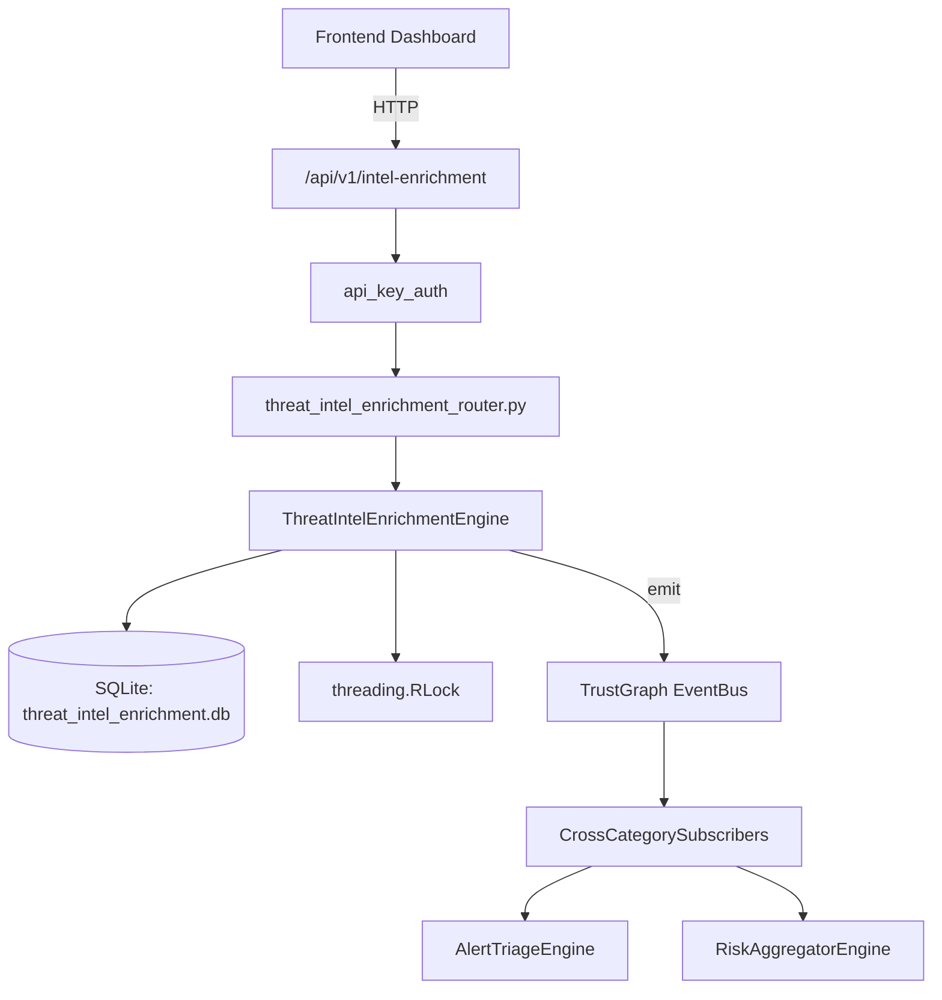

# US-0292: Threat Intel Enrichment

## Sub-Epic: AI Intelligence
**Master Goal**: ALDECI — $35/mo enterprise security intelligence platform replacing $50K-500K/yr tools

## User Story
As a **Nina Patel (Threat Intel Analyst)**, I need to automate threat intelligence
so that the platform delivers enterprise-grade ai intelligence capabilities at 1/1000th the cost of legacy tools.

## Why This Matters
Threat Intel Enrichment replaces functionality found in enterprise tools like CrowdStrike, Wiz, Snyk, and Rapid7.
By building this into ALDECI's $35/mo stack, customers save $50K+/yr on standalone AI Intelligence tooling.

## Architecture

## Current State: 95% Complete
- ✅ `create_enrichment_request()` — Create a new enrichment request with status=pending. (line 146)
- ✅ `add_enrichment_result()` — Add an enrichment result; auto-update request sources_responded. (line 186)
- ✅ `get_enrichment()` — Return request dict with nested results list. (line 265)
- ✅ `get_indicator_summary()` — Aggregate enrichment results for an indicator across all requests. (line 291)
- ✅ `register_source()` — Register a new enrichment source. API key stored as SHA-256 hash. (line 354)
- ✅ `update_source_stats()` — Increment request_count and recompute success_rate. (line 397)
- ❌ TrustGraph event emission — not yet verified

## Key Functions (from `suite-core/core/threat_intel_enrichment_engine.py` — 519 lines)
- `ThreatIntelEnrichmentEngine.create_enrichment_request()` — Create a new enrichment request with status=pending. (line 146)
- `ThreatIntelEnrichmentEngine.add_enrichment_result()` — Add an enrichment result; auto-update request sources_responded. (line 186)
- `ThreatIntelEnrichmentEngine.get_enrichment()` — Return request dict with nested results list. (line 265)
- `ThreatIntelEnrichmentEngine.get_indicator_summary()` — Aggregate enrichment results for an indicator across all requests. (line 291)
- `ThreatIntelEnrichmentEngine.register_source()` — Register a new enrichment source. API key stored as SHA-256 hash. (line 354)
- `ThreatIntelEnrichmentEngine.update_source_stats()` — Increment request_count and recompute success_rate. (line 397)
- `ThreatIntelEnrichmentEngine.list_sources()` — List registered enrichment sources. (line 431)
- `ThreatIntelEnrichmentEngine.get_enrichment_stats()` — Return aggregated enrichment statistics. (line 449)

## Dependencies
- **Depends on**: standalone
- **Depended by**: Routers, TrustGraph EventBus, CrossCategorySubscribers
- **TrustGraph**: Event emission wired via ResponseInterceptorMiddleware
- **Source file**: `suite-core/core/threat_intel_enrichment_engine.py` (519 lines)
- **Router file**: `suite-api/apps/api/threat_intel_enrichment_router.py`

## API Endpoints
| Method | Path | Description |
|--------|------|-------------|
| POST | `/api/v1/intel-enrichment/requests` | create enrichment request |
| GET | `/api/v1/intel-enrichment/requests/{request_id}` | get enrichment |
| POST | `/api/v1/intel-enrichment/requests/{request_id}/results` | add enrichment result |
| GET | `/api/v1/intel-enrichment/indicators/{indicator}/summary` | get indicator summary |
| POST | `/api/v1/intel-enrichment/sources` | register source |
| POST | `/api/v1/intel-enrichment/sources/{source_id}/stats` | update source stats |
| GET | `/api/v1/intel-enrichment/sources` | list sources |
| GET | `/api/v1/intel-enrichment/stats` | get enrichment stats |
| POST | `/api/v1/intel-enrichment/bulk` | bulk enrich |

## Tasks Remaining
1. Verify TrustGraph event emission works end-to-end (2h)
2. Add integration test with real persona workflow (2h)
3. Wire CrossCategorySubscriber consumer chain (1h)
4. Validate with 30-persona walkthrough (1h)
5. Optimize query performance for large datasets (2h)
6. Expand test coverage to edge cases (2h)

## Definition of Done
- [ ] Nina Patel (Threat Intel Analyst) can access /api/v1/intel-enrichment and get meaningful data
- [ ] All CRUD operations return correct HTTP status codes
- [ ] TrustGraph receives events from this engine
- [ ] 37+ tests passing in `tests/test_threat_intel_enrichment_engine.py`
- [ ] 30-persona walkthrough includes this endpoint at 100%
- [ ] No hardcoded org_id — all queries are org-scoped

## Sprint: Wave 51 (est. April 27-29, 2026)

## Test Coverage
- **Test file**: `tests/test_threat_intel_enrichment_engine.py`
- **Tests**: 37 tests
- **Status**: Passing
