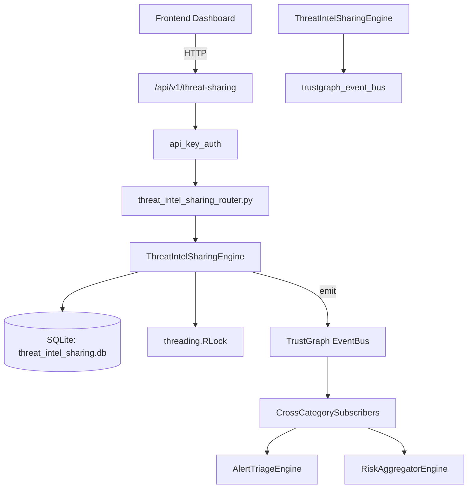

# US-0295: Threat Intel Sharing

## Sub-Epic: AI Intelligence
**Master Goal**: ALDECI — $35/mo enterprise security intelligence platform replacing $50K-500K/yr tools

## User Story
As a **Nina Patel (Threat Intel Analyst)**, I need to automate threat intelligence
so that the platform delivers enterprise-grade ai intelligence capabilities at 1/1000th the cost of legacy tools.

## Why This Matters
Threat Intel Sharing replaces functionality found in enterprise tools like CrowdStrike, Wiz, Snyk, and Rapid7.
By building this into ALDECI's $35/mo stack, customers save $50K+/yr on standalone AI Intelligence tooling.

## Architecture

## Current State: 95% Complete
- ✅ `create_group()` — Create a new sharing group. (line 146)
- ✅ `list_groups()` — List all sharing groups for an org. (line 185)
- ✅ `share_indicator()` — Share a threat indicator with a group. (line 207)
- ✅ `list_indicators()` — List shared indicators with optional filters. (line 270)
- ✅ `export_stix_bundle()` — Export indicators as a STIX 2.1 bundle. (line 299)
- ✅ `import_stix_bundle()` — Import a STIX 2.1 bundle. Returns import summary. (line 366)
- ❌ TrustGraph event emission — not yet verified

## Key Functions (from `suite-core/core/threat_intel_sharing_engine.py` — 625 lines)
- `ThreatIntelSharingEngine.create_group()` — Create a new sharing group. (line 146)
- `ThreatIntelSharingEngine.list_groups()` — List all sharing groups for an org. (line 185)
- `ThreatIntelSharingEngine.share_indicator()` — Share a threat indicator with a group. (line 207)
- `ThreatIntelSharingEngine.list_indicators()` — List shared indicators with optional filters. (line 270)
- `ThreatIntelSharingEngine.export_stix_bundle()` — Export indicators as a STIX 2.1 bundle. (line 299)
- `ThreatIntelSharingEngine.import_stix_bundle()` — Import a STIX 2.1 bundle. Returns import summary. (line 366)
- `ThreatIntelSharingEngine.create_policy()` — Create a sharing policy. (line 465)
- `ThreatIntelSharingEngine.get_sharing_stats()` — Get aggregate sharing statistics for an org. (line 500)

## Dependencies
- **Depends on**: trustgraph_event_bus
- **Depended by**: Routers, TrustGraph EventBus, CrossCategorySubscribers
- **TrustGraph**: Event emission wired via ResponseInterceptorMiddleware
- **Source file**: `suite-core/core/threat_intel_sharing_engine.py` (625 lines)
- **Router file**: `suite-api/apps/api/threat_intel_sharing_router.py`

## API Endpoints
| Method | Path | Description |
|--------|------|-------------|
| POST | `/api/v1/threat-sharing/groups` | create group |
| GET | `/api/v1/threat-sharing/groups` | list groups |
| POST | `/api/v1/threat-sharing/groups/{group_id}/indicators` | share indicator |
| GET | `/api/v1/threat-sharing/indicators` | list indicators |
| GET | `/api/v1/threat-sharing/groups/{group_id}/export/stix` | export stix bundle |
| POST | `/api/v1/threat-sharing/import/stix` | import stix bundle |
| POST | `/api/v1/threat-sharing/policies` | create policy |
| GET | `/api/v1/threat-sharing/stats` | get sharing stats |

## Tasks Remaining
1. Verify TrustGraph event emission works end-to-end (2h)
2. Add integration test with real persona workflow (2h)
3. Wire CrossCategorySubscriber consumer chain (1h)
4. Validate with 30-persona walkthrough (1h)
5. Optimize query performance for large datasets (2h)
6. Expand test coverage to edge cases (2h)

## Definition of Done
- [ ] Nina Patel (Threat Intel Analyst) can access /api/v1/threat-sharing and get meaningful data
- [ ] All CRUD operations return correct HTTP status codes
- [ ] TrustGraph receives events from this engine
- [ ] 35+ tests passing in `tests/test_threat_intel_sharing_engine.py`
- [ ] 30-persona walkthrough includes this endpoint at 100%
- [ ] No hardcoded org_id — all queries are org-scoped

## Sprint: Wave 51 (est. April 27-29, 2026)

## Test Coverage
- **Test file**: `tests/test_threat_intel_sharing_engine.py`
- **Tests**: 35 tests
- **Status**: Passing
