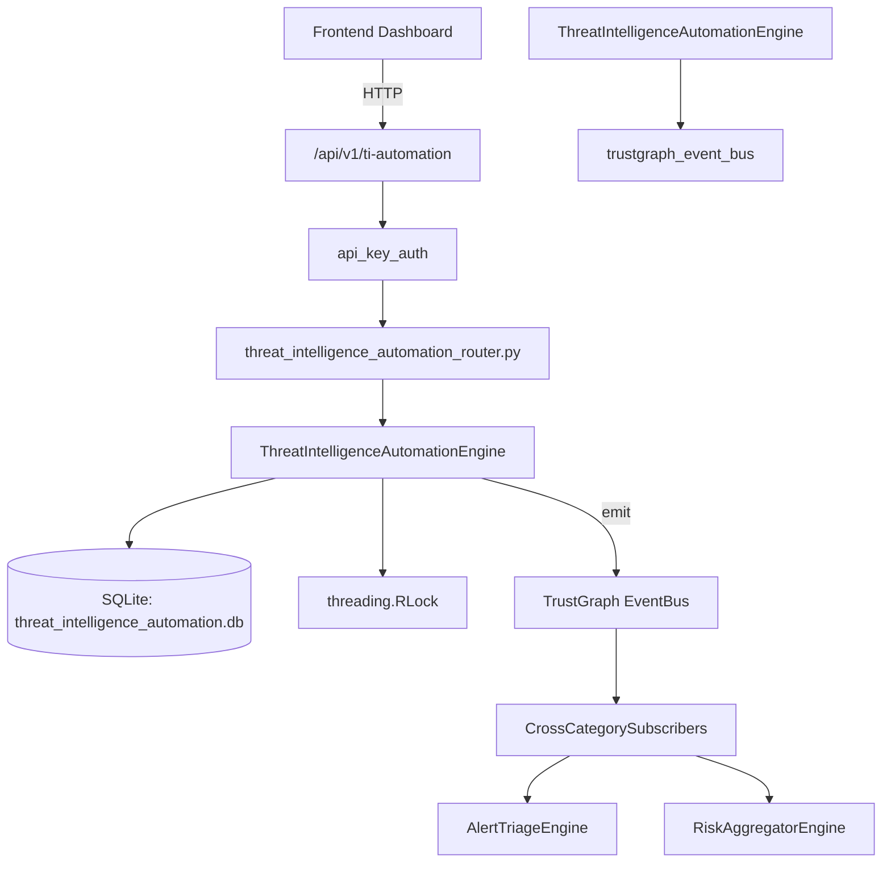

# US-0296: Threat Intelligence Automation

## Sub-Epic: AI Intelligence
**Master Goal**: ALDECI — $35/mo enterprise security intelligence platform replacing $50K-500K/yr tools

## User Story
As a **Nina Patel (Threat Intel Analyst)**, I need to automate threat intelligence
so that the platform delivers enterprise-grade ai intelligence capabilities at 1/1000th the cost of legacy tools.

## Why This Matters
Threat Intelligence Automation replaces functionality found in enterprise tools like CrowdStrike, Wiz, Snyk, and Rapid7.
By building this into ALDECI's $35/mo stack, customers save $50K+/yr on standalone AI Intelligence tooling.

## Architecture

## Current State: 95% Complete
- ✅ `register_feed()` — Register a new threat intelligence feed. (line 164)
- ✅ `list_feeds()` — List feeds for an org, optionally filtered. (line 219)
- ✅ `update_feed_stats()` — Increment ioc_count by delta and optionally update last_polled. (line 242)
- ✅ `create_automation()` — Create an automation rule. (line 275)
- ✅ `execute_automation()` — Increment execution_count and update last_executed. (line 324)
- ✅ `list_automations()` — List automations for an org, optionally filtered. (line 347)
- ❌ TrustGraph event emission — not yet verified

## Key Functions (from `suite-core/core/threat_intelligence_automation_engine.py` — 526 lines)
- `ThreatIntelligenceAutomationEngine.register_feed()` — Register a new threat intelligence feed. (line 164)
- `ThreatIntelligenceAutomationEngine.list_feeds()` — List feeds for an org, optionally filtered. (line 219)
- `ThreatIntelligenceAutomationEngine.update_feed_stats()` — Increment ioc_count by delta and optionally update last_polled. (line 242)
- `ThreatIntelligenceAutomationEngine.create_automation()` — Create an automation rule. (line 275)
- `ThreatIntelligenceAutomationEngine.execute_automation()` — Increment execution_count and update last_executed. (line 324)
- `ThreatIntelligenceAutomationEngine.list_automations()` — List automations for an org, optionally filtered. (line 347)
- `ThreatIntelligenceAutomationEngine.store_enrichment()` — Store an IOC enrichment record. (line 374)
- `ThreatIntelligenceAutomationEngine.get_enrichment()` — Return most recent enrichment for ioc_value in org, or None. (line 426)

## Dependencies
- **Depends on**: trustgraph_event_bus
- **Depended by**: Routers, TrustGraph EventBus, CrossCategorySubscribers
- **TrustGraph**: Event emission wired via ResponseInterceptorMiddleware
- **Source file**: `suite-core/core/threat_intelligence_automation_engine.py` (526 lines)
- **Router file**: `suite-api/apps/api/threat_intelligence_automation_router.py`

## API Endpoints
| Method | Path | Description |
|--------|------|-------------|
| POST | `/api/v1/ti-automation/feeds` | register feed |
| GET | `/api/v1/ti-automation/feeds` | list feeds |
| PUT | `/api/v1/ti-automation/feeds/{feed_id}/stats` | update feed stats |
| POST | `/api/v1/ti-automation/automations` | create automation |
| GET | `/api/v1/ti-automation/automations` | list automations |
| PUT | `/api/v1/ti-automation/automations/{automation_id}/execute` | execute automation |
| POST | `/api/v1/ti-automation/enrichments` | store enrichment |
| GET | `/api/v1/ti-automation/enrichments` | list enrichments |
| GET | `/api/v1/ti-automation/enrichments/{ioc_value}` | get enrichment |
| GET | `/api/v1/ti-automation/stats` | get ti stats |

## Tasks Remaining
1. Verify TrustGraph event emission works end-to-end (2h)
2. Add integration test with real persona workflow (2h)
3. Wire CrossCategorySubscriber consumer chain (1h)
4. Validate with 30-persona walkthrough (1h)
5. Optimize query performance for large datasets (2h)
6. Expand test coverage to edge cases (2h)

## Definition of Done
- [ ] Nina Patel (Threat Intel Analyst) can access /api/v1/ti-automation and get meaningful data
- [ ] All CRUD operations return correct HTTP status codes
- [ ] TrustGraph receives events from this engine
- [ ] 45+ tests passing in `tests/test_threat_intelligence_automation_engine.py`
- [ ] 30-persona walkthrough includes this endpoint at 100%
- [ ] No hardcoded org_id — all queries are org-scoped

## Sprint: Wave 51 (est. April 27-29, 2026)

## Test Coverage
- **Test file**: `tests/test_threat_intelligence_automation_engine.py`
- **Tests**: 45 tests
- **Status**: Passing
