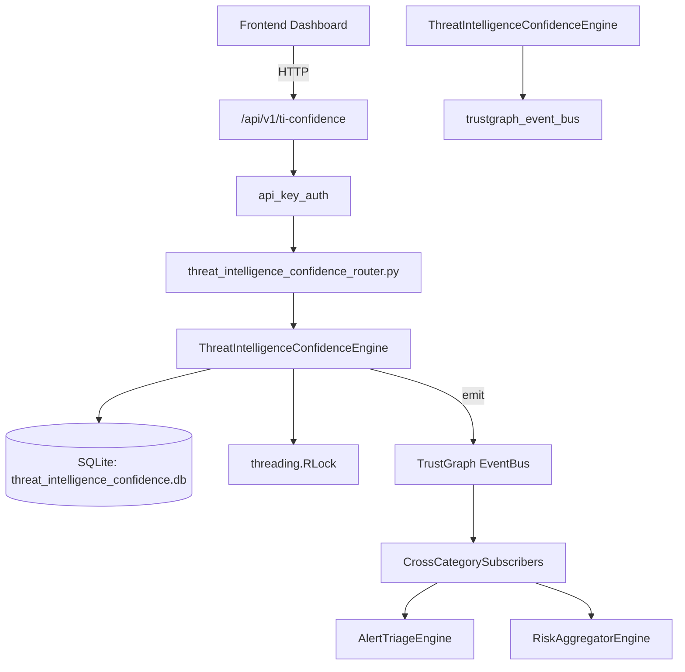

# US-0297: Threat Intelligence Confidence

## Sub-Epic: AI Intelligence
**Master Goal**: ALDECI — $35/mo enterprise security intelligence platform replacing $50K-500K/yr tools

## User Story
As a **Nina Patel (Threat Intel Analyst)**, I need to automate threat intelligence
so that the platform delivers enterprise-grade ai intelligence capabilities at 1/1000th the cost of legacy tools.

## Why This Matters
Threat Intelligence Confidence replaces functionality found in enterprise tools like CrowdStrike, Wiz, Snyk, and Rapid7.
By building this into ALDECI's $35/mo stack, customers save $50K+/yr on standalone AI Intelligence tooling.

## Architecture

## Current State: 95% Complete
- ✅ `score_ioc()` — Score or re-score an IOC from a source. (line 187)
- ✅ `confirm_ioc()` — Mark IOC as confirmed by a source; increase source reliability. (line 267)
- ✅ `report_false_positive()` — Mark IOC as false positive; decrease source reliability (floor 0.1). (line 290)
- ✅ `expire_stale_iocs()` — Expire IOCs past their expires_at date. Returns count expired. (line 319)
- ✅ `get_ioc_summary()` — Summary stats: totals, by_type, by_threat_level, active, expired, top10. (line 338)
- ✅ `get_source_rankings()` — All sources ordered by reliability_score DESC. (line 383)
- ❌ TrustGraph event emission — not yet verified

## Key Functions (from `suite-core/core/threat_intelligence_confidence_engine.py` — 415 lines)
- `ThreatIntelligenceConfidenceEngine.score_ioc()` — Score or re-score an IOC from a source. (line 187)
- `ThreatIntelligenceConfidenceEngine.confirm_ioc()` — Mark IOC as confirmed by a source; increase source reliability. (line 267)
- `ThreatIntelligenceConfidenceEngine.report_false_positive()` — Mark IOC as false positive; decrease source reliability (floor 0.1). (line 290)
- `ThreatIntelligenceConfidenceEngine.expire_stale_iocs()` — Expire IOCs past their expires_at date. Returns count expired. (line 319)
- `ThreatIntelligenceConfidenceEngine.get_ioc_summary()` — Summary stats: totals, by_type, by_threat_level, active, expired, top10. (line 338)
- `ThreatIntelligenceConfidenceEngine.get_source_rankings()` — All sources ordered by reliability_score DESC. (line 383)
- `ThreatIntelligenceConfidenceEngine.get_high_confidence_iocs()` — Active IOCs with confidence_score >= min_confidence. (line 394)
- `ThreatIntelligenceConfidenceEngine.search_ioc()` — Exact match on ioc_value within org. (line 407)

## Dependencies
- **Depends on**: trustgraph_event_bus
- **Depended by**: Routers, TrustGraph EventBus, CrossCategorySubscribers
- **TrustGraph**: Event emission wired via ResponseInterceptorMiddleware
- **Source file**: `suite-core/core/threat_intelligence_confidence_engine.py` (415 lines)
- **Router file**: `suite-api/apps/api/threat_intelligence_confidence_router.py`

## API Endpoints
| Method | Path | Description |
|--------|------|-------------|
| POST | `/api/v1/ti-confidence/iocs/score` | score ioc |
| PUT | `/api/v1/ti-confidence/iocs/{ioc_id}/confirm` | confirm ioc |
| PUT | `/api/v1/ti-confidence/iocs/{ioc_id}/false-positive` | report false positive |
| POST | `/api/v1/ti-confidence/expire` | expire stale iocs |
| GET | `/api/v1/ti-confidence/summary` | get ioc summary |
| GET | `/api/v1/ti-confidence/sources` | get source rankings |
| GET | `/api/v1/ti-confidence/high-confidence` | get high confidence iocs |
| GET | `/api/v1/ti-confidence/search` | search ioc |

## Tasks Remaining
1. Verify TrustGraph event emission works end-to-end (2h)
2. Add integration test with real persona workflow (2h)
3. Wire CrossCategorySubscriber consumer chain (1h)
4. Validate with 30-persona walkthrough (1h)
5. Optimize query performance for large datasets (2h)
6. Expand test coverage to edge cases (2h)

## Definition of Done
- [ ] Nina Patel (Threat Intel Analyst) can access /api/v1/ti-confidence and get meaningful data
- [ ] All CRUD operations return correct HTTP status codes
- [ ] TrustGraph receives events from this engine
- [ ] 42+ tests passing in `tests/test_threat_intelligence_confidence_engine.py`
- [ ] 30-persona walkthrough includes this endpoint at 100%
- [ ] No hardcoded org_id — all queries are org-scoped

## Sprint: Wave 51 (est. April 27-29, 2026)

## Test Coverage
- **Test file**: `tests/test_threat_intelligence_confidence_engine.py`
- **Tests**: 42 tests
- **Status**: Passing
